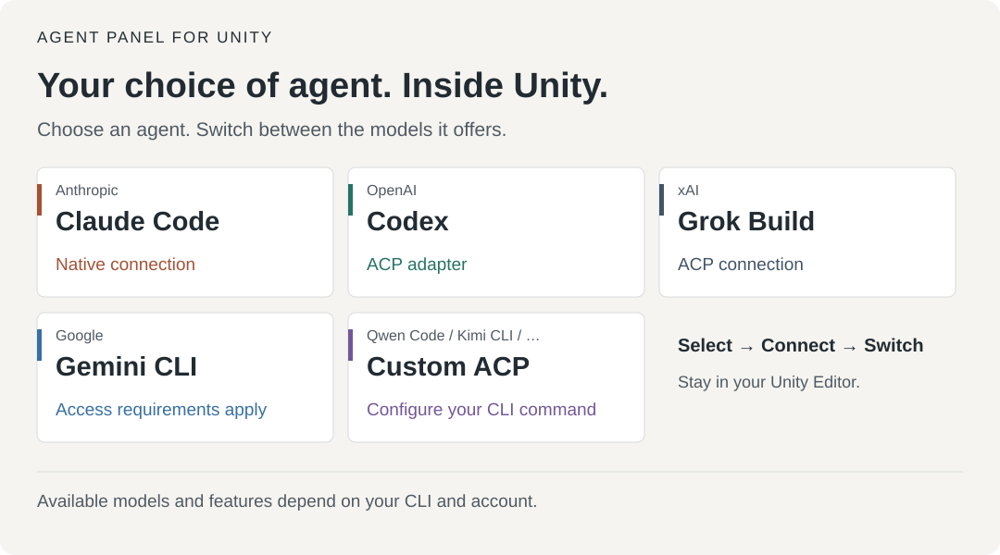

  

# Agent Panel for Unity

*日本語: [README.md](README.md)*

A chat panel that puts a coding agent inside the Unity Editor. Claude Code is the default, and Codex, Grok Build and other ACP-capable CLIs can be selected instead. From a docked panel you can ask the agent to write code, fix files and work on the scene. A permission card appears before every tool runs, and the conversation survives script recompiles.

## Your choice of agent and model, inside Unity



| Agent | Connection | Models and requirements |
|---|---|---|
| **Claude Code** / Anthropic | Native | Choose from the models offered by Claude Code |
| **Codex** / OpenAI | ACP adapter | Choose from the models offered by Codex |
| **Grok Build** / xAI | ACP | Choose from the models offered by Grok Build |
| **Gemini CLI** / Google | ACP | Requires a Gemini API key or an eligible Code Assist license; see the setup guide below |
| **Custom ACP** / Qwen Code, Kimi CLI and others | Configure command and arguments | Models and features exposed by the connected agent |

**Select an agent in Settings → connect → choose a model in the header.** Available models depend on the CLI version, authentication method and account. Model listing and switching also depend on the connected agent.

[Agent setup and switching (Japanese)](docs/USER-GUIDE.md#11-claude-以外のエージェントを使う) · [Model selection (Japanese)](docs/USER-GUIDE.md#10-モデルの選択)

| Chat | Permission card | Settings |
|---|---|---|
|  |  |  |

## What it does

- **Chat** — streamed replies, slash-command completion, thinking summaries, subagent progress cards and question cards you answer by clicking.
- **Permission cards** — allow once, allow for the session, or deny with a reason before a file edit or command runs. Auto-approval can be widened step by step in Settings.
- **Unity context** — attach the Hierarchy / Project selection, Console errors, dragged assets and images with one click.
- **Unity tools** — the agent edits scenes, components and assets, searches and takes screenshots without writing C#. One turn undoes with a single Undo.
- **Script verification gate** — C# written by the agent reaches Assets only after it compiles (Windows).
- **Domain-reload resilience** — the same session reconnects after a recompile or an editor restart.
- **History, model picker, in-panel login** — restore past sessions, switch models and log the CLI in without leaving the panel.
- **Other agents** — switch to Codex, Grok Build or any ACP-capable CLI.
- **English / Japanese** — the UI follows the OS language and can be switched in Settings.

See the [user guide](docs/USER-GUIDE.md) for details (Japanese).

## Requirements

| Item | Details |
|---|---|
| Unity | 2022.3 LTS or later, including Unity 6 |
| OS | Verified on Windows. macOS / Linux should work but are untested |
| Claude Code CLI | Latest release recommended; the panel can install it for you |
| Claude account | Subscription login recommended (an API key also works) |

Installing and signing in to Codex / Grok Build and other non-Claude agents is covered in the [user guide, section 1.1](docs/USER-GUIDE.md#11-claude-以外のエージェントを使う).

## Installation

No required package dependencies ([UITK Font Fix](https://github.com/c-colloid/UITKFontFix) is picked up for CJK fonts when present, but is optional). Use **option 1** if you manage the project with VCC / ALCOM, otherwise **option 2**.

### Option 1: add to VCC / ALCOM

1. In VCC open **Settings > Packages > Add Repository**; in ALCOM open **Resources > Repositories > Add Repository**. Paste the URL below and press **Add**.

   ```
   https://c-colloid.github.io/vpm/index.json
   ```

2. Open **Manage Project** (**Manage** in ALCOM) for the project and press **+** next to **Agent Panel for Unity**. Type "Agent" in the search box to narrow a long list.
3. Later updates show up as an **Update** button in the same list.


### Option 2: Git URL in the Package Manager

Git must be installed (get it from [git-scm.com](https://git-scm.com/) and restart Unity if not).

1. Open **Window > Package Manager**.
2. Press **+** in the top-left corner and choose **Add package from git URL...** (**Install package from git URL...** on Unity 6).
3. Paste the URL below and press **Add** (**Install** on Unity 6).

   ```
   https://github.com/c-colloid/AgentPanelForUnity.git?path=jp.colloid.unity-agent-panel
   ```

4. To update later, select the package in Package Manager and press **Update**.


### Option 3: zip

Extract `jp.colloid.unity-agent-panel-<version>.zip` from the [latest release](https://github.com/c-colloid/AgentPanelForUnity/releases/latest) into `Packages/jp.colloid.unity-agent-panel/` in your project (so that `package.json` sits directly in that folder). Update by replacing the folder.

### Trying a beta

Every finished piece of work ships as a beta, `X.Y.Z-beta.N`; a stable release bundles them every few days to weeks. Betas are invisible to a normal install and reach you through these routes:

- **VCC / ALCOM**: turn on **Settings > Packages > Show Pre-release Packages** in VCC, or **Show pre-release packages** in ALCOM's settings, and the betas appear in the same list.
- **Git URL**: append `#beta` to the URL.

  ```
  https://github.com/c-colloid/AgentPanelForUnity.git?path=jp.colloid.unity-agent-panel#beta
  ```

- **zip**: the entries marked **Pre-release** under [Releases](https://github.com/c-colloid/AgentPanelForUnity/releases).

## Getting started

1. Open **Window > Agent Panel**.
2. If the CLI is missing or you are not logged in, follow the card in the panel to install and log in.
3. Once the status bar says idle, send a message.


## Core and Pro

This README installs **Core** (`jp.colloid.unity-agent-panel`, MIT), which works on its own. The separately sold **Agent Panel Pro** (`jp.colloid.agent-panel-pro`, [PolyForm Internal Use License 1.0.0](https://polyformproject.org/licenses/internal-use/1.0.0): internal use and modification allowed, no distribution) adds prefab override tools, animation / material editing, lightmap baking (with Bakery support), editor UI automation and bundled profiles for VRChat SDK3 (Base, Avatars and Worlds) / Udon / UdonSharp / NDMF / Modular Avatar / VRCFury / Avatar Optimizer / lilycalInventory / lilToon / UniVRM / MagicaCloth2 / Final IK / ProBuilder and others. To install Pro, enter the registry URL and product key you receive at purchase under Settings > **Agent Panel Pro updates**; updates then come through Package Manager or VCC / ALCOM (see the [user guide](docs/USER-GUIDE.md#15-設定画面リファレンス)).

## Documentation

- [User guide](docs/USER-GUIDE.md) (Japanese) — layout, chips and attachments, permission cards, history, Unity tools, settings reference, troubleshooting
- [CHANGELOG](jp.colloid.unity-agent-panel/CHANGELOG.md)
- [docs/](docs/README.md) — architecture and design notes
- [CONTRIBUTING.md](CONTRIBUTING.md) — development, tests and releases

## License

Each package has its own license.

- **Core** (`jp.colloid.unity-agent-panel`, what this README installs): [MIT License](jp.colloid.unity-agent-panel/LICENSE.md)
- **Agent Panel Pro** (`jp.colloid.agent-panel-pro`, sold separately): [PolyForm Internal Use License 1.0.0](https://polyformproject.org/licenses/internal-use/1.0.0) (not MIT). The license text and the licensor's additional permissions ship inside the Pro package as `LICENSE.md` / `LICENSE-ADDITIONAL.md`
