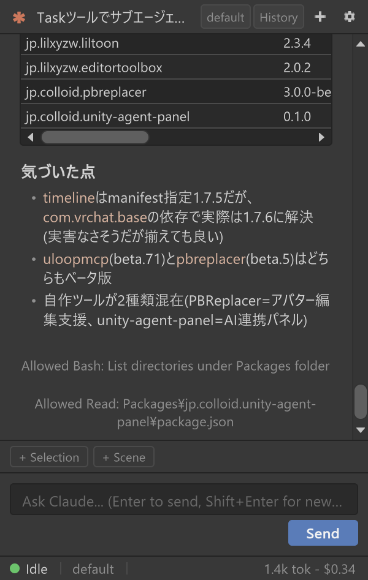
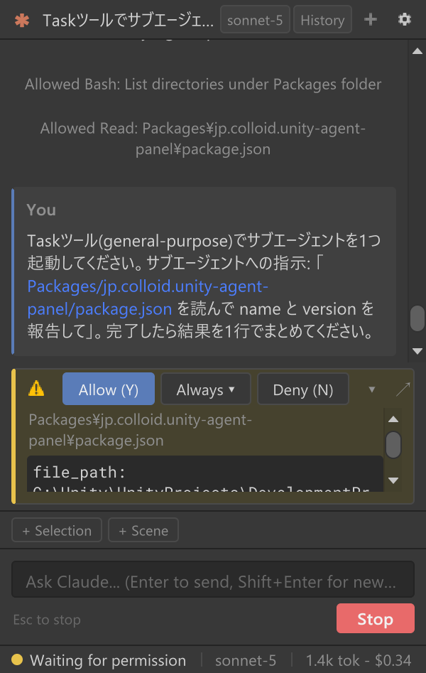
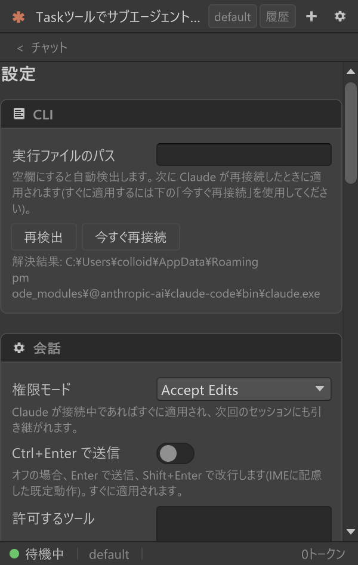
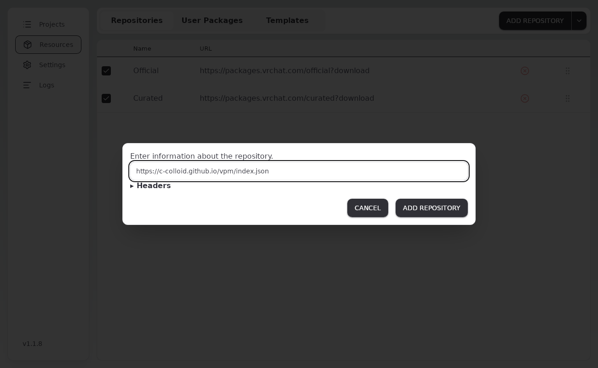
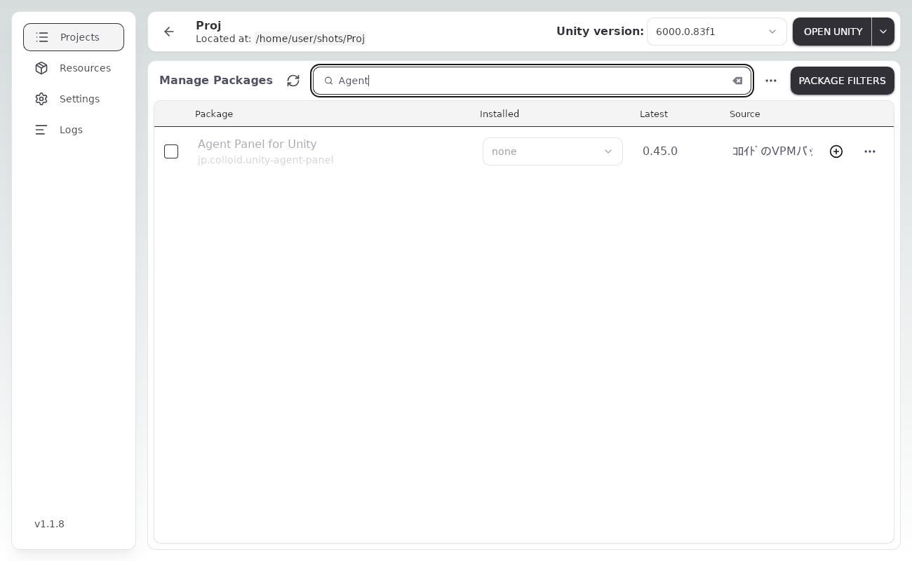
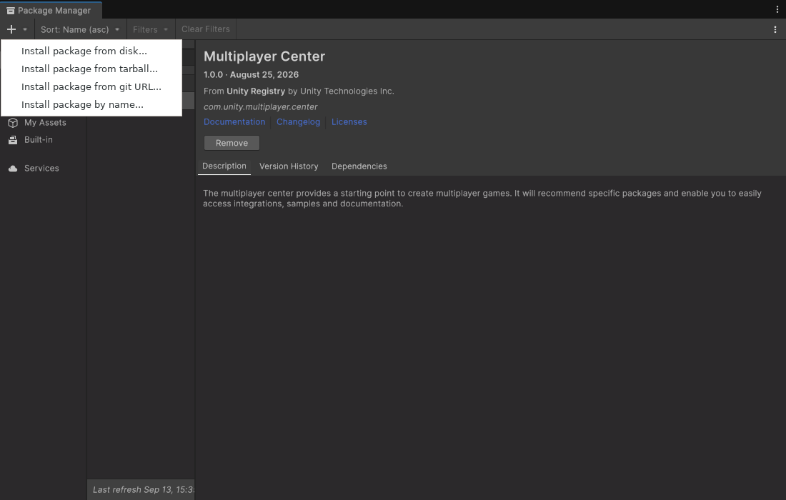
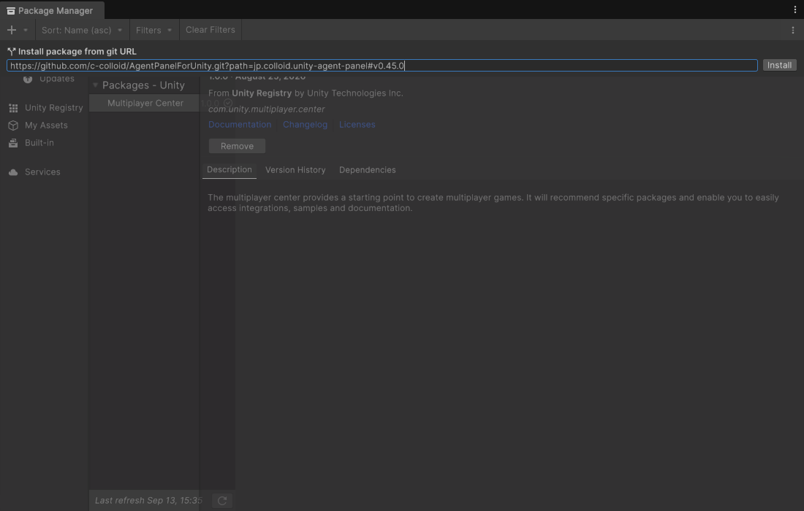
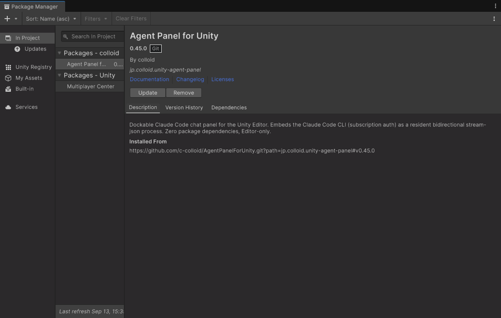
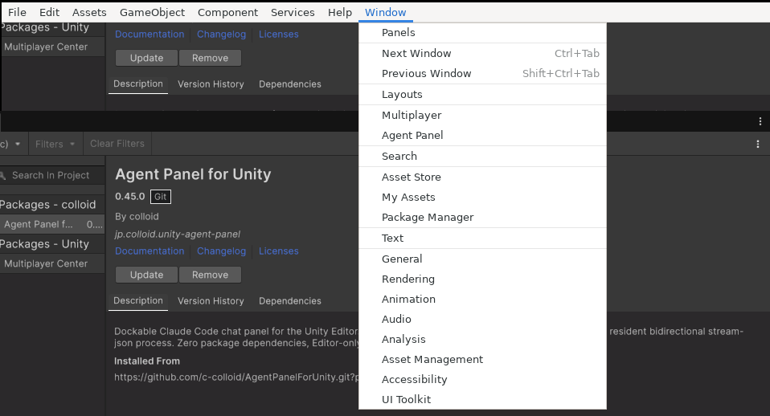

  

# Agent Panel for Unity

*English: [README.en.md](README.en.md)*

コーディングエージェントを Unity エディタの中で使うためのチャットパネルです。Claude Code を中心に、Codex・Grok Build などの ACP 対応 CLI にも切り替えられます。エディタにドッキングしたパネルから、コードを書く・ファイルを直す・シーンを操作するといった作業をエージェントに頼めます。ツールを実行する前には許可カードが出て、スクリプトの再コンパイルをまたいでも会話は続きます。

| チャット | 許可カード | 設定画面 |
|---|---|---|
|  |  |  |

## できること

- **チャット** — 応答はストリーミング表示。スラッシュコマンドの補完、思考の要約、サブエージェントの進捗カード、質問カード(選択肢で回答)に対応。
- **許可カード** — ファイル編集やコマンド実行の前に「許可 / このセッション中は許可 / 拒否」を選べます。自動承認の範囲は設定で段階的に広げられます。
- **Unity の文脈を渡す** — Hierarchy / Project の選択、Console のエラー、ドラッグしたアセット、画像をワンクリックで添付。
- **Unity 操作ツール** — エージェントが C# を書かずにシーン・コンポーネント・アセットを操作し、検索やスクリーンショットも行えます。1 ターン分は Undo 1 回で戻せます。
- **スクリプト検証ゲート** — エージェントが書いた C# はコンパイルが通ってから Assets に入ります(Windows)。
- **ドメインリロード耐性** — 再コンパイルやエディタ再起動の後も同じセッションに自動で再接続します。
- **履歴・モデル切替・パネル内ログイン** — 過去のセッションの復元、モデルの切替、CLI へのログインをパネル内で完結。
- **Claude 以外のエージェント** — Codex、Grok Build など ACP 対応の CLI にも切り替えられます。
- **日本語 / English** — UI は OS 言語に追従し、設定で切り替えられます。

操作の詳細は [操作ガイド](docs/USER-GUIDE.md) を参照してください。

## 必要要件

| 項目 | 内容 |
|---|---|
| Unity | 2022.3 LTS 以降(Unity 6 系を含む) |
| OS | Windows で検証しています。macOS / Linux は動く想定ですが未検証です |
| Claude Code CLI | 最新版を推奨。未導入ならパネルの案内から導入できます |
| Claude アカウント | サブスクリプションでのログインを推奨(API キーでも可) |

Codex / Grok Build など Claude 以外のエージェントの導入とサインインは [操作ガイド 1.1 節](docs/USER-GUIDE.md#11-claude-以外のエージェントを使う) を参照してください。

## インストール

必須の依存パッケージはありません([UITK Font Fix](https://github.com/c-colloid/UITKFontFix) が入っていれば CJK フォント設定を自動で引き継ぎますが、無くても動きます)。VCC / ALCOM を使っているなら **方法 1**、それ以外は **方法 2** が簡単です。

### 方法 1: VCC / ALCOM に追加

1. VCC なら **Settings > Packages > Add Repository**、ALCOM なら **Resources > Repositories > Add Repository** を開き、次の URL を貼り付けて **Add** を押します。

   ```
   https://c-colloid.github.io/vpm/index.json
   ```

2. プロジェクトの **Manage Project**(ALCOM では **Manage**)を開き、**Agent Panel for Unity** の **+** を押します。一覧が長いときは検索欄に「Agent」と入れます。
3. 以後の更新は同じ一覧に出る **Update** ボタンです。





### 方法 2: Unity Package Manager に Git URL を追加

Git がインストールされている必要があります(無ければ [git-scm.com](https://git-scm.com/) から入れて Unity を再起動)。

1. **Window > Package Manager** を開きます。
2. 左上の **+** から **Add package from git URL...**(Unity 6 では **Install package from git URL...**)を選びます。
3. 次の URL を貼り付けて **Add**(Unity 6 では **Install**)を押します。

   ```
   https://github.com/c-colloid/AgentPanelForUnity.git?path=jp.colloid.unity-agent-panel
   ```

4. 以後の更新は Package Manager でパッケージを選んで **Update** です。







### 方法 3: zip

[最新リリース](https://github.com/c-colloid/AgentPanelForUnity/releases/latest) の `jp.colloid.unity-agent-panel-<バージョン>.zip` を、Unity プロジェクトの `Packages/jp.colloid.unity-agent-panel/` に展開します(`package.json` がそのフォルダ直下に来る形)。更新は zip の差し替えです。

## はじめかた

1. **Window > Agent Panel** を開きます。
2. CLI が無い・未ログインなら、パネルのカードの案内に従って導入とログインを済ませます。
3. ステータスバーが「待機中」になれば、メッセージを送れます。



## Core と Pro

この README で導入するのは **Core**(`jp.colloid.unity-agent-panel`、MIT)で、単体ですべての基本機能が動きます。別売の **Agent Panel Pro**(`jp.colloid.agent-panel-pro`、[PolyForm Internal Use License 1.0.0](https://polyformproject.org/licenses/internal-use/1.0.0): 内部利用と改変は可、配布は不可)を追加すると、プレハブのオーバーライド操作、アニメーション / マテリアル編集、ライトマップベイク(Bakery 対応)、エディタ UI の自動操作、VRChat SDK3(共通 / アバター / ワールド)/ Udon / UdonSharp / NDMF / Modular Avatar / VRCFury / Avatar Optimizer / lilycalInventory / lilToon / UniVRM / MagicaCloth2 / Final IK / ProBuilder などの同梱プロファイルが使えるようになります。Pro の導入は購入時に受け取るレジストリ URL と製品キーを 設定 > **Agent Panel Pro の更新** に入力するだけで、以後は Package Manager または VCC / ALCOM から更新できます(詳細は [操作ガイド](docs/USER-GUIDE.md#15-設定画面リファレンス))。

## ドキュメント

- [操作ガイド](docs/USER-GUIDE.md) — 画面の構成、チップと添付、許可カード、履歴、Unity 操作ツール、設定リファレンス、困ったときは
- [CHANGELOG](jp.colloid.unity-agent-panel/CHANGELOG.md) — 変更履歴
- [docs/](docs/README.md) — アーキテクチャと設計ノート
- [CONTRIBUTING.md](CONTRIBUTING.md) — 開発・テスト・リリース手順

## ライセンス

パッケージごとに異なります。

- **Core**(`jp.colloid.unity-agent-panel`、この README で導入するもの): [MIT License](jp.colloid.unity-agent-panel/LICENSE.md)
- **Agent Panel Pro**(`jp.colloid.agent-panel-pro`、別売): [PolyForm Internal Use License 1.0.0](https://polyformproject.org/licenses/internal-use/1.0.0)(MIT ではありません)。条文と作者からの追加許諾は Pro パッケージ内の `LICENSE.md` / `LICENSE-ADDITIONAL.md` にあります
