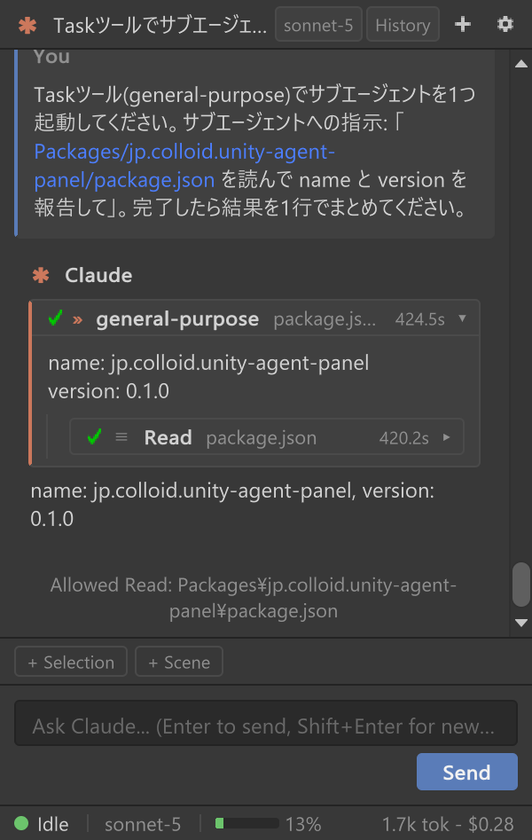
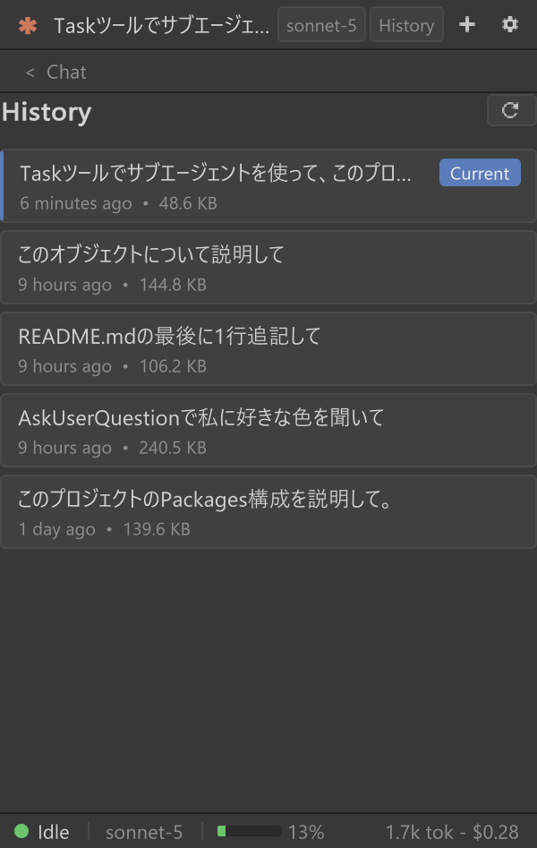
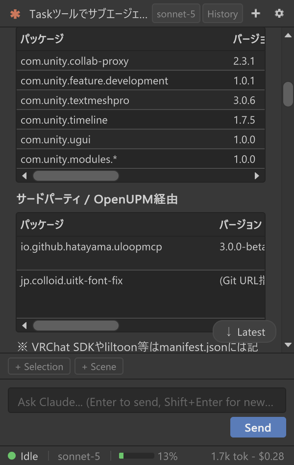

  

# Agent Panel for Unity

*English: [README.en.md](README.en.md)*

Claude Code CLI を Unity エディタにドッキング可能なチャットパネルとして組み込むエディタ拡張です。CLI を常駐プロセスとして起動し、双方向の `stream-json` プロトコルでやり取りすることで、コードを書く・ファイルを編集する・シェルを実行するといったエージェントの作業を、Unity エディタから離れることなくチャット形式で行えます。ツール実行前には権限確認カードが挟まり、スクリプトの再コンパイル(ドメインリロード)が起きてもセッションは自動的に再接続されるため、Unity プロジェクトの開発ワークフローにネイティブに馴染むことを目指しています。

[ComfyUI Agent Panel](https://github.com/artokun/comfyui-mcp-panel) に着想を得ています。

## スクリーンショット

| チャット | 権限カード | サブエージェントカード |
|---|---|---|
|  |  |  |

| 履歴ブラウザ | 設定画面 | Markdown テーブル表示 |
|---|---|---|
|  |  |  |

## 特徴

### チャット体験

- **常駐プロセス + ストリーミング表示** — CLI を 1 チャット = 1 プロセスとして起動し、応答をタイプライター風に逐次描画します。
- **Claude 以外のサブスク型 AI(ACP バックエンド)** — 設定の「エージェント」で Gemini CLI(`gemini --experimental-acp`)、Codex(`codex-acp`)、Grok Build(`grok agent stdio`)、その他の ACP(Agent Client Protocol)対応エージェント(Qwen Code、Kimi CLI など)に切り替えられます。各 CLI 自身の認証情報をそのまま使います — Codex は ChatGPT アカウント(`codex login`)または `CODEX_API_KEY` / `OPENAI_API_KEY`、Grok Build は SuperGrok / X Premium+ ログイン(`grok login`)または `XAI_API_KEY`、Gemini CLI は Gemini API キー(`GEMINI_API_KEY`、または `~/.gemini/.env`)または Gemini Code Assist Standard / Enterprise の Google ログイン(個人向けの「Login with Google」は 2026-06-18 に終了しました)。パネルは API キーを保存しません。キーは各 CLI 自身の環境変数か設定ファイルに置いてください。権限カード・ストリーミング・Unity 操作ツールは同じように動作します(履歴ブラウザ・パネル内ログイン・サブエージェントモデル設定・スクリプトゲートのフックは Claude Code 専用)。
- **スラッシュコマンド入力** — 入力欄に `/` と打つと、CLI が提供するコマンド一覧(`/compact` など)が候補として表示され、矢印キーと Tab/Enter で補完できます。
- **コンテキスト圧縮の可視化** — `/compact` や CLI の自動圧縮が起きた位置に会話ログ上でノートを表示し、ステータスバーのコンテキストメーターは次のターンまで「圧縮済み」を示します。
- **思考の要約表示** — Claude の推論の要約を折りたたみ表示で確認できます(設定で切替)。
- **サブエージェント(Task ツール)カード** — サブエージェント実行を進捗付きの入れ子カードとして表示し、内部のツール呼び出しをトップレベルの会話に混在させません。
- **AskUserQuestion カード** — エージェントが選択肢を提示して確認を求める場面を、専用の選択肢カードとして表示します。
- **セッション履歴ブラウザ** — CLI 自身が保存しているセッション記録を一覧・検索し、選択したセッションを復元できます。

### 権限と安全性

- **インライン権限カード** — ファイル編集やシェル実行などツール呼び出し前に、許可(1 回のみ / セッション中は常に許可) / 拒否+理由を選べるカードを表示します。パネル幅が狭い場合は自動でフローティングウィンドウに切り替わります。
- **自動承認レベル** — 「読み取りのみ」から「全ツール」まで段階的に自動承認の範囲を選べます(既定は毎回確認)。
- **スクリプト検証ゲート** — エージェントが書く C# は一旦ステージングに置かれ、コンパイル検証を通ったものだけが Assets に入ります。壊れたコードでドメインリロードが起きることはなく、コンパイルエラーはそのままエージェントに返って自己修正されます(フック層は Windows のみ。他 OS では権限カード側の事前フィルタだけが働きます)。
- **破壊的操作の確認ゲート** — `uap_asset_delete` / `uap_prefab_apply_overrides` のような取り消せない操作は `confirm:true` なしでは拒否され、影響範囲だけを返します(`dry_run:true` でプレビューのみ)。

### Unity 連携

- **Unity コンテキストの自動収集** — Hierarchy/Project の選択オブジェクトや Console のエラーをコンテキストチップとして提示し、ワンクリックでプロンプトに含められます。
- **ドラッグ&ドロップ / 画像添付** — Project/Hierarchy からアセットやオブジェクトをパネルにドラッグしてチップとして添付できます。画像はファイル・ドロップ・クリップボード・画面キャプチャから添付できます。
- **Unity 公式プラグインの検出と導入** — Unity 公式の Claude Code プラグイン(`unity@unity-agent-plugin`、`/unity:*` スキル群)の導入状態を設定画面に表示し、未導入ならワンクリックで CLI に導入できます。導入済みのときは、公式スキルの使い分けと「Editor 操作はパネルのツールで行い `unity` CLI を入れない」「Unity 6 前提の指針は 2022 LTS では飛ばす」という注記を Claude の指示に加えます(設定で切替)。
- **Scene ビュー 3D マーカー** — エージェントが Scene ビューに球・矢印・ワイヤ箱・ラベルなどのマーカーを置いて位置を示せます。ユーザー側からもピンを打ってエージェントに場所を伝えられます。
- **ドメインリロード耐性** — スクリプトの再コンパイルやエディタ再起動をまたいでセッションを自動的に再接続します。
- **UITK Font Fix 連携** — [UITK Font Fix](https://github.com/c-colloid/UITKFontFix) が導入されていれば、その CJK フォント設定をそのまま使います(依存はなく、有無を自動判定)。

### Unity 操作ツール(UapOps)

パネル内蔵の MCP サーバ経由で、エージェントが C# を書かずに Unity エディタを型付きツールとして操作できます(ローカルループバック限定+トークン認証)。1 ターン分の操作は Undo 1 回でまとめて巻き戻せます。

- **シーン / アセット操作** — オブジェクト作成・コンポーネント追加・プロパティ変更・Transform・アセット操作・メニュー実行・エディタスクリーンショット。
- **検索(`uap_search`)** — Unity Search のクエリ(`t:prefab ref:Player.prefab`、`t:Light -isstatic` など)をアセットとシーンに対して実行し、他のツールにそのまま渡せるパスで結果を返します。Unity 公式プラグインの検索スキルが組み立てたクエリを、Search ウィンドウを開かずにチャット内で処理できます。
- **プレハブ差分** — オーバーライド一覧・Apply・Revert(全体/個別)。
- **アニメーション / マテリアル** — AnimationClip 作成、AnimatorController 編集、シェーダプロパティ探索付きのマテリアル設定、インポータ設定の変更(既定 OFF)。
- **ライトマップベイク** — Unity 標準ライトマッパー(`uap_lightmap_bake`: メモリ preflight・自動最適化・最適化ガイド)と [Bakery GPU Lightmapper](https://assetstore.unity.com/packages/tools/level-design/bakery-gpu-lightmapper-122218)(`uap_bakery_bake`: 設定取得/変更・プリセット・スコープ指定)の両方を、Editor をブロックせずに開始・進捗確認・中止できます。
- **ジョブ化** — メインスレッドの待ち時間を超えた呼び出しはジョブとして保持され、`uap_job_status` で後から結果を取得できます。
- **拡張プロファイル** — VRChat SDK3 / UniVRM / MagicaCloth2 / Final IK / Bakery を自動検出し、その SDK の要点を Claude の指示に追加します(同梱プロファイルのみ自動、プロジェクト独自プロファイルは全文確認と承認が必要)。

各ツールの詳細は [docs/design-notes/](docs/design-notes/) の該当ノートを参照してください。

### 設定・その他

- **モデル設定** — デフォルトモデル(新規セッション用)と現在のセッションのモデル(ヘッダーのピッカー)を分離。サブエージェントは「コスト方針」で誘導できます(例: 単純作業だけ Haiku)。
- **パネル内ログイン/ログアウト** — 設定のアカウントカードからログイン状態を確認でき、ターミナルを開かずに CLI の OAuth ログインとログアウトを行えます。
- **カスタム指示 / クイックアクション** — 定常指示をシステムプロンプトに追記したり、よく使う定型プロンプトを 1 クリックで挿入できます。
- **外観設定** — フォントサイズと日本語などの CJK 用 UI フォントを設定画面から調整できます。
- **多言語対応(日本語 / English)** — UI 全文字列をローカライズ。既定は OS 言語に追従(Auto)し、設定画面から即時切替できます。

## Core と Pro

このリポジトリは 2 つのパッケージで構成されています。

- **`jp.colloid.unity-agent-panel`(Core、MIT)** — このリポジトリの本体。チャット・権限確認・スクリプト検証ゲート・履歴・ACP バックエンド、および基本的な UapOps ツール(シーン/コンポーネント/プロパティ/アセット操作、検索、スクリーンショット、Editor メニュー実行など)を含みます。
- **`jp.colloid.agent-panel-pro`(Pro、プロプライエタリ、別売)** — 以下の高度な UapOps ツールと、主要拡張アセット向けの Extension Profiles を追加します。Core と組み合わせて初めて動作します(Core 単体でも動きますが、下記機能は使えません)。
  - **prefab** — プレハブ作成・オーバーライドの取得/適用/差し戻し
  - **editor(ライトマップ/Bakery)** — 非同期ライトマップベイク・プリフライト診断・Bakery GPU Lightmapper 連携
  - **anim** — アニメーションクリップ/AnimatorController編集・マテリアル設定・アセットプロパティ設定・アバターインポーター設定
  - **ui** — UI Toolkit ウィンドウの一覧・ダンプ・クリック・値設定によるエディタ UI 自動操作
  - Bakery / Final IK / Magica Cloth 2 / UniVRM / VRChat SDK3 向けの Extension Profiles

Pro 未導入でも Core は問題なく動作し、設定画面の該当モジュールのトグルには「Agent Panel Pro(未導入)で提供」と表示されます。Pro は BOOTH/Gumroad で配布される zip をプロジェクトの `Packages/` フォルダ直下に展開してインストールします(配布リンクは追って掲載します)。

## 必要要件

| 要件 | 内容 |
|---|---|
| Unity | 2022.3 LTS 以降、Unity 6(6000.0 / 6.3 / 6.5)を含む(CI の EditMode テストを 2022.3.22f1 / 6000.0.83f1 / 6000.3.24f1 / 6000.5.11f1 で実行) |
| OS | Windows で開発・検証しています。macOS / Linux 向けの CLI 探索・プロセス終了経路は用意していますが、日常的な検証は行っていません |
| Claude Code CLI | v2.1.218 以降。ネイティブインストーラでの導入を推奨 |
| 認証 | Claude のサブスクリプション(Pro/Max)。パネル内のアカウントカード、またはターミナルの `claude` + `/login` でログインします |
| (任意)他の ACP エージェント | Codex(ChatGPT アカウント、または `CODEX_API_KEY` / `OPENAI_API_KEY` + `codex-acp` アダプタ)、Grok Build(SuperGrok / X Premium+ ログイン、または `XAI_API_KEY`)、Gemini CLI(Gemini API キー: `GEMINI_API_KEY` または `~/.gemini/.env`、あるいは Gemini Code Assist Standard / Enterprise の Google ログイン)など、ACP を実装する CLI。設定の「エージェント」で選ぶと、インストール(npm 系は Node.js が必要)もサインイン(エージェントがブラウザを開く)もパネル内で完結します。パネルは API キーを保存しません — キーは各 CLI 自身の環境変数か設定ファイルに置いてください |

> [!NOTE]
> サブスクリプション(Pro/Max)ログインを推奨します。エディタの環境に `ANTHROPIC_API_KEY` があれば CLI 自身の判断でそれが使われ、課金が従量課金の API 経由に切り替わります -- パネルはどちらで接続しているかを設定 > アカウントに表示します。常にサブスクリプションを使いたい場合は、同じ場所の「APIキー認証」を「サブスクリプションのみ」に設定してください。

## インストール

パッケージ本体はリポジトリ内の `jp.colloid.unity-agent-panel/` フォルダです。外部パッケージへの依存はありません。以下のいずれかの方法で導入できます。

### 方法 1: Git URL を Unity Package Manager に追加(推奨)

`Window > Package Manager > + > Add package from git URL...` を開き、次の形式で入力します。

[https://github.com/c-colloid/UnityAgentPanel.git?path=jp.colloid.unity-agent-panel](https://github.com/c-colloid/UnityAgentPanel.git?path=jp.colloid.unity-agent-panel#v0.42.2)

上記のリンク先は最新のリリースタグ(`#v0.42.2`)を指しています。URL 末尾にタグを付けるとそのバージョンに固定でき、省略すると main の最新を取得します。タグの一覧は [CHANGELOG](jp.colloid.unity-agent-panel/CHANGELOG.md) を参照してください。

### 方法 2: `Packages` フォルダへ配置(embedded パッケージ)

リポジトリを任意の場所に clone し、`jp.colloid.unity-agent-panel` フォルダを Unity プロジェクトの `Packages/` 直下にコピーするか、シンボリックリンク/ジャンクションを張ります。

```
git clone https://github.com/c-colloid/UnityAgentPanel.git
```

```
mklink /J <UnityProjectPath>\Packages\jp.colloid.unity-agent-panel <clone先>\jp.colloid.unity-agent-panel
```

`manifest.json` は変更しないため、VPM/VCC で管理しているプロジェクトにも影響しません。

### 方法 3: zip ダウンロード

リポジトリを zip でダウンロードして展開し、中の `jp.colloid.unity-agent-panel` フォルダを Unity プロジェクトの `Packages/` 直下に配置します。以降の更新は zip の再ダウンロード+差し替えで行います。

## 初期セットアップ

1. Unity エディタのメニューから **Window > Agent Panel** を開きます。
2. CLI が見つからない場合や未ログインの場合は、パネル内に案内カード(セットアップカード)が表示されるので、指示に従ってください。未ログインの場合は、セットアップカードまたは設定のアカウントカードの「ログイン」からパネル内でログインできます(ブラウザで認証し、表示された認可コードを貼り付けます)。ターミナルで `claude` を起動して `/login` する従来の方法も引き続き使えます。

## 使い方

### チャット

- 入力欄にメッセージを入力し、Enter で送信します(Shift+Enter で改行)。
- IME による日本語変換確定時に誤って送信されてしまう場合は、設定画面で **Ctrl+Enter 送信** に切り替えられます。
- 応答生成中は送信ボタンが停止ボタンに切り替わり、いつでも中断できます。

### スラッシュコマンドとコンテキスト圧縮

- 入力欄の先頭に `/` を打つと、CLI が提供するスラッシュコマンドの候補ポップアップが入力欄の上に開きます。↑↓ で選択、Tab または Enter で補完、Esc で閉じます。補完後にもう一度 Enter を押すと送信されます。
- 送信した `/コマンド 引数` は CLI にそのまま渡されます。このとき、コンテキストチップや添付画像は消費されず、次の通常メッセージに持ち越されます。
- `/compact` を送ると CLI がここまでの会話を要約し、会話ログの圧縮位置にノート(手動/自動の別と圧縮前のトークン数)が表示されます。CLI がコンテキスト不足で自動圧縮した場合も同じノートが出ます。
- `/clear` は CLI には送らず、パネルの「新規チャット」と同じ動作(現在のセッションを閉じて新しいセッションを開始)になります。

### 権限カードとハイブリッド許可ウィンドウ

ファイル編集やコマンド実行など、副作用のあるツール呼び出しの前には権限確認カードが挟まります。「許可」「このセッション中は常に許可」「拒否(理由付き)」から選択できます。パネル幅・高さが一定を下回る場合は、同じカードが自動的にフローティングウィンドウとして表示されます。複数の要求が並んでいる場合は「あと N 件」と表示されます。

自動承認の範囲は設定画面の「自動承認レベル」で変更できます。「全ツール」レベルは既定では選べず、切り替え時に確認を求めます。

### AskUserQuestion カード

エージェントが作業方針などについてユーザーに選択肢を提示してきた場合、専用のカードとして選択肢が表示され、クリックで回答できます。自由入力(Other)にも対応しています。

### コンテキストチップと添付

- Hierarchy/Project で選択中のオブジェクトは、自動でコンテキストチップとして入力欄付近に表示されます。
- Console にエラーが出ている場合も同様にチップとして提示され、ワンクリックで「修正して」といった依頼につなげられます。
- Project ウィンドウや Hierarchy からアセット・オブジェクトをパネル上にドラッグ&ドロップすると、添付チップとして会話に含められます。
- 画像はファイル選択・ドロップ・クリップボード貼り付け・画面キャプチャから添付できます。

### 履歴ブラウザ

サイドの履歴ビューから、これまでのセッションを一覧・選択できます。CLI 自身が保存しているセッション記録(トランスクリプト)を直接参照しているため、パネル側で独自にすべてを保持し直す必要はありません。選択したセッションは `--resume` で復元されます。

### モデルピッカー

ヘッダーのモデルピッカーから、起動時に取得したモデル一覧の中から使用モデルを切り替えられます。新規セッションの既定モデルとサブエージェントの方針は設定画面で変更します。

### フォントサイズ / CJK フォント設定

設定画面の外観セクションから、チャット全体のフォントサイズと、日本語などの CJK 文字表示に使う UI フォントを設定できます。

プロジェクトに [UITK Font Fix](https://github.com/c-colloid/UITKFontFix)(`jp.colloid.uitk-font-fix`)が導入されている場合、CJK 用 UI フォントはその解決結果をそのまま使います。設定画面の「検出されたフォント」に「UITK Font Fix 経由」と表示されていれば連携中です。未導入の場合はパネル内蔵の候補チェーン(Yu Gothic UI → Meiryo → Noto Sans CJK JP …)で解決します。

### サブエージェントカード

エージェントが Task ツールでサブエージェントを起動した場合、その実行は入れ子のカードとして表示され、進行状況(実行中/完了/失敗)や内部のツール呼び出しをトップレベルの会話とは区別して確認できます。

## ドメインリロード・エディタ再起動との共存

スクリプトの変更によるドメインリロードが発生すると、C# 側の実行状態は一度失われますが、本パネルはリロード直前に CLI プロセスを終了し(子プロセスも含めたツリーキル)、セッション ID を保存します。リロード完了後は自動的に `--resume` で同じセッションに再接続し、直前までの会話をそのまま表示し続けます。エディタの再起動をまたいでも同様に、保存されたセッション ID から会話を再開できます。

ターン実行中にリロードが発生した場合は、「中断されました」というバナーとともにワンクリックで続きを実行できる案内が表示されます(既定では自動再送しません)。Play モードへの出入りのようにユーザー操作によるリロードでターンが頻繁に中断される場合は、設定の「中断後に自動継続する」を ON にすると、パネルが同じ「続きを実行」を自動送信します(会話ログに必ず明示され、ターンが完了しないまま 3 回連続で止まります)。

## トラブルシューティング

| 症状 | 対処 |
|---|---|
| CLI が見つからない | 初回カードまたは設定 > CLI の「インストール」ボタンでパネルから導入できます(コマンドは実行前に表示)。既に入っている場合は「CLI パス」欄(ACP エージェントは「コマンド」欄)にパスを指定してください |
| ACP エージェントでトークン数やコンテキストメーターが出ない | Codex(codex-acp)は各ターンの最終モデル呼び出し分のトークンとコンテキスト使用率を報告します。Grok Build はモデル一覧と通知に載る独自の `_meta` 値から表示します。Gemini CLI はコンテキストサイズを通知しないため、トークン数のみ表示されメーターは出ません。何も表示されない場合はエージェント側の CLI を最新にしてください |
| 未ログイン / 認証エラー | 設定のアカウントカード(またはターミナルで `claude` + `/login`)からログインしてください。エディタの環境に `ANTHROPIC_API_KEY` があるとそちらが優先されるので、設定 > アカウントで実際にどちらの認証が使われているか確認してください。ACP エージェントはサインインが必要になるとブラウザを開きます。開かない場合は会話に出るリンクを開くか、ターミナルで `gemini` / `codex login` を実行してから「再接続」してください |
| パネルが応答しなくなった/エディタ終了後もプロセスが残っている | 次回パネル起動時に、前回起動した PID と開始時刻が一致する残留プロセス(ゾンビプロセス)は自動的に検出・終了されます。手動での `taskkill` は通常不要です |
| 日本語がまだら太字・豆腐になる | 設定画面の外観セクションで CJK フォントを指定するか、[UITK Font Fix](https://github.com/c-colloid/UITKFontFix) を導入してください |
| 権限カードが多すぎる | 権限カードの「常に許可」メニューにあるツール単位のルール、または設定の「自動承認レベル」を使ってください |

## ドキュメント

- [docs/USER-GUIDE.md](docs/USER-GUIDE.md) — 操作ガイド(画面構成・チップと添付・権限カード・履歴・Unity 操作ツール・設定リファレンス)
- [docs/README.md](docs/README.md) — ドキュメントの索引(アーキテクチャ・設計ノート・調査レポート・検証記録)
- [docs/ARCHITECTURE.md](docs/ARCHITECTURE.md) — アーキテクチャ決定文書(設計判断とその根拠)
- [CHANGELOG](jp.colloid.unity-agent-panel/CHANGELOG.md) — 変更履歴

## 開発・貢献

リポジトリ構成・テストの実行方法・リリース手順は [CONTRIBUTING.md](CONTRIBUTING.md) を参照してください。Issue や Pull Request は歓迎します。

## ライセンス

[MIT License](LICENSE)
