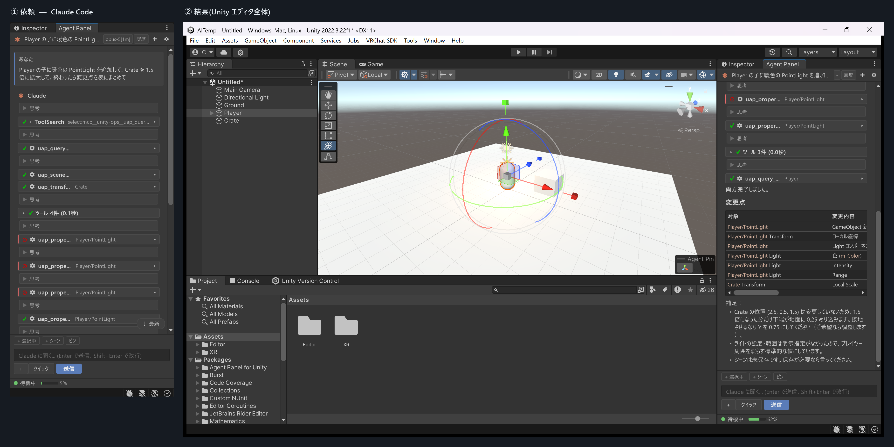
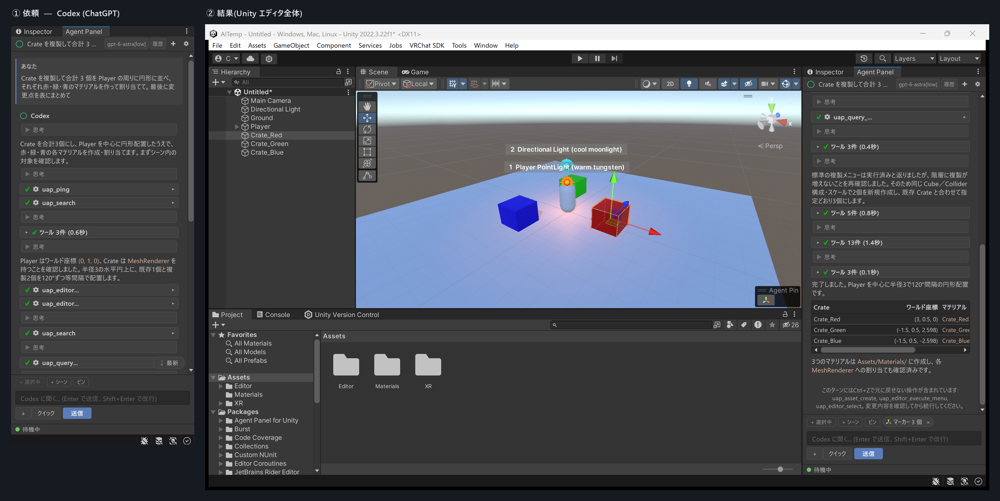
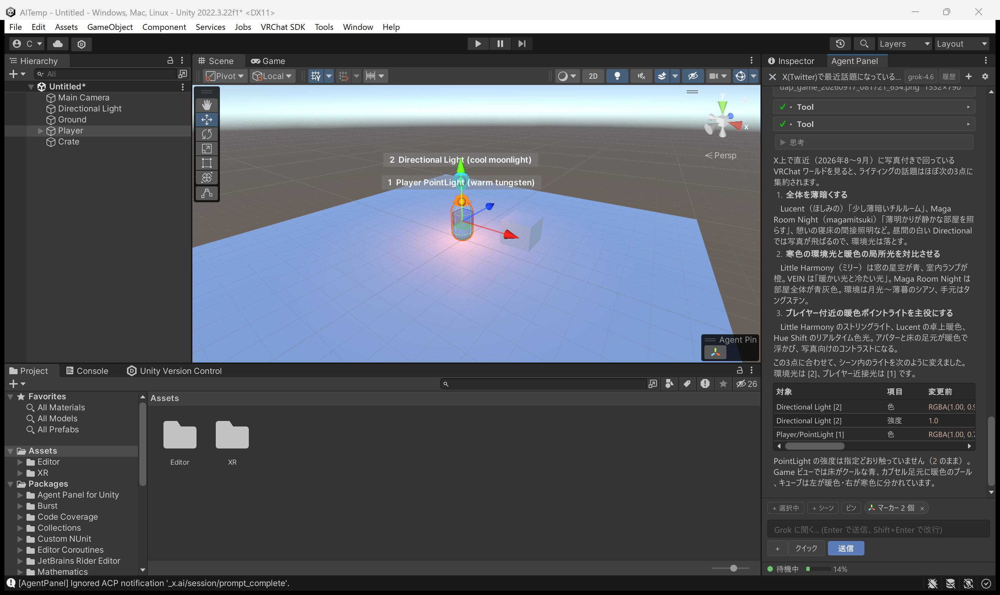
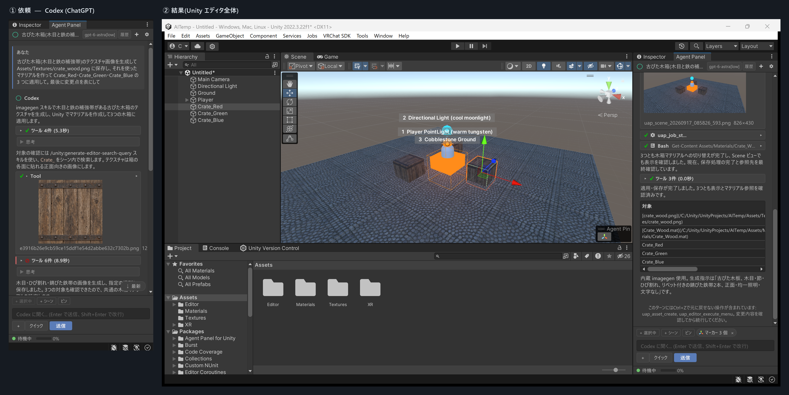
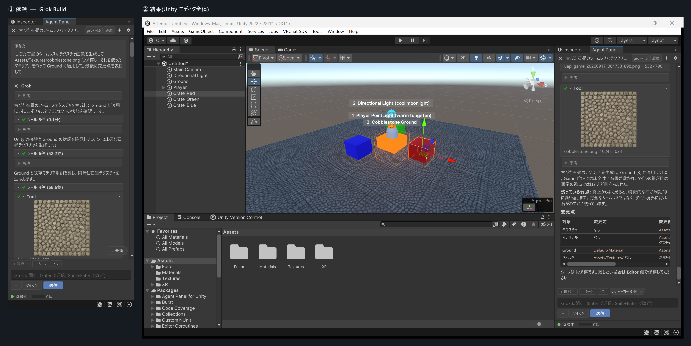
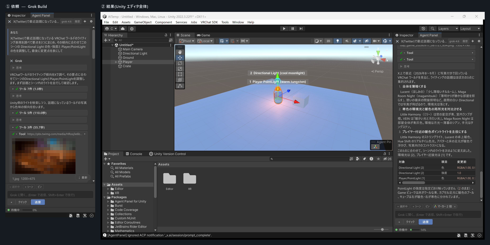

# エージェント別の使用例

*English: [AGENT-SHOWCASE.en.md](AGENT-SHOWCASE.en.md)*

[共通の使い方](#共通の使い方シーン編集と変更点の確認) · [画像生成](#画像生成素材を作ってシーンに適用) · [X 検索](#x-検索調べた内容を制作に活かす) · [切り替え方法](#エージェントを切り替えるには)

## 共通の使い方：シーン編集と変更点の確認

チャットからオブジェクトの配置・サイズ変更、マテリアルの適用、ライトの調整を依頼できます。

| | Claude Code | Codex | Grok Build |
|---|---|---|---|
| 操作例 | ライト追加・サイズ変更 | 配置・色分け | ライトの色・強度の調整 |
| 画面（クリックで拡大） |  |  |  |

## 画像生成・検索の使用例

### 画像生成：素材を作って、シーンに適用

生成したい素材と適用先をチャットで指定します。

#### Codex

#### Grok Build

### X 検索：調べた内容を制作に活かす

Grok Build に X で調べたい内容と編集したい箇所を指定すると、検索結果をもとにシーンを編集できます。

## エージェントを切り替えるには

1. **設定 > エージェント** を開き、使いたいエージェントを選択します。
2. CLI が未導入なら、同じカードの **インストール** から導入します。
3. 必要に応じて **サインイン** を済ませ、接続を確認して依頼を送ります。

**エージェントの選択は設定、接続先のモデルの選択はヘッダー。**

[導入・サインインの詳しい手順](USER-GUIDE.md#11-claude-以外のエージェントを使う) · [モデルの選択](USER-GUIDE.md#10-モデルの選択) · [インストール](../README.md#インストール)

## その他の対応エージェント

Gemini CLI や、Qwen Code・Kimi CLI などの ACP 対応 CLI も接続できます。Gemini CLI の利用条件と、その他の CLI の手動設定は [操作ガイド](USER-GUIDE.md#11-claude-以外のエージェントを使う)を確認してください。
