# Agent Panel for Unity 操作ガイド

Unity エディタ内でコーディングエージェント(Claude Code、Codex、Grok Build などの ACP 対応 CLI)を使うパネルの操作説明です。インストールと必要要件は
[README](../README.md) を参照してください。本文は既定の Claude Code を前提に書いています。他のエージェントへの切り替えは [1.1 節](#11-claude-以外のエージェントを使う) を参照してください。本文中の「」内はパネルに表示される日本語 UI の文言です
(設定 > パネル > 外観 の「言語」で English に切り替えられます)。

## 目次

1. [パネルを開く・初回セットアップ](#1-パネルを開く初回セットアップ)
   - [1.1 Claude 以外のエージェントを使う](#11-claude-以外のエージェントを使う)
2. [画面の構成](#2-画面の構成)
3. [チャットの基本操作](#3-チャットの基本操作)
4. [Unity のコンテキストを渡す(チップと添付)](#4-unity-のコンテキストを渡すチップと添付)
5. [権限カード(ツール実行の許可)](#5-権限カードツール実行の許可)
6. [自動承認レベル](#6-自動承認レベル)
7. [エージェントからの質問カード](#7-エージェントからの質問カード)
8. [ツールカードとサブエージェントカード](#8-ツールカードとサブエージェントカード)
9. [セッションと履歴](#9-セッションと履歴)
10. [モデルの選択](#10-モデルの選択)
11. [スラッシュコマンドとコンテキスト圧縮](#11-スラッシュコマンドとコンテキスト圧縮)
12. [Unity 操作ツール(UapOps)](#12-unity-操作ツールuapops)
13. [Scene ビューのマーカー・ピン・スケッチ](#13-scene-ビューのマーカーピンスケッチ)
14. [スクリプトの再コンパイル・Play モードとの共存](#14-スクリプトの再コンパイルplay-モードとの共存)
15. [設定画面リファレンス](#15-設定画面リファレンス)
16. [キーボードショートカット](#16-キーボードショートカット)
17. [困ったときは](#17-困ったときは)

---

## 1. パネルを開く・初回セットアップ

1. メニューの **Window > Agent Panel** を選びます。パネルは他のエディタウィンドウと同様にドッキングできます。
2. 初回は状態に応じてセットアップカードが表示されます。
   - **「Claude Code CLI が見つかりません」**: 「Claude Code をインストール」で CLI を入れるか(実行するコマンドは押す前に表示されます)、自分でインストールしてから「再検出」を押すか、「参照...」で `claude`(`claude.exe`)の実行ファイルを直接指定します。

     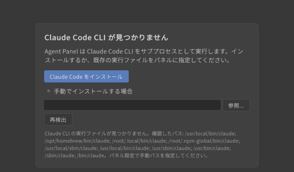

   - **「Claude にサインイン」**: 「ログイン」を押すと設定の「アカウント」カードが開き、「サインインURL」が表示されます。「ブラウザで開く」でブラウザ認証を済ませ、表示された認証コードを「認証コード」欄に貼り付けて「送信」します。完了するとパネルは自動的に再接続します。
   - ターミナルで `claude` を起動して `/login` する方法でもかまいません。その場合は完了後に「再確認」を押します。

     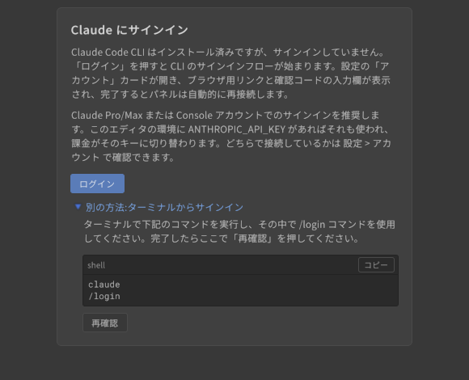

3. ステータスバーが「待機中」になれば準備完了です。

> サブスクリプションログインを推奨します。エディタの環境に `ANTHROPIC_API_KEY` があると CLI 自身の判断でそちらが使われ、従量課金の API 経由になります -- 設定 > エージェントに実際に使われている認証方式が表示されます。常にサブスクリプションを使いたい場合は同じ場所の「サインイン方式」を「サブスクリプションのみ」にしてください。

### 1.1 Claude 以外のエージェントを使う

Claude Code の代わりに、ACP(Agent Client Protocol)対応の CLI をパネルから使えます。切り替えは次の 3 ステップです。

1. 設定 > エージェント の **エージェント** で使うエージェントを選びます(v0.55.1 までは設定 > CLI にありました)。
2. CLI が入っていなければ、同じカードに出る **「インストール」** を押します(npm で入るものは Node.js が必要です。実行するコマンドは押す前に表示されます)。
3. サインインが必要なら **「サインイン」** を押します。Codex / Grok Build では、パネルが各 CLI のログインコマンド(`codex login` / `grok login`)をパネル内で実行し、ブラウザ用のリンクと CLI の出力を設定 > エージェント に表示します。コマンドが終わるとパネルが再接続し、実際に使われた方式が表示されます。ログインコマンドを持たないエージェントでは、エージェント自身のブラウザ手順が始まります(始まらないときは「再接続」)。

| エージェント | サインイン | API キーで使う場合 |
|---|---|---|
| **Codex** | ChatGPT アカウント(推奨) | 環境変数 `CODEX_API_KEY` または `OPENAI_API_KEY` |
| **Grok Build** | SuperGrok / X Premium+ のアカウント(推奨) | 環境変数 `XAI_API_KEY` |
| **その他の ACP 対応 CLI**(Qwen Code、Kimi CLI など) | CLI ごとの方法 | 起動コマンドと引数を設定 > エージェント > 詳細設定 に手入力します |

- API キーはパネルには保存しません。OS の環境変数か、各 CLI 自身の設定ファイルに置いてください。OS の環境変数はエディタを再起動しないと反映されません。
- 他のエージェントでも、権限カード・チップと添付・Unity 操作ツール・スクリプト検証ゲート・思考ブロック・履歴ブラウザ・パネル内ログイン・サブエージェントのモデル設定は同じように使えます。違いは次の 3 点です。
  - **履歴**: ACP エージェントの会話はパネル自身が `UserSettings/AgentPanel/Sessions/` に保存し、Claude Code のセッションと同じ一覧に(エージェント名付きで)並びます。`session/load` に対応していないエージェントは再開時に新しいセッションを開始し、次のメッセージと一緒にそれまでの会話ログを受け取ります(会話欄にその旨のノートが出ます)。
  - **サブエージェントのモデル設定**: 「サブエージェントモデルを強制固定」と「タイプ別の詳細設定」は、新しいセッションの最初に指示文として送られます(Claude Code のように環境変数や `.claude/agents` では渡せないため)。エージェントがサブエージェントのモデルを選べる場合にそれに従います。
  - **スクリプト検証ゲートのフック**(`PreToolUse` フック)は Claude Code 専用です。ACP ではパネル側の `uap_scripts_commit` ゲートだけが働きます。
- **Gemini CLI** は 2026-06-18 に個人向け(Google AI Pro / Ultra / 無料枠)の提供が終了し、Google は後継の Antigravity CLI への移行を案内しています。パネルの「Gemini CLI」プリセットは、Gemini API キー(`GEMINI_API_KEY` または `~/.gemini/.env`)か Gemini Code Assist Standard / Enterprise のライセンスを持っている場合にだけ使えます。新しく使い始める用途にはおすすめしません。

## 2. 画面の構成

```
┌──────────────────────────────────────────────┐
│ ヘッダー: セッション名 / モデルピッカー / 履歴 / + / ⚙ │
├──────────────────────────────────────────────┤
│ バナー(再接続中・中断・エラー時のみ)               │
├──────────────────────────────────────────────┤
│                                              │
│ 会話ログ(メッセージ・ツールカード・権限カード)      │
│                                              │
├──────────────────────────────────────────────┤
│ コンテキストバー: 選択オブジェクト / エラー などのチップ │
├──────────────────────────────────────────────┤
│ 入力欄  [クイック] [+]                  [送信/停止] │
├──────────────────────────────────────────────┤
│ ステータスバー: 状態 / モデル / コンテキスト% / トークン │
└──────────────────────────────────────────────┘
```

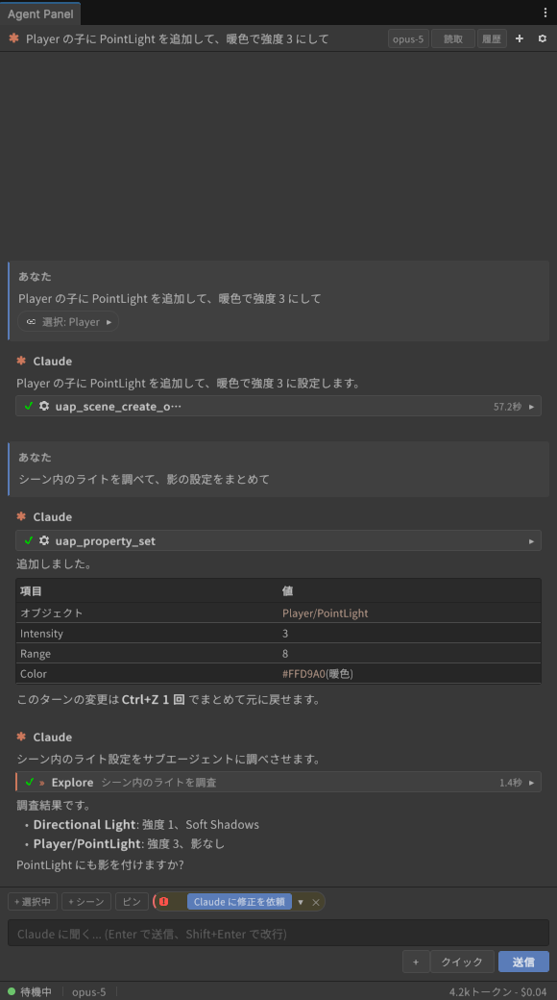

- **ヘッダー**: 現在のセッション名(既定は「新規セッション」)、モデルピッカー、「履歴」ボタン、新規セッション(+)、設定(⚙)。パネル幅が狭いときはモデルと自動承認レベルが 1 つのメニューにまとまります。
- **ステータスバー**: 「待機中」「応答中...」「ツール実行中...」「権限確認待ち」などの状態、使用中のモデル、コンテキストウィンドウの使用率、このセッションの累計トークン(設定でコスト表示も可)。トークン表示をクリックすると「このセッションの使用状況」ポップオーバーが開き、入力/出力/キャッシュの内訳が見られます。

## 3. チャットの基本操作

- 入力欄に依頼を書いて **Enter** で送信します(**Shift+Enter** で改行)。日本語入力の変換確定で誤送信する場合は、設定 > 会話 の「Ctrl+Enter で送信」を ON にしてください。
- 応答中は送信ボタンが「停止」に変わります。クリックまたは **Esc** でターンを中断できます。
- 応答中でも入力欄は使えます。Enter を押すと、実行中のターンにメッセージが追加送信されます(入力欄下のヒント「Enter で実行中のターンに送信 / Esc で停止」)。

  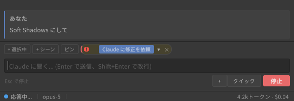
- Unity がコンパイル中のときはメッセージがキューに入り、コンパイル完了後に送信されます。
- **クイック** ボタンから、設定で登録した定型プロンプト(クイックアクション)を挿入できます。何も会話がない空状態では、同じクイックアクションが提案として表示されます。
- 応答の Markdown(見出し・リスト・表・コードブロック)はそのままレンダリングされます。コードブロックにはコピーボタンがあります。
- 応答中の `Assets/...` パスはリンクになり、クリックすると Project ウィンドウで該当アセットがハイライト(ping)されます。
- Claude の推論の要約は「思考」の折りたたみとして表示されます(設定 > 表示 の「思考ブロックを表示」)。

## 4. Unity のコンテキストを渡す(チップと添付)

コンテキストバーには、いまエージェントに渡せる情報がチップとして並びます。

| チップ | 出所 | 動作 |
|---|---|---|
| 選択オブジェクト | Hierarchy / Project で選択中のもの | 自動で表示。クリックで送信対象に含める/外す |
| コンソールエラー | Console のエラー | 自動で表示。クリックで「修正して」の依頼につなげられる。× で消すとそのエラーは恒久的に無視(設定 > コンソールエラー で解除) |
| ドロップしたアセット/オブジェクト | Project / Hierarchy からパネルへドラッグ&ドロップ | 添付チップとして会話に含まれる |
| 画像 | 入力欄横の **+** メニュー | 「画像ファイル...」「Scene ビュー」「Game ビュー」「Scene ビュー(表示のまま)」「クリップボードの画像を貼り付け」。PNG/JPEG のファイルをパネルへドロップしても添付できます |

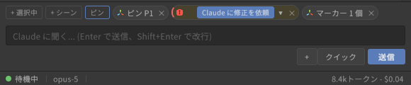

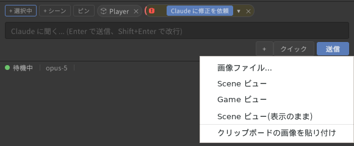

- チップと添付画像は、次に送る通常メッセージに含まれて消費されます。スラッシュコマンドを送っても消費されず、次のメッセージに持ち越されます。
- 送信されたメッセージには添付内容が折りたたみで残り、あとから確認できます。

## 5. 権限カード(ツール実行の許可)

ファイル編集・シェル実行・Unity 操作など副作用のあるツールをエージェントが使う前に、会話ログの末尾に権限カードが出ます(「Claude が Edit を使用しようとしています」など)。カードには編集内容の差分やコマンドの内容が表示されます(右端の ▾ で展開)。

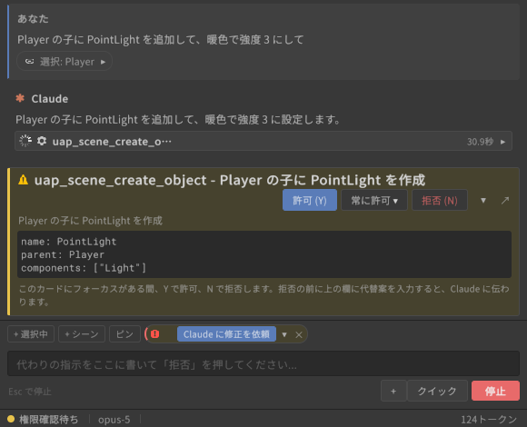

| ボタン | 動作 |
|---|---|
| **許可 (Y)** | この 1 回だけ許可 |
| **常に許可 ▾** | 範囲を選んでこのセッション中は確認なしにする。先頭に「このツールを常に許可」があり、続いて CLI が提案するパスやコマンド接頭辞つきの範囲、権限モードの切り替えが並ぶ |
| **拒否 (N)** | 拒否する。拒否前に入力欄(「代わりの指示があれば入力」)に代替案を書くと、それがエージェントに伝わる |

- カードにフォーカスがある間は **Y** / **N** キーで回答できます。
- パネルが狭い(幅や高さが一定未満)ときは、同じカードが自動的にフローティングウィンドウで開きます。ログには「権限確認を待っています - ウィンドウに表示中」と出るので、「ここに表示」でインラインに戻せます。
- カードを表示したままパネルをその大きさより小さくすると、カードは要約行 1 行に折りたたまれます(▸ で展開できます)。パネルを元の大きさに戻すと自動で展開に戻ります。
- 複数の要求が並んでいるときは「あと N 件待機中」と表示されます。回答すると次のカードが出ます。
- 権限待ちの間、パネルが非アクティブなら設定 > 通知 でビープ音を鳴らせます。

## 6. 自動承認レベル

毎回カードで確認する代わりに、ある範囲までを自動で許可できます。ヘッダー(狭幅時は「モデルと自動承認レベル」メニュー)または設定 > 会話 の「自動承認レベル」で選びます。

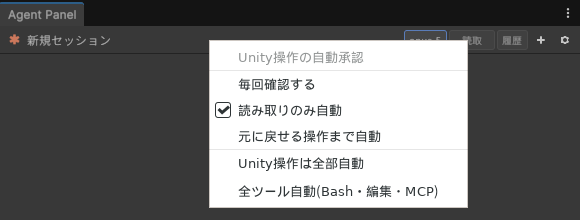

| レベル | 自動で許可される範囲 |
|---|---|
| **毎回確認する**(既定) | なし。すべてカードで確認 |
| **読み取りのみ自動** | 読み取り系のツール(ファイル読み取り、検索、Unity の inspect 系) |
| **元に戻せる操作まで自動** | 上記 + Undo で戻せる Unity 操作 |
| **Unity操作は全部自動** | 上記 + すべての `uap_*` Unity 操作。切り替え時に確認ダイアログが出ます |
| **全ツール自動(Bash・編集・MCP)** | Bash、ファイル編集、他の MCP サーバまで全部。エージェントからの質問だけは待ちます。切り替え時に確認が出ます |

- どのレベルでも、スクリプト検証ゲートによる自動拒否と、取り消せない操作の `confirm` ゲートは先に働きます。
- ターン終了時に Undo できない操作があった場合は警告のノートが出ます。
- 設定 > 危険な設定 の「すべての権限確認をスキップ(危険)」は CLI 側の確認を完全に止めるもので、通常は使いません。

## 7. エージェントからの質問カード

エージェントが方針を確認したいとき(AskUserQuestion)、選択肢つきの質問カードが出ます。

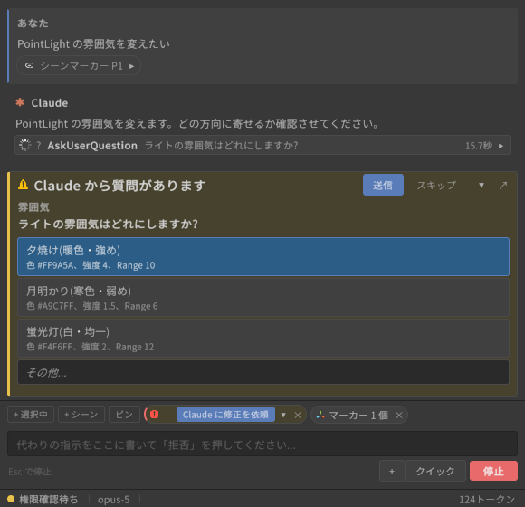

- 選択肢をクリックして「送信」します。複数の質問があるときはタブで 1 問ずつ答えます。
- 「その他...」を選ぶと自由回答欄が開きます。
- 「スキップ」で回答せずに続行できます。

## 8. ツールカードとサブエージェントカード

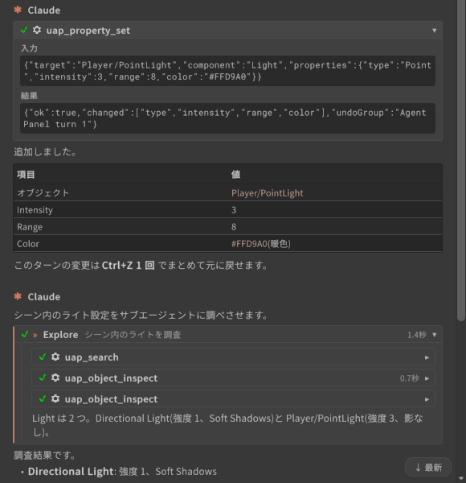

- **ツールカード**: エージェントが使ったツール(Read / Edit / Bash / `uap_*` など)は 1 行のカードになり、実行中はスピナー、完了で ✓、失敗で ✗ が付きます。クリックで展開すると「入力」「結果」「エラー」が見られます。完了済みカードが 3 つ以上続くと「ツール N件」のグループ行にまとまります。
- **ツールが返した画像**(エディタのスクリーンショット、PNG の Read、画像生成ツールの出力など)は、そのツールカードの見出し直下にサムネイルとして表示されます。クリックすると OS の既定アプリで開きます。
  - 表示されるのは、結果が名指ししたファイルが実在する場合と、結果に画像データが埋め込まれていた場合(`Library/AgentPanel/Attachments` に 7 日間保持)です。
  - 画像付きのカードは「ツール N件」のグループにはまとまりません。
- **サブエージェントカード**(Claude Code): Claude が Task ツールでサブエージェントを起動すると、入れ子のカードになります。進捗(実行中/完了/失敗)と内部のツール呼び出しはカードの中だけに表示され、上位の会話には混ざりません。設定 > 表示 の「サブエージェントカードを既定で展開」で初期状態を変えられます。
- 展開/折りたたみの状態は、会話が更新されても維持されます。

## 9. セッションと履歴

- **新規セッション**: ヘッダーの **+**。現在のセッションは履歴に残ります。入力欄で `/clear` を送っても同じです。
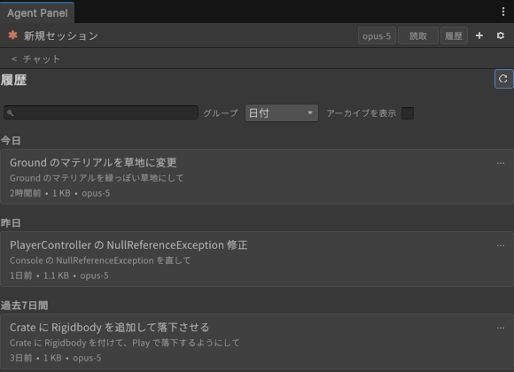

- **履歴を開く**: ヘッダーの「履歴」。このプロジェクトのセッション一覧が表示されます(Claude Code が保存したセッションと、パネルが保存した ACP エージェントのセッション。後者は行の末尾にエージェント名が付きます)。別のエージェントのセッションを開くと、そのエージェントに切り替えずに、現在のエージェントが新しいセッションで会話ログを引き継ぎます。
  - 上部の検索欄でタイトルや内容を検索できます。
  - 「グループ」で 日付 / シーン / プロジェクト / カスタムグループ の並べ替えを切り替えられます。
  - 行の右端のメニューから「開く」「ピン留め」「名前を変更...」「グループへ移動」(「新規グループ...」もここから)「アーカイブ」「削除...」ができます。「アーカイブを表示」でアーカイブ済みも一覧に出ます。
  - 行を選んで「切り替え」を押すと、そのセッションが `--resume` で復元され、会話ログが再表示されます。使用状況(トークン)や圧縮ノートも復元されます。
- セッション名は既定で会話の先頭から自動生成されます。「名前を変更...」で任意のタイトルに変え、「既定に戻す」で自動生成に戻せます。

## 10. モデルの選択

- **現在のセッションのモデル**: ヘッダーのモデルピッカー。接続後に CLI から取得したモデル一覧から選びます。切り替えは即時で、結果は会話ログのシステムノートで確認できます(「切り替えました」/「失敗しました」)。
  - 「+」や再接続の直後でまだ接続が完了していないときに選ぶと、接続が完了し次第このセッションに適用されます(ログに「接続の完了を待っています」と出ます)。

  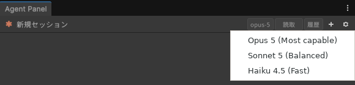
- **新規セッションの既定モデル**: 設定 > モデル の「デフォルトモデル」。
- **サブエージェント**: 設定 > モデル の「サブエージェントのコスト方針」で「おまかせ(推奨)」か「コスト重視: 単純作業は Haiku」を選びます。さらに「サブエージェントモデルを強制固定」や「タイプ別の詳細設定(上級)」でエージェント名ごとの上書きもできます。これらは新しいセッションから有効です。

## 11. スラッシュコマンドとコンテキスト圧縮

- 入力欄の先頭で `/` を打つと、CLI が提供するコマンドの候補ポップアップが開きます。**↑↓** で選択、**Tab** で補完、**Enter** で送信、**Esc** で閉じます。

  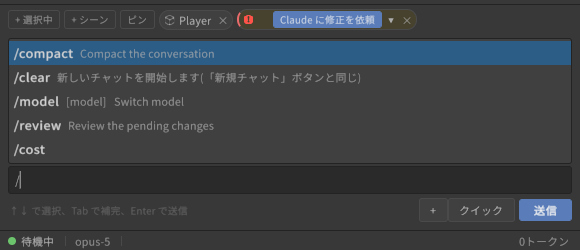
- `/compact` を送ると CLI がここまでの会話を要約し、会話ログの圧縮位置に「手動/自動」「圧縮前のトークン数」つきのノートが入ります。コンテキストが足りなくなって CLI が自動圧縮したときも同じノートが出ます。
- 圧縮直後はステータスバーのコンテキストメーターが「圧縮済み」になり、次のターンが完了すると実際の値に戻ります。
- コンテキストの残りが少なくなるとメーターが警告色になります。長い作業では区切りのよいところで `/compact` を送るとよいです。
- `/clear` はパネル内で処理され、新規セッションと同じ動作になります。

## 12. Unity 操作ツール(UapOps)

パネルは内蔵の MCP サーバ(ローカルループバック限定・トークン認証)を通じて、エージェントに Unity エディタを直接操作させることができます。設定 > Unity操作(UapOps) の「Unity操作(UapOps)を有効化」を ON にし、使うモジュールを選びます。

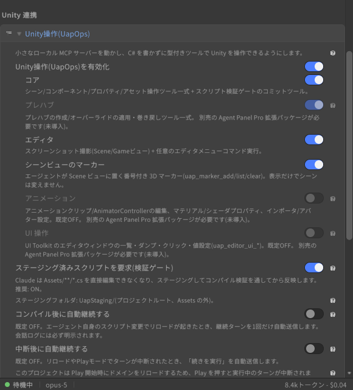

| モジュール | できること |
|---|---|
| **コア** | シーンオブジェクトの作成・検索・inspect、コンポーネント追加、プロパティ/Transform の設定、アセット操作、メニュー実行、スクリプトのステージングとコミット |
| **プレハブ**\*(Agent Panel Pro) | プレハブ作成、オーバーライドの一覧・適用(Apply)・巻き戻し(Revert)、Prefab Mode の開閉。プレハブの中身を編集したいときはステージを開きます(開いている間、他のツールはシーン名を省略するとそのステージを指します)。閉じると保留中の編集はプレハブに書き込まれます。既にプレハブインスタンスになっているものから作成すると Unity の仕様で Variant になり、結果にどちらを作ったかが出ます |
| **エディタ** | Scene / Game ビューのスクリーンショット、任意のエディタメニューの実行。ライトマップベイク(非同期・プリフライト診断)と Bakery GPU Lightmapper 連携\*(Agent Panel Pro) |
| **アニメーション**\*(Agent Panel Pro、既定 OFF) | AnimationClip 作成(float / GameObject の ON・OFF / スプライト等の差し替えカーブ、キー補間指定)、AnimatorController 編集(パラメータ/ステート/遷移/レイヤー/サブステートマシン/Entry・Exit/Write Defaults/Motion Time、遷移の詳細設定、要素の削除)、BlendTree(1D / 2D / Direct)の作成・編集、StateMachineBehaviour の付与・設定・削除、AvatarMask と AnimatorOverrideController の作成・編集、マテリアル/シェーダプロパティ、アセットプロパティ設定、インポータ設定 |
| **UI 操作**\*(Agent Panel Pro、既定 OFF) | UI Toolkit ウィンドウの一覧・ダンプ・クリック・値設定によるエディタ UI 自動操作 |
| **プロファイル作成**\*(Agent Panel Pro、既定 OFF) | このプロジェクト用の拡張プロファイル(`.uap-profiles/*.json`)の下書きと検証。導入済みパッケージの型を実際に走査して検出条件を書き、指示文だけを TODO として残します。作成しただけでは注入されず、拡張プロファイルの一覧での承認が必要です。Claude Code のスキル(`.claude/skills/<name>/SKILL.md`)の書き出しも同じモジュールです |
| **アバター計測**\*(Agent Panel Pro、既定 OFF) | アバターの三角形数・マテリアルスロット・レンダラ・ボーン・ブレンドシェイプ・PhysBone / Contact / Constraint・欠損スクリプトを計測。2 つ目の階層(ベイク済みクローンなど)を渡すと統計ごとの差分を返します。VRChat SDK があれば PC / Quest のパフォーマンスランクも読み取ります。NDMF の manual bake を実行してクローンとの差分まで一度に出すこともできます(生成物を書くため確認付き)。エキスプレッションメニューとパラメータの読み書きもこのモジュールで、書き込み前に VRChat SDK の規則(1 メニューのコントロール上限、256 bit の同期パラメータ予算、パペットの軸パラメータ数、存在しないパラメータを指すコントロール)を全件検証します |
| **一括実行**\*(Agent Panel Pro、既定 OFF) | 複数の Unity 操作を 1 回の呼び出し・1 枚の許可カードでまとめて実行します。実行前に全件を検証するため、1 件でも不正なら何も実行されません。破壊的な操作(プレハブの Apply など)と、OFF にしているモジュールのツールは含められません |
| **テスト実行**\*(Agent Panel Pro、既定 OFF) | プロジェクトの EditMode テストを Unity Test Runner で実行し、失敗したテストの名前・メッセージ・スタックを返します。アセンブリ名・正規表現・テスト完全名・カテゴリで絞れます。実行せずに「どんなテストがあるか」だけを返すこともできます(フィルタを当てずっぽうで書かずに済みます)。フィルタが 1 件も当たらなかった実行は「0 件」として報告されます(Test Runner 自身はそれを成功として報告するため)。PlayMode には対応していません。この行は `com.unity.test-framework` が入っているプロジェクトでのみ有効になります |
| **パーティクル**\*(Agent Panel Pro、既定 OFF) | Particle System のモジュールをスクリプト上の名前(`main` / `emission` / `shape` / `colorOverLifetime` ...)で読み書きします。シリアライズ名は別物(Inspector の「Main」はファイル上 `InitialModule`、Duration はそこに無く最上位の `lengthInSec`、形状は enum 名の無いただの整数)なので、そちらを覚える必要はありません。カーブ値はモードを値と同時に決めるため「数値のつもりがカーブの倍率になっていた」が起きず、OFF のモジュールへの書き込み(Unity は受け付けたうえで何もしません)と、もう効果の無い古いプロパティは拒否します。バーストの設定もここから行えます |
| **メッシュ生成**\*(Agent Panel Pro、既定 OFF) | コンパイル不要のメッシュ操作 4 本。`uap_mesh_create` は数値からメッシュを生成します: 箱・平面・円柱・円錐・球・トーラス・階段、XZ 外形の押し出し、XY プロファイルの回転体、SDF ツリー(球・箱・カプセル・円柱・トーラス・楕円体を union / intersect / subtract で合成、`smooth` で継ぎ目を丸める = 有機的な形と滑らかなブーリアン)、頂点列そのまま(`raw`)。`assetPath` で Mesh アセットに保存、`place` で MeshFilter + MeshRenderer(任意で MeshCollider)を持つ GameObject までシーンに作ります。`uap_mesh_inspect` は既存メッシュの頂点数・bounds・保存場所・閉じているかを返し、範囲内や最寄りの頂点を一覧します。`uap_mesh_edit` は既存メッシュを範囲(球 + 減衰 = プロポーショナル編集、箱、全体)で編集します: 移動・膨らませ・平滑化・細分化・ノイズ。Unity 組み込みやインポート済みのメッシュは `detach:true` でコピーしてから編集します。`uap_mesh_boolean` は閉じた 2 メッシュの union / intersect / subtract を新しいメッシュとして作ります(入力は変更しません)。生成系は新規作成のみで既存アセットを上書きしません。`uap_mesh_validate` は退化・重複三角形、非多様体エッジ、巻き方向の食い違い、開いた辺(意図的なことが多いので既定では情報扱い)、法線の向き違い、内向きに揃った面(スカイボックスなどは情報扱い)、同一平面の重なりを重大度つきで報告し、`uap_mesh_repair` はそれらを選んで修復します(既定は形を変えない安全な組み合わせ。溶接・重なり除去・穴埋めはオプトイン、Ctrl+Z 可)。`uap_scene_zfight_scan` はシーン内の別オブジェクト同士で同一平面に重なる面(Z ファイティング)を一覧し、対処案を示します。`place.checkZFight: true` で配置直後の照合もできます |
| **シーンビューのマーカー** | Scene ビューに番号付き 3D マーカーを置く(表示のみ。シーンは変更しない) |
| **Web 取得** | エージェントが URL の中身を取得する `uap_web_fetch`。PNG / JPEG は縮小して画像として返し(ツールカードにサムネイル)、GIF / WebP はそのまま、PDF やその他のファイルは `Library/AgentPanel/Downloads/` に保存してパスを返し(Claude Code は `Read` で PDF を読めます。`as:"text"` や `pages:"1-5"` を付けるとパネル側で本文テキストを抽出して返すので、PDF を読めないエージェントでも中身が分かります。レイアウトは平坦化され、画像やスキャンだけのページは空になります)、HTML は本文テキストとページ内の画像 URL・リンク URL の一覧にします。エージェント自身の Web 取得ツールはテキストしか返せないため、「検索で見つけた画像や PDF を見せる」にはこちらを使います。`save_to` を付けると `Assets/` 配下に直接保存してインポートします(「このテクスチャを取ってきてマテリアルに貼って」が 1 手で済みます。既存ファイルは `overwrite` 指定がなければ上書きしません)。公開ホストのみ(localhost・LAN・リンクローカルは拒否)、20 MB まで、Cookie や認証ヘッダは送りません。設定の「許可するホスト」「拒否するホスト」(1 行 1 ホスト、サブドメイン含む)で取得先をさらに絞れます。同じモジュールの `uap_web_search` は、自前の Web 検索を持たないエージェント向けの検索です。設定の「検索プロバイダ」(Brave Search API / Tavily)と「検索 API キー」を入れると使え、タイトル・URL・スニペットを返します(キーが無いときはその旨をエージェントに伝えるだけで、外部には何も送りません)。プロジェクトは変更しませんが外部へ通信するため、読み取り専用の自動承認の対象外で、毎回 URL を示した権限カードが出ます(「常に許可」で省略できます) |

\* 印のモジュールは別売パッケージ Agent Panel Pro(`jp.colloid.agent-panel-pro`)が必要です。未導入の間は該当トグルが無効化され、ヒントに「別売の Agent Panel Pro 拡張パッケージが必要です(未導入)」と出ます。Pro の導入は 設定 > Agent Panel Pro の更新([15 章](#15-設定画面リファレンス))に購入時のレジストリ URL と製品キーを入れるだけで、次のドメインリロード後にトグルが有効になります。印のないモジュールは Core だけで使えます。

使い方のポイント:

- 依頼は普通の言葉でかまいません(例: 「選択中のオブジェクトの子に PointLight を追加して強度を 3 にして」)。エージェントが対応する `uap_*` ツールを選び、権限カードを経て実行します。
- **Undo**: 1 ターン分の Unity 操作は Ctrl+Z 1 回でまとめて元に戻せます。
- **スクリプト検証ゲート**(「ステージング済みスクリプトを要求(検証ゲート)」): エージェントが書く C# はまず一時フォルダに置かれ、コンパイルが通ったものだけが `Assets/` に入ります。壊れたコードでドメインリロードが起きることはなく、コンパイルエラーはエージェントに返って自己修正されます。フック層は Windows のみで動作します。
- **取り消せない操作**(アセット削除、Pro ではプレハブへの Apply も)は、エージェントが `confirm:true` を付けるまで実行されず、影響範囲(削除対象、他のインスタンス数)だけが返ります。実行前に会話で内容を確認してください。
- **時間のかかる操作**(Pro のライトマップベイクなど)はジョブになり、エージェントが `uap_job_status` で後から結果を取得します。Editor が処理中でも応答は返ります。
- **拡張プロファイル**(設定 > 拡張プロファイル): 検出したサードパーティ SDK の要点をエージェントの指示に追加します。
  - プロジェクト独自のプロファイル(プロジェクト直下の `.uap-profiles/*.json`)は Core だけで使えます。「確認して承認」で全文を確認してから有効になります。
  - VRChat SDK3(共通 / アバター / ワールド)/ Udon / UdonSharp / NDMF / Modular Avatar / VRCFury / Avatar Optimizer / lilycalInventory / lilToon / UniVRM / MagicaCloth2 / Final IK / Bakery / RPG Maker Unite / ProBuilder を自動検出する同梱プロファイルは Pro に収録されています。Pro 未導入のプロジェクトでは、対応 SDK が入っていても検出されず、その旨がこの欄に表示されます。
- **uLoop 連携**(設定 > uLoop連携): [uLoopMCP](https://github.com/hatayama/uLoopMCP) を導入しているプロジェクトでは、「uloopコマンドを許可」で権限ルールを、「指示スニペットを挿入」でカスタム指示を追加できます。未導入なら「uLoopを導入」から導入できます(変更内容を確認してから実行)。

## 13. Scene ビューのマーカー・ピン・スケッチ

エージェントに「ここ」を伝える道具が 3 つあります。エージェント側が置く**マーカー**と、あなたが置く**ピン**、あなたが描く**スケッチ(線)**です。ピンとスケッチは Scene ビューの **Agent Tools** ツールバーかコンテキストバーから使います。

### 13.1 エージェントからのマーカー

位置を示したいとき、エージェントは Scene ビューに球・矢印・ワイヤ箱・折れ線・ラベルなどの番号付きマーカーを置きます(`uap_marker_add` / `uap_marker_list` / `uap_marker_clear`)。マーカーは表示だけでシーンには保存されません。コンテキストバーの「マーカー N 個」チップの × でまとめて消せます。

### 13.2 Agent Tools ツールバー

Scene ビューの右下に「Agent Tools」というツールバーが出ます。左からピン / 平面に描く / 表面に描くの 3 つのトグルで、点灯するのは常に 1 つだけです(片方を選ぶともう片方は解除されます。同じ左クリックを取り合うためです)。コンテキストバーの「ピン」ボタンと「スケッチ」メニューも同じ状態を動かすので、どちらから入っても同じです。

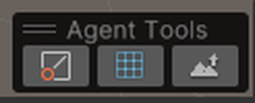

- ほかのオーバーレイと同じく、ヘッダーをドラッグして好きな場所に移せます。Scene ビュー右上の ⋮ > Overlays(または `` ` `` キー)のオーバーレイメニューで非表示にもできます。非表示にしてもパネル側のボタンは使えます。
- **Esc** でどのモードも抜けます。

### 13.3 ピン

1. ツールバーのピントグル(またはコンテキストバーの「ピン」)を押します。カーソルの下に、置かれる位置の**プレビュー**(球と足元の円)が出ます。
2. Scene ビューを左クリックすると、その位置にピン(P1, P2, ...)が置かれ、コンテキストバーに「ピン P1」チップが出ます。チップは次の送信でエージェントに渡り、ワールド座標・クリックしたオブジェクト・近くのオブジェクト・Scene カメラの位置が伝わります。
3. 1 本置くとモードは自動で終わります。**Shift** を押しながらクリックすると連続で置けます。

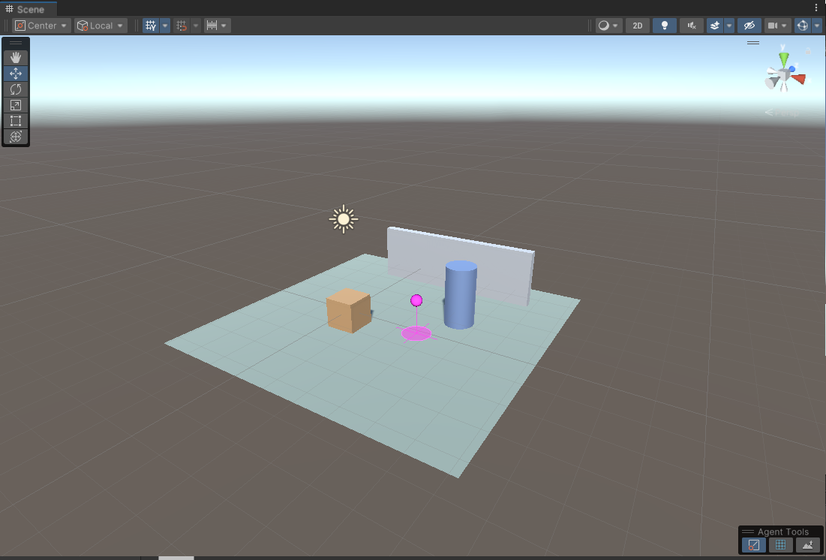

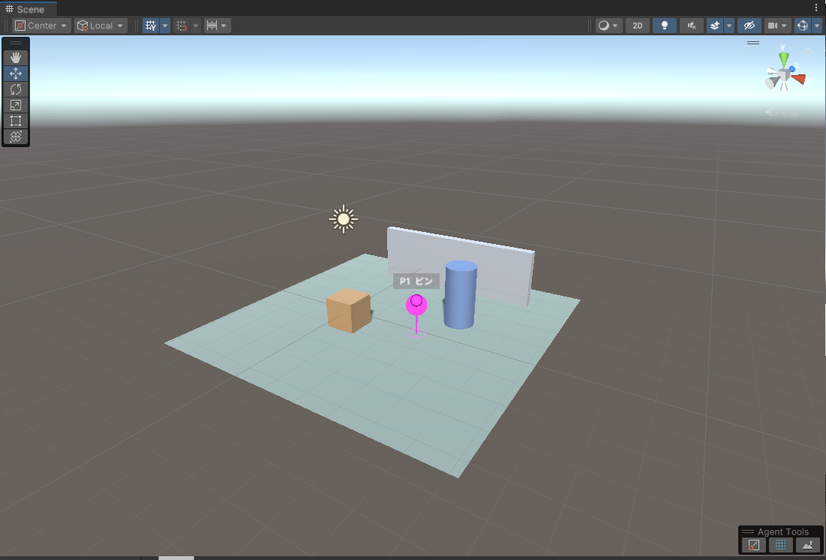

### 13.4 スケッチ(線)

平面か表面のトグル(またはコンテキストバーの「スケッチ」メニュー)で描画モードに入り、Scene ビューを**左ドラッグ**すると線(S1, S2, ...)が描けます。線はコンテキストバーに「スケッチ S1」チップとして出て、点列としてエージェントに渡ります(エージェントは `uap_stroke_list` で全点・法線・描いたオブジェクト・長さ・閉じているか・スケッチ平面を JSON で読めます)。描いた線は保存前に間引かれます(長さの 0.5% 未満の凹凸は落ちます)。

**平面に描く**は、先に深度を決めた平面に描きます。上に平面の深度・軸と、カーソル下の面が平面の何 m 前 / 後ろかの読み出しが出ます。平面が周囲のオブジェクトを切る位置に水色の**輪郭線**、カーソルの周りに深度テスト付きの**格子**が出るので、どの奥行きに平面があるかが分かります。

| キー | 働き |
|---|---|
| ホイール / `[` `]` | 深度を前後に |
| **F** | カーソル下の面の深度に合わせる |
| **X** / **Y** / **Z** | ワールド軸に固定した平面にする |
| **C** | カメラ正対の平面に戻す |
| **Shift** + ドラッグ | 直線 |

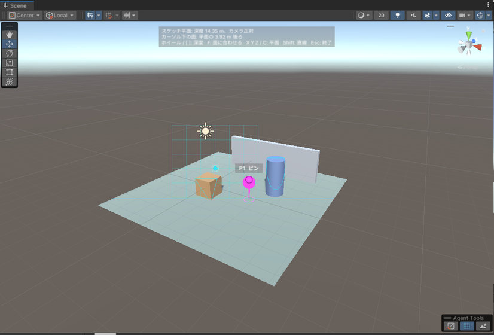


**表面に描く**は、カーソル下のメッシュ表面に沿って描きます。描いたオブジェクトと各点の法線も一緒に伝わるので、「この面のここ」を渡すのに向きます。

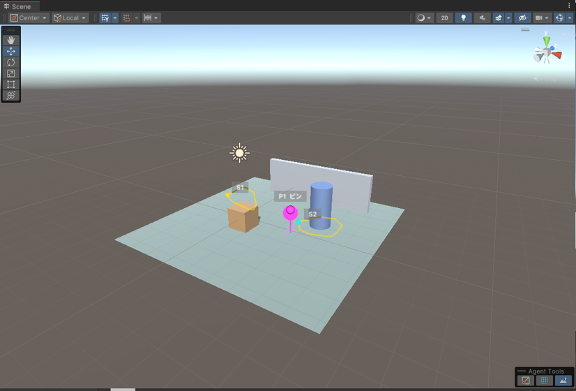

Pro のメッシュツールはこの線をそのまま使えます: 線に沿って溝を掘る / 盛り上げる(`uap_mesh_edit`)、線に沿ったチューブや、閉じた線の外形で穴をあける・板を貼る(`uap_mesh_create` の `sdf` / `extrude`)。

### 13.5 チップと片づけ

置いたピンと描いた線は、コンテキストバーの「ピン P1」「スケッチ S1」チップになり、× で個別に消せます。「マーカー N 個」の数と「Scene ビューのマーカーとピンをすべて消す」はピンとスケッチも含みます。ピンとスケッチはドメインリロードを越えて残り、シーンの切替や Play で消えます。

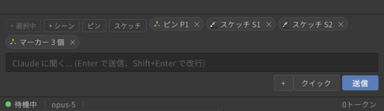

### 13.6 使用例: ピンとスケッチで「ここ」を伝える

上の図の状態(ピン P1、平面スケッチ S1、表面スケッチ S2)で、こう頼みます。番号はチップのものをそのまま書けば通じます。

> ピン P1 の位置に暖色の PointLight を置いて。スケッチ S1 の線に沿って小さな Sphere を 4 個等間隔に並べて、S2 の閉じた線の内側の中心にラベル「ここ」のマーカーを置いて。最後に置いたものを表にまとめて。

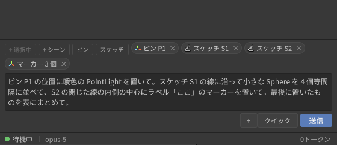

送信すると、依頼文の後ろにチップの中身が付いてエージェントに届きます。たとえばピン P1 はこう伝わります。

```text
[1] Scene marker P1 (user-placed pin in the Scene view)
  world position: (2.20, -0.50, 0.61)
  hit object: Ground
  nearest objects: Ground (1.3m), Barrel (1.9m), Crate (2.3m)
  scene view camera: position (8.76, 6.40, -10.12), pivot (1.50, 0.30, 1.50)
```

スケッチは点列・長さ・閉じているか・平面(平面モード)/ 描いたオブジェクト(表面モード)が付き、点が多いときは `uap_stroke_list` で法線付きの全点を読めます。この例でエージェントが受け取る全文と、`uap_marker_list` / `uap_stroke_list` の出力は [docs/examples/agent-tools-request.md](examples/agent-tools-request.md) にそのまま載せています。

## 14. スクリプトの再コンパイル・Play モードとの共存

- スクリプトを変更するとドメインリロードが起きますが、パネルは直前に CLI プロセスを終了してセッション ID を保存し、リロード後に同じセッションへ自動で再接続します(バナー「前回のセッションに再接続しています...」→「セッションを再開しました。」)。エディタを再起動しても同様に前回のセッションが復元されます。
- ターンの途中でリロードが起きた場合は「直前のターンはスクリプトの再読み込みにより中断されました。」のバナーが出ます。「続行」を押すとエージェントが続きを実行します。

  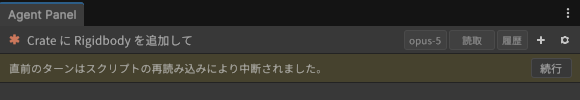
- Play モードの出入りやスクリプト保存後のフォーカス復帰で頻繁に中断される場合は、設定 > Unity操作(UapOps) の「中断後に自動継続する」を ON にすると、パネルが自動で「続行」を送ります(会話ログに明示されます)。回数の上限はありません。止まるのは、CLI プロセスが 4 回続けて終了して再接続が停止したとき(下記の「再接続」バナー)と、あなたが停止ボタンを押したときだけです。
- エージェントが C# を書いた後のコンパイル完了を待って作業を続けさせたいときは、同じ場所の「コンパイル後に自動継続する」を使います。継続ターンがさらにスクリプトをコミットした場合も、そのリロード後に再び継続するので、書く→コンパイル→エラーを直す のループを無人で回せます。回数の上限はなく、止まる条件は「中断後に自動継続する」と同じです(エージェントがコミットをやめたとき、再接続が停止したとき、停止ボタンを押したとき)。
- Play モード中に Unity 操作ツールがタイムアウトする場合は、Project Settings > Editor の "Enter Play Mode Settings" を見直してください(設定に「Project Settings > Editor を開く」ボタンがあります)。
- CLI プロセスが落ちると「エージェントのプロセスが終了しました。」のバナーとヘッダーの再接続ボタンが出ます。3 回までは自動で再接続し、4 回続けて落ちると自動再接続を止めて「再接続」を待ちます([17 章](#17-困ったときは))。

## 15. 設定画面リファレンス

ヘッダーの ⚙ で開きます。設定は 5 つのタブに分かれ、最後に見ていたタブがエディタを閉じるまで記憶されます。

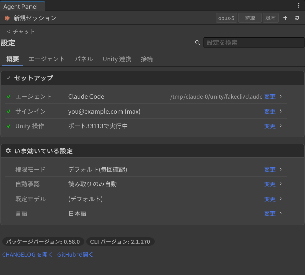

項目名がうろ覚えなら、タイトル右の検索欄に語を入れると全タブから一致する行だけが「タブ > カード」付きで並びます(Esc で戻る)。多くの項目は即時に反映され、再接続が必要なものは上部に「一部の変更は次回の再接続後に適用されます。」と表示されて、ターンが終わると自動的に適用されます(「今すぐ再接続」で即時にも可)。

| タブ | 用途 |
|---|---|
| **概要** | 現在の状態を見る場所。設定項目そのものは置かず、各行の「変更」で本来の場所へ移動します |
| **エージェント** | 会話しながら変えるもの(権限、モデル、指示文、定型プロンプト) |
| **パネル** | パネルの見た目と通知 |
| **Unity 連携** | エディタ側の機構(Unity 操作、拡張プロファイル、uLoop、公式プラグイン) |
| **接続** | エージェントの選択・検出・サインイン、CLI の出力、Agent Panel Pro の更新 |

| タブ > カード | 主な項目 |
|---|---|
| **概要 > セットアップ** | エージェント(選択中のエージェントと解決した実行ファイル。見つからなければ「設定する」)、サインイン(メール / プラン。未サインインなら「サインイン」でログインを開始して接続タブへ)、Unity 操作(ポート / オフ。オフなら「有効にする」) |
| **概要 > いま効いている設定** | 権限モード、自動承認、既定モデル、言語。「すべての権限確認をスキップ」が ON のときは先頭に赤い行が出ます。下にパッケージ / CLI のバージョンと CHANGELOG・GitHub へのリンク |
| **エージェント > 会話** | 権限モード(デフォルト / プランモード / 編集を自動承認)、自動承認レベル、Ctrl+Enter で送信、「ツールの許可・禁止リスト」の折りたたみ(許可するツール / 禁止するツール。行末に件数) |
| **エージェント > モデル** | デフォルトモデル、サブエージェントのコスト方針、サブエージェントモデルを強制固定、タイプ別の詳細設定(上級)。ACP エージェントでは後者 2 つが指示文として新しいセッションの最初に送られる旨のヒントが出ます |
| **エージェント > カスタム指示** | システムプロンプトに追記する定常指示(例: 「常に日本語で回答して」) |
| **エージェント > クイックアクション** | ラベルとプロンプトの組を登録。「クイック」メニューと空状態の提案に出る |
| **エージェント > 危険な設定** | タブ末尾の折りたたみカード。「すべての権限確認をスキップ(危険)」。ON の間だけカードが警告色になります |
| **パネル > 表示** | 思考ブロックを表示、サブエージェントカードを既定で展開、USD でコストを表示 |
| **パネル > 外観** | 言語(自動 / 日本語 / English)、フォントサイズ、CJK 対応フォントを優先する、検出されたフォント(UITK Font Fix 経由かどうか) |
| **パネル > 通知** | 権限リクエスト時 / ターン完了時のビープ音(パネル非フォーカス時のみ) |
| **パネル > コンソールエラー** | 無視パターン(1 行 1 つ)、無視リストの管理 |
| **Unity 連携 > Unity操作(UapOps)** | 有効化、「モジュール」の折りたたみ(コア / プレハブ / エディタ / シーンビューのマーカー / Web 取得とその許可 / 拒否ホスト・検索プロバイダ / アニメーション / UI 操作 / プロファイル作成 / アバター計測 / 一括実行 / テスト実行 / パーティクル / メッシュ生成。行末に「N / 13 オン」)、検証ゲート、コンパイル後に自動継続する、中断後に自動継続する、Play モードのリロード設定のヒント、自動承認レベルへのリンク、サーバ状態(「ポート N で実行中」) |
| **Unity 連携 > 拡張プロファイル** | 有効化、検出された SDK の一覧と承認/取り消し、プロファイルが無い導入済みパッケージの一覧と「下書きを頼む文をコピー」(Pro 導入時のみ) |
| **Unity 連携 > uLoop連携** | uLoop を導入、uloop コマンドを許可、指示スニペットを挿入 |
| **Unity 連携 > Unity 公式プラグイン** | Unity 公式の Claude Code プラグインの検出と導入 |
| **接続 > エージェント** | エージェント(Claude Code / Gemini CLI / Codex / Grok Build / その他の ACP エージェント)、解決結果とインストール、サインイン状態(メール/プラン、実際に使われた認証方式)、サインイン方式、ログイン / サインイン / アカウントを切り替え / ログアウト、詳細設定(実行ファイルのパス、または起動コマンドと引数。未検出のとき自動で開く)、再接続 |
| **接続 > CLI の出力(stderr)** | 最近の CLI の stderr(コピー / クリア) |
| **接続 > Agent Panel Pro の更新** | 購入時のレジストリ URL と製品キー。「キーを保存」で `~/.upmconfig.toml`(または `UPM_USER_CONFIG_DIR`)にトークンを、`Packages/manifest.json` に scoped registry を書き込み、以後 Package Manager の My Registries から Pro を導入・更新できる。「VCC / ALCOM に追加」は同じキーで VPM リポジトリを VRChat Creator Companion / ALCOM に登録する。パネルはキーを保存しない。ベータ版も受け取りたいときはレジストリ URL の `/npm` の前に `/beta` を入れる(`https://<host>/beta/npm`) |

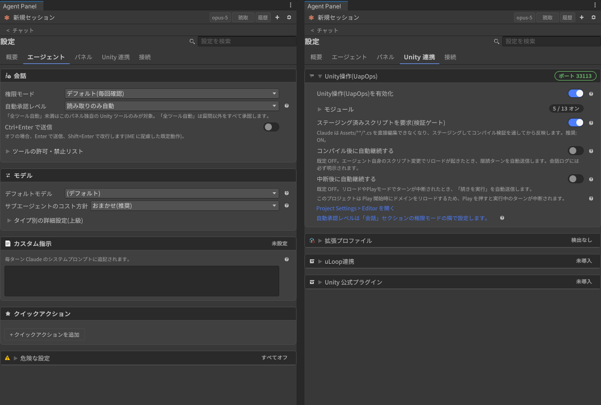

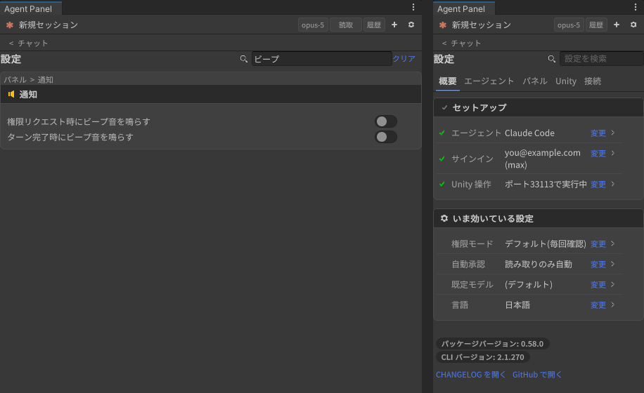

Unity 連携と接続の各カード、およびエージェントタブの「危険な設定」は折りたたまれた状態で始まります。見出しをクリックすると開きます。各カードの見出し右端には現在の状態が 1 語で出ます(「ポート 46673」「サインイン済み」「未設定」「3 件」など)ので、開かなくても状態が分かります。項目の説明が長いものは行末の「?」に入っています。パネル幅が狭いときはタブ名が短縮表示(「Unity」「接続」)になります。

## 16. キーボードショートカット

| 場面 | キー | 動作 |
|---|---|---|
| 入力欄 | Enter | 送信(設定で Ctrl+Enter に変更可) |
| 入力欄 | Shift+Enter | 改行 |
| 入力欄 | Esc | 実行中のターンを停止 |
| スラッシュ候補 | ↑ / ↓ / Tab / Enter / Esc | 選択 / 補完 / 送信 / 閉じる |
| 権限カード(フォーカス時) | Y / N | 許可 / 拒否 |
| Scene ビュー(ピン配置中) | 左クリック / Shift+クリック / Esc | 配置 / 連続配置 / 中止 |
| Scene ビュー(スケッチ中) | 左ドラッグ / Shift+ドラッグ / Esc | 描く / 直線 / 終了 |
| Scene ビュー(平面スケッチ中) | ホイール, `[` `]` / F / X, Y, Z / C | 深度 / 面に合わせる / 軸平面 / カメラ正対 |
| Unity | Ctrl+Z | 直前のターンの Unity 操作をまとめて取り消し |

## 17. 困ったときは

| 症状 | 確認すること |
|---|---|
| ステータスが「CLI が見つかりません」 | 設定 > エージェント > 詳細設定 で実行ファイルのパスを指定(見つからない間は自動で開きます) |
| 「接続中...(通常より時間がかかっています)」のまま | ログイン状態(設定 > エージェント。`ANTHROPIC_API_KEY` があるとそちらが優先されるので実際の認証方式もここで確認)、設定 > CLI の出力(stderr) |
| 権限カードが多すぎる | 「常に許可」のツール単位ルール、または自動承認レベルを上げる |
| 日本語がまだら太字・□になる | 設定 > 外観 で CJK フォントを優先、または UITK Font Fix を導入 |
| エラーチップを消してしまった | 設定 > コンソールエラー で無視リストから解除 |
| Unity 操作ツールが「メインスレッド待ちタイムアウト」になる | Editor がフォーカスを失っている / Play モード中。Editor に戻すか、エージェントに `uap_job_status` で結果を取らせる |
| エディタ終了後に `claude` プロセスが残る | 次回パネル起動時に自動で終了されます |
| 「エージェントのプロセスが繰り返し終了しました。自動再接続を停止しました。」 | CLI が 4 回続けて落ちた状態。ターミナルで `claude` が起動できるか(ログイン切れ、CLI の更新失敗など)を確認してから、バナーかヘッダーの「再接続」を押す |

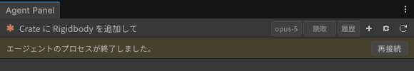

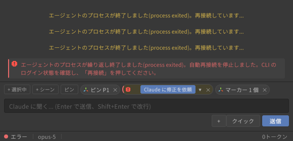

上記で解決しないときは、設定 > CLI の出力(stderr) と再現手順を添えて
[GitHub Issues](https://github.com/c-colloid/AgentPanelForUnity/issues) に報告してください。
