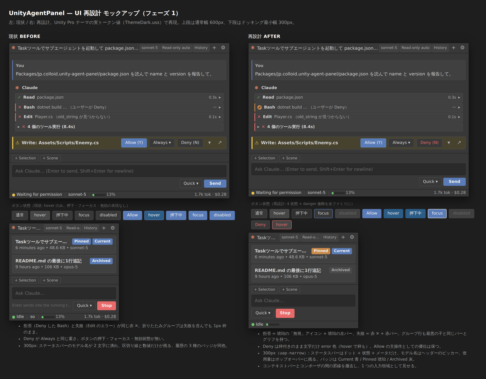
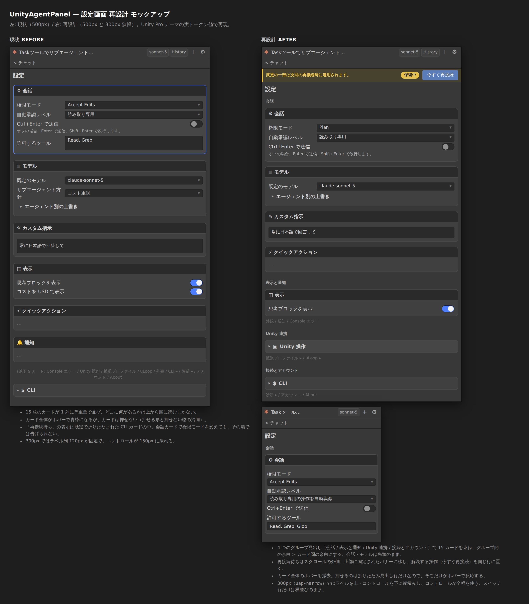
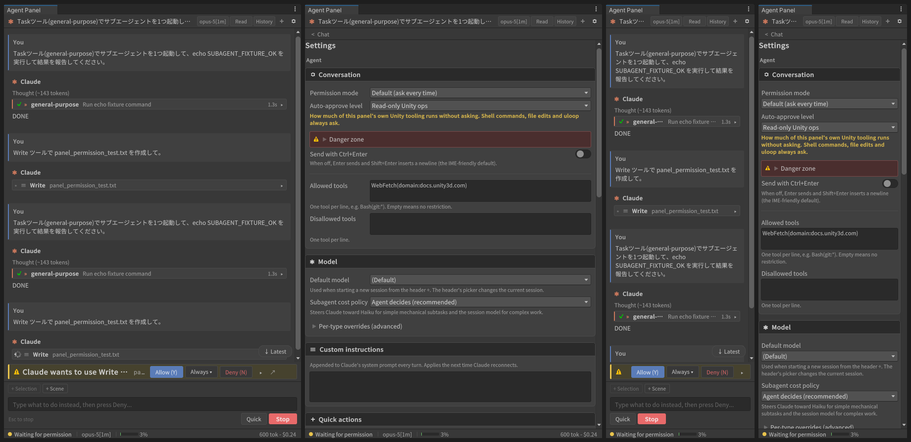
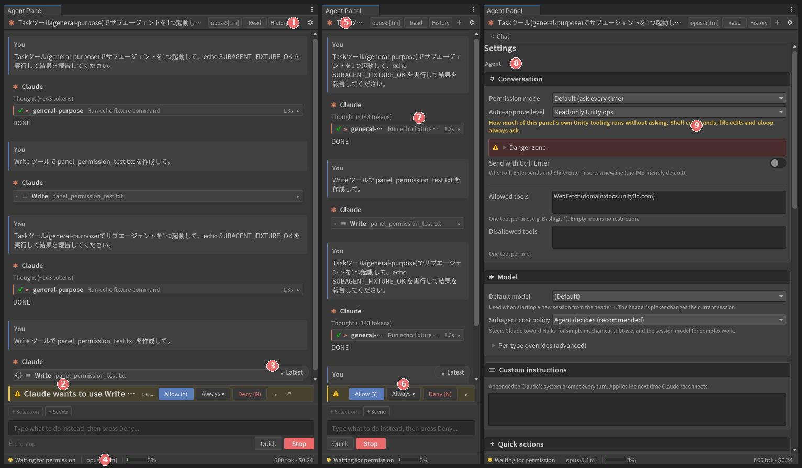
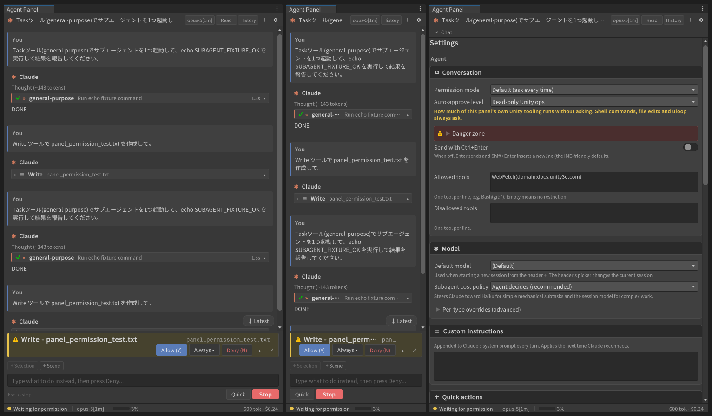
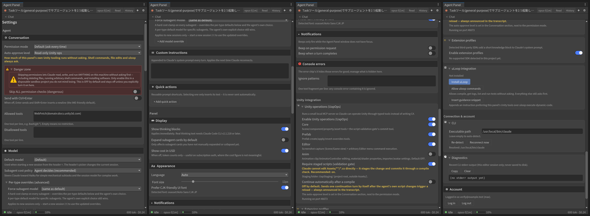

# 2026-09-05 -- UI 再設計・再検討: 「操作語彙の統一」フェーズ

発端: ユーザー「UIデザインの再設計・再検討」(具体的な不満の指定なし)。

方法: 4 本の並列監査(チャットシェル / トランスクリプト内カード / 設定・履歴 /
USS トークン体系)で `Editor/UI/*.cs` と `Editor/UI/Uss/*.uss` を突き合わせ、
2026-08-14 の polish audit 以降に残った構造的な問題を洗い出した。監査で挙がった
事実は本ノート執筆前に PM(本セッション)がソース上で再確認している(行番号は
本ノート執筆時点の main)。

判定軸は 8 原則: 説明不要 / 快適さ / 必要最小限 / 誤解ゼロ / アイコン圧縮 /
共通認識 / 向きと動作 / 情報圧と余白。既存の設計原則(05-ux-spec §0:
Unity ネイティブ・状態が常に分かる・300px でも壊れない)は維持し、**視覚言語の
刷新ではなく、操作語彙(コントロールの形と状態表現)の統一**を今回の主題とする。



(HTML で実トークン値を再現した比較モック。Unity 実機のスクリーンショットではない。)

---

## 0. 結論(先に決めたこと)

| # | 決定 | 原則 | フェーズ |
|---|---|---|---|
| D1 | ボタンを 4 ファミリ(icon / chip / button / primary)+ 2 修飾(quiet / danger)に整理し、寸法をトークン化する | 共通認識・快適さ | 1 |
| D2 | 全操作要素に hover / active / focus / disabled の 4 状態を USS で用意する | 快適さ | 1 |
| D3 | ツールカードの状態語彙に「拒否(Denied)」を追加し「失敗(Failed)」と分離する。ツールグループにも失敗の左アクセントを付ける | 誤解ゼロ | 1 |
| D4 | 権限カードの Deny を danger 修飾で「止める操作」として視覚的に分離する | 誤解ゼロ | 1 |
| D5 | パネル幅 340px 未満で root に `uap-narrow` クラスを付け、ステータスバーのモデル名と ctx ラベル、ヘッダーの履歴ボタン文字幅を USS だけで畳む | 必要最小限・300px 原則 | 1 |
| D6 | シェルを貫く 5 本の罫線のうち、コンポーザ上端の 1 本を落とす(コンテキストバー+コンポーザを 1 つの入力領域として扱う) | 情報圧と余白 | 1 |
| D7 | 履歴の Current / Pinned / Archived バッジを修飾クラスで色分けする | 誤解ゼロ | 1 |
| D8 | 死んだ USS(`.uap-tool` 行スタイル 4 ルール)を削除する | 必要最小限 | 1 |
| D9 | ステータスバーからモデル名を撤去し、ヘッダーのピッカーを唯一の表示にする | 必要最小限 | 2 |
| D10 | Console エラーチップの「今回だけ閉じる ×」と「今後無視する ▾」を分離する | 誤解ゼロ | 2 |
| D11 | 設定のフィールド行に狭幅レイアウト(ラベル上・コントロール下)を導入する | 300px 原則 | 2 |
| D12 | 展開チェブロンの 4 実装を 1 つの共有エクスパンダに統合する | 共通認識 | 2 |

フェーズ 1 は本ノートと同じブランチで実装済み(§4)。フェーズ 2 は C# の振る舞いと
テスト契約(`StatusBarViewLogicTests.ResolveModelName` 等)に触れるため、
別バッチとして切り出す。

---

## 1. 監査で見つかった構造的な問題

### 1.1 コントロール語彙が 22 クラスに散っている(原則 6・2)

`AgentPanel.uss` にはボタン様のクラスが 22 個あり、同じ「アイコンのみ・透明・枠なし」
パターンだけでも 5 クラス(`.uap-header-btn` 22px / `.uap-perm-iconbtn` 20px /
`.uap-history-refresh-btn` 22px / `.uap-ctx-chip-x` 14px / `.uap-history-row-menu-btn`
min 22px)が独立に寸法を持つ。「標準テキストボタン」の `padding: 3px 10px` は
6 か所にコピーされており(`.uap-card-btn` 1739, `.uap-settings-btn` 3021,
`.uap-quickactions-btn` 867, `.uap-history-confirm-btn` 3950, `.uap-jump-pill` 759)、
トークンがないため 1 か所直すと他がずれる。

状態表現はさらに偏っている。`:hover` は 41 ルールあるが、**`:active` は 0**、
`:focus` は 5、`:disabled` は 3(2026-08-14 に初めて追加されたもの)。Send/Stop、
設定ボタン、ヘッダーのチップ、履歴の確認ボタンはキーボードフォーカスも押下も
無効状態も無表現で、HeaderView は `SetEnabled(false)` を呼ぶ(HeaderView.cs:120,
231-232)のに対応する USS がないため、Unity 既定の無効表示(テーマ外の見た目)に
落ちる。

### 1.2 状態アイコンが「拒否」と「失敗」を区別しない(原則 4)

`ToolActivityCard.CreateStatusIcon` (ToolActivityCard.cs:238-256) は
`ToolCallStatus.Failed` と `Denied` を同じ赤 ✕ に写像する。ユーザーが自分で
Deny した結果と、ツールが実際にエラーを返した結果が、後から見返すと同じに見える。
グループ行(`CreateGroupRow`)も同様で、しかも `.uap-toolgroup` には
`.uap-toolcard--failed` に相当する左アクセントがなく(AgentPanel.uss:2216-2230)、
失敗を含むグループが折りたたまれると 1px 枠の普通のカードと同じに見える。

### 1.3 Deny が Always と同じ重さ(原則 4)

権限カードのボタン列は Allow(primary)/ Always ▾(plain)/ Deny(plain)で、
Deny は「会話を止める」操作なのに隣の Always と視覚的に同格
(PermissionCard.cs:519-521)。一方 AskUserQuestion 変種の Skip だけは `--quiet`
で格下げされており、「安全弁を格下げする」語法が変種ごとに違う。

### 1.4 320px で壊れる行(300px 原則)

- ヘッダー(28px 1 行): 6 コントロール + タイトル。縮められるのはタイトル
  (`flex-shrink:1`)と自動承認チップ(下限 46px)だけで、22+22+22 のアイコン
  ボタン + 110 のモデル + 46 の自動承認 + 履歴文字ボタンで約 250px を固定消費する
  (HeaderView.cs:147-149 のコメント自身が squeeze を認めている)。
- ステータスバー: `flex-wrap` なし。縮むのはモデル名だけで、区切り線 2 本
  (各 8px 余白付き)+ 36px の ctx メータ + % ラベル + 使用量ラベルは固定。
  狭幅ではモデル名が 0 幅に潰れて意味のない断片になる。
- 設定のフィールド行: Unity 既定の `BaseField` ラベル幅に依存し、狭幅対策なし。

UI Toolkit にコンテナクエリはないので、狭幅対応は C# で幅を測って root に
クラスを付ける以外にない(フォントスケールと同じ「root クラス → USS」機構)。

### 1.5 情報の重複と罫線の過剰(原則 3・8)

- モデル名がヘッダーのピッカー(HeaderView.cs:57-60)とステータスバーのラベル
  (StatusBarView.cs:87-90)の両方に、8px 離れて同時に出る。どちらが操作で
  どちらが表示かの手掛かりがない。
- ヘッダー下・バナー下・コンテキストバー上・コンポーザ上・ステータスバー上の
  5 本の 1px 罫線がすべて同じ `--uap-border` で、領域の重要度差を表現していない。
  コンテキストバーとコンポーザは機能的に 1 つの「入力領域」なのに、間に罫線がある。
- コンポーザのヒントラベルはターン中しか文字を持たないが、常時行幅を予約している。

### 1.6 履歴バッジが文字でしか区別できない(原則 4)

Pinned / Archived / Current はすべて同じ `.uap-history-row-badge`(accent-user 塗り、
HistoryView.cs:789-795)で、意味(固定 / 保管 / 今ここ)が違うのに色が同じ。

### 1.7 Console チップの「×」と「▾」(原則 4)

一時的に閉じる × と、恒久的に無視する ▾ メニューが 2px 隣同士で同じ
`.uap-ctx-chip-x` サイズ(ContextBarView.cs:145-155)。永続性が正反対の操作が
誤タップ距離にある。

### 1.8 死んだ USS

`.uap-tool` / `.uap-tool-name` / `.uap-tool-summary` / `.uap-tool-time`
(AgentPanel.uss:627-689)は C# のどこからも参照されない旧ツール行スタイル。
`.uap-tool-icon` / `.uap-tool-glyph*` は現役なので残す。

### 1.9 良かった点(変えないもの)

- 色リテラルは USS 構造シートに 1 つもなく(透明の `rgba(0,0,0,0)` を除く)、
  61 トークンはすべて両テーマに定義され、参照されている。
- コンテキストバーだけは `flex-wrap` で狭幅を生き延びる設計になっている。
- 設定の 5 つの上級セクションは 2026-08-26 に折りたたみ化済み。
- 履歴行メニューは既に UI Toolkit ポップオーバー化され、Delete は無効化+理由
  ツールチップで説明される。

---

## 2. 再設計の語彙(契約)

### 2.1 コントロールファミリ

| ファミリ | 用途 | 形 | 例 |
|---|---|---|---|
| **icon** | 1 アクションのアイコンボタン | `--uap-icon-btn-size`(22px)正方・透明・枠なし | ヘッダー +/歯車、履歴の更新、権限カードのチェブロン |
| **chip** | 現在値を示しつつ切り替える | 高さ `--uap-control-h`(20px)・elevated 地・小フォント | モデルピッカー、自動承認、履歴ボタン |
| **button** | 通常アクション | `--uap-btn-pad-y`/`-x`(3px/10px)・meta フォント | card-btn, settings-btn, quickactions, history-confirm |
| **primary** | 画面内でただ 1 つの主操作 | accent-user 塗り | Allow, Submit, Send, Reconnect |
| 修飾 quiet | 安全弁(押さなくても困らない) | 透明・枠なし・secondary 文字 | Skip |
| 修飾 danger | 止める / 取り消す | error 文字・hover で error 枠 | Deny, Stop(Stop は塗りの既存扱いを維持) |

### 2.2 4 状態

| 状態 | 表現 | トークン |
|---|---|---|
| hover | 地を 1 段明るく | `--uap-bg-hover` |
| active(押下中) | 地を 1 段沈める | `--uap-bg-active`(新規: dark #303030 / light #AFAFAF) |
| focus | 枠を accent-user に | `--uap-focus-ring`(新規: `var(--uap-accent-user)`) |
| disabled | 塗り・枠・文字を平坦化 | elevated / border-subtle / text-disabled(2026-08-14 の card-btn と同じ) |

primary の active は `--uap-bg-selected`(既存)、danger の hover/active は
error 系を使う。

### 2.3 状態アイコン語彙(ツール / サブエージェント / グループ共通)

| 状態 | グリフ | 色 |
|---|---|---|
| 実行中 | スピナー | busy |
| 成功 | ✓ (TestPassed) | idle 緑 |
| 失敗 | ✕ (TestFailed) | error 赤 |
| **拒否** | **TestIgnored アイコン**(Test Runner の「無視」。フォールバックは既存の ✕) | **caution 琥珀**(`--uap-accent-caution`: 「ユーザーの方針でそうなった」の色) |
| 未着手 | • | disabled |

拒否を caution にするのは 2026-08-14 の色分け(error = 今まさに何かが壊れている /
caution = 立てた方針の結果)と同じ理屈で、ユーザー自身の Deny が「壊れた」と
読まれないようにするため。

### 2.4 新規トークン(両テーマ)

```
--uap-control-h: 20px;         /* chip 高さ */
--uap-icon-btn-size: 22px;     /* icon ボタン一辺 */
--uap-btn-pad-y: 3px;          /* button 上下 */
--uap-btn-pad-x: 10px;         /* button 左右 */
--uap-bg-active: #303030 / #AFAFAF;
--uap-focus-ring: var(--uap-accent-user);
--uap-badge-pinned-bg / --uap-badge-archived-bg  (履歴バッジ)
```

### 2.5 狭幅クラス

`AgentPanelWindow.ResolveIsNarrow(width, threshold)`(純関数)が 340px 未満で
true を返し、`ApplyWidthClass` が root の `GeometryChangedEvent` ごとに
`uap-narrow` を付け外しする。幅が NaN / 0 以下(初回レイアウト前・ドッキング直後)
のときは「狭幅ではない」に倒す。しきい値は
05-ux-spec §2.2/§2.6 が既に「狭幅(<340px)」と定義している値をそのまま採用。
USS 側の畳み方:

- `.uap-narrow .uap-status-model`, `.uap-status-sep`, `.uap-status-ctx-label`,
  `.uap-status-usage-container`: `display: none`(モデル名はヘッダーのピッカー、
  使用量は使用量ポップオーバー、% はメータのツールチップに残る。spec §2.6 の
  「狭幅では % のみ・トークン省略」よりさらに一段畳む)
- `.uap-narrow .uap-header-model-btn`: `max-width: 72px`
- `.uap-narrow .uap-header-autoapprove-btn`: `max-width: 56px`
- `.uap-narrow .uap-composer-hint`: `display: none`

---

## 3. 各画面の再設計

### 3.1 ヘッダー / ステータスバーの役割分担

- **ヘッダー = 「このセッションは何で、何を変えられるか」**: タイトル、モデル
  (chip)、自動承認(chip)、履歴(chip)、新規(icon)、設定(icon)、再接続(icon・
  エラー時のみ)。
- **ステータスバー = 「今どういう状態か」**: 状態ドット+文言、ctx メータ、使用量。
  フェーズ 2(D9)でモデル名を撤去し、状態文言に幅を返す。

### 3.2 トランスクリプト

- メッセージのリズムは現状維持(ユーザー発言の上 12px で「ターン」を区切る
  非対称は意図的)。
- ツール / サブエージェント / グループの 3 カードで状態アイコン語彙(§2.3)と
  左アクセント規則(失敗 = error 2px、拒否 = caution 2px、サブエージェント =
  agent 2px 常時)を揃える。
- 展開チェブロンの統合(D12)はフェーズ 2。

### 3.3 権限カード

Allow(primary)/ Always ▾(button)/ Deny(button + danger)。Deny は文字色を
error にし、hover で枠が error になる。塗りにはしない(塗り赤は Stop の語彙で、
「進行中の何かを止める」意味に取っておく)。フローティング窓ホストも同じコードパス
なので自動的に揃う。

### 3.4 入力領域

コンテキストバー(添付ボタン + チップ)とコンポーザ(入力欄 + Quick + Send)を
1 つの領域として扱い、間の罫線を落とす。領域上端の罫線はコンテキストバーが担う。
狭幅ではヒント行を隠す。

### 3.5 履歴

Current = accent-user(既存)、Pinned = caution 琥珀、Archived = 中立
(elevated 地 + secondary 文字)。意味の違いを色にも載せる。

### 3.6 設定(2 回目の再検討で決定、同ブランチで実装)



設定画面は 2026-08-01(カード化)・08-14(順序)・08-26(上級セクションの折りたたみ)
と手が入っており、1 枚ずつのカードは妥当。残っていたのは「15 枚を 1 列に並べた
ときの読み方」と「状態が見えない場所で告げられる」問題で、4 点を決めた。

| # | 決定 | 原則 |
|---|---|---|
| S1 | 15 カードを 4 グループ見出し(エージェント / パネル / Unity 連携 / 接続とアカウント)で束ね、グループ間の余白 > カード間の余白にする。会話・モデルは先頭のまま | 情報圧と余白・説明不要 |
| S2 | 「再接続待ち」の告知を、既定で折りたたまれた CLI カードの中からスクロール外の上部バナーに移し、解決する操作(今すぐ再接続)を同じ行に置く | 誤解ゼロ(状態が一目で分かる) |
| S3 | カード全体のホバー強調(青枠 + 明るい地)を撤去する。カードは押せない。押せるのは折りたたみ見出し行だけなので、そこにだけホバーを付ける | 説明不要(押せる物と押せない物を分ける) |
| S4 | `uap-narrow` のとき、フィールド行をラベル上・コントロール下に縦積みする。スイッチ行だけは横並びを維持 | 300px 原則 |

順序(グループ内):

- エージェント: Conversation, Model, Custom Instructions, Quick Actions
- パネル: Display, Appearance, Notifications, Console Errors

(実機で最初「会話」と付けたところ、直下の「会話」カードと同じ語が 2 段重なって
読めたため、見出しは「その下のカードが何についてか」を一段抽象した語にした。)
- Unity 連携: Unity Operations ▸, Extension Profiles ▸, uLoop ▸
- 接続とアカウント: CLI ▸, Diagnostics ▸, Account, About

(▸ = 折りたたみ既定。Appearance が Display の隣に移動した以外、グループ内の相対順は
08-14 の順を保っている。)

実装上の構造変更: `SettingsView.CreateGUI` の root が ScrollView そのものから
「バナー + ScrollView(`uap-settings-scroll`)」の縦コンテナに変わった。
`uap-settings` クラスは root に残るので、表示切替と font-scale のテスト契約は
そのまま。`ScrollToAccountSection` は `_scroll` を見る。

見送ったもの:

- セクションへのジャンプ(チップ列 / 検索): 300px では 15 チップが 4 行になり、
  それ自体が読む負担になる。グループ見出しで十分か実機で確かめてから判断する。
- 「< チャット」ストリップと「設定」タイトルの 2 段を 1 段に畳む: 見出し 1 行分の
  節約にしかならず、AgentPanelWindow 側のストリップ構造に手を入れる価値が薄い。

---

## 4. フェーズ 1 実装(本ブランチ)

| 変更 | ファイル |
|---|---|
| 新規トークン(§2.4) | ThemeDark.uss / ThemeLight.uss |
| button ファミリの padding をトークン longhand に統一、icon ファミリの寸法をトークン化 | AgentPanel.uss |
| `:active` / `:focus` / `:disabled` を icon / chip / button / primary / Send / Quick / settings / history / viewstrip / banner / chip / jump-pill に追加 | AgentPanel.uss |
| `.uap-card-btn--danger` 追加、Deny に付与 | AgentPanel.uss / PermissionCard.cs |
| `CreateStatusIcon` の Denied 分岐(`TestIgnored` アイコン)、`.uap-toolcard--denied`、`.uap-tool-glyph--denied`、`.uap-toolgroup--failed/--denied`、`ResolveGroupModifier` | ToolActivityCard.cs / AgentPanel.uss |
| `ResolveWidthClass` + `GeometryChangedEvent` で `uap-narrow` 付け替え、狭幅 USS | AgentPanelWindow.cs / AgentPanel.uss |
| コンポーザ上端の罫線を削除 | AgentPanel.uss |
| 履歴バッジの修飾クラス(`--pinned` / `--archived` / `--current`) | HistoryView.cs / AgentPanel.uss |
| 死んだ `.uap-tool` 行スタイル 4 ルールを削除 | AgentPanel.uss |
| 設定 S1: グループ見出し 4 本(L10n 4 文字列)と並べ替え | SettingsView.cs / UiStrings.cs / UiStringsJa.cs / AgentPanel.uss |
| 設定 S2: 再接続待ちバナー(root を縦コンテナ化、`uap-settings-scroll`) | SettingsView.cs / AgentPanel.uss |
| 設定 S3: カードのホバー撤去、折りたたみ見出しのみホバー | AgentPanel.uss |
| 設定 S4: `uap-narrow` でフィールド縦積み | AgentPanel.uss |

### 回帰ガード

- `AgentPanelWindowWidthClassTests`: `ResolveIsNarrow` の境界(339 / 340 / 0 / NaN)と
  `ApplyWidthClass` の付け外し。
- `ToolActivityCardStatusVocabularyTests`: Denied が `uap-tool-glyph--denied` /
  `uap-toolcard--denied` を持ち `--fail` 系を持たないこと、Failed はその逆。
  グループ行は失敗 > 拒否 > なし の優先で修飾クラスとヘッダーグリフを持つ。
- `PermissionCardTests` に Deny の `uap-card-btn--danger` を追加。
- `HistoryViewLogicTests` にバッジ修飾クラスを追加。
- `SettingsViewLayoutTests`: root がバナー → スクロールの順で持つこと、バナーが
  初期非表示で主操作ボタンを持つこと、グループ見出しが 4 本で先頭が `--first`、
  先頭カードが Conversation のままであること。
- `UssHygieneTests` はそのまま(新トークンは両テーマに定義、shorthand に var なし、
  許可リスト対象クラスの flex 宣言は不変)。

### 実機検証(2026-09-05、同セッション内)



このコンテナに Unity 2022.3.22f1 の Linux エディタを直接展開し、`Unity.Licensing.Client
--activate-all --include-personal` で検証用アカウントの Personal シートを有効化して
確認した(CI と同じ手順)。

- **EditMode 全スイート**: 1 回目 2534 件中 2510 合格 / 6 失敗 / 18 スキップ。失敗の
  内訳は (a) 新規 `ToolActivityCardStatusVocabularyTests` 3 件 -- 実機では組み込み
  アイコン(TestIgnored/TestFailed)が解決されるため、フォールバック用のグリフ
  クラスが付かない、という前提誤り。アイコンの同一性(Image のテクスチャ名 or
  フォールバック Label のクラス)で拒否≠失敗を検証する形に書き直した。
  (b) `UapScriptsCommitToolTests.Poll_*` 3 件 -- 60 秒の時間予算内にステージング
  スクリプトのコンパイルが終わらない。UI 変更とは無関係で、対象フィクスチャ
  だけを再実行すると 190 件中 189 合格 / 0 失敗 / 1 スキップで通った(全スイート
  同時実行時の負荷とコールドキャッシュが原因と見ている)。
  2 回目の全スイート(テスト修正後、キャッシュ温存): 2535 件中 2526 合格 / 1 失敗 /
  8 スキップ。残る 1 件 `FontLoaderTests.GrownAtlas_NewTexturesComeBackUnstamped_
  AndSpareSlotsStayHealthy` は「アトラス配列が 8 より大きく育つ」という前提
  アサーションで、1 回目(CJK フォント未導入)では合格していた。撮影のために
  `fonts-noto-cjk` を入れて CJK UI フォントを有効化した後に落ちたので、フォント
  環境依存であり UI 変更とは無関係。
- **GUI 描画**: Xvfb + Mesa llvmpipe 上でエディタ本体を起動し、
  `ci/HostProject/Assets/Editor/UapShot.cs`(検証専用ドライバ)でパネルを開いて
  600px / 300px でチャット・設定・履歴を撮影した。Claude Code CLI 本体はこの環境に
  ないので、`Tests/Editor/Fixtures` の実機キャプチャを再生する擬似 CLI
  (`--version` / `auth status --json` / stream-json の initialize と can_use_tool の
  往復だけを実装)を `/usr/local/bin/claude` に置いて接続した。
  実機で確認できたこと: Deny の danger 表示、サブエージェントカード、
  `uap-narrow` でのステータスバー折りたたみ(ダンプで `uap-status-usage-container
  display=None` を確認)、設定のグループ見出しとバナー構造、300px でのフィールド
  縦積み(スイッチ行は横並び)。
- 実機で見つけて直したもの: グループ見出し「会話」が直下の「会話」カードと二重に
  読める → 「エージェント」「パネル」に改名。複数行フィールド(許可/禁止ツール)が
  `uap-settings-multiline` クラスで縦積み規則から漏れていた。狭幅でも ctx の % は
  残す(spec §2.6)。

### UI 設計の観点での実機レビュー(2026-09-06)



8 原則のチェックリストを実機スクリーンショットに当てた結果。番号は画像の丸数字。

| 原則 | 結果 | 所見 |
|---|---|---|
| 1 説明不要 | ⚠️ | (1) ヘッダーの 3 チップ(モデル / 自動承認 "Read" / History)が同じ形で並び、切替・方針・移動という別種の操作が同格に見える。"Read" 単独では自動承認レベルと分からない(ツールチップ頼み) |
| 2 快適さ | ✅(未確認あり) | 4 状態は USS で用意したが、押下・フォーカスの見た目はスクリーンショット駆動では未確認 |
| 3 必要最小限 | ⚠️ | (4) ステータスバーのモデル名がヘッダーと重複(D9 として既知)。(9) 自動承認の琥珀色 2 行警告は常時表示だが、08-04 の判断どおり「有効化の意味」を告げる警告として維持 |
| 4 誤解ゼロ | ❌ → 要修正 | (2)(6) **権限カードの要約行で、対象(何を書くのか)がボタン列に押し出されて読めない。** 600px で "pa…"、300px では対象もタイトルも消え、⚠ とボタンだけが残る。直上のツールカードにファイル名は出るが、承認を求める行そのものが対象を示していないのは、この画面で最も重要な情報の欠落 |
| 5 アイコン圧縮 | ✅ | ▸ / ↗ / + / ⚙ はツールチップ付き。「»」(サブエージェント印)は文字ラベル併記で成立 |
| 6 共通認識 | ✅ | 戻る=左上、設定=右上、主操作=右端。Deny=赤文字、警告=琥珀、成功=緑 |
| 7 向きと動作 | ✅ | 展開 ▸/▾、Latest ↓、チェブロン方向は一貫 |
| 8 情報圧と余白 | ⚠️ | (5) 300px でタイトルが 3 文字になる一方、モデルチップは全文残る(優先順位が逆)。(7) サブエージェント名が "general-···" に切れ、所要時間 "1.3s" は温存。(8) 「Settings」直下の「Agent」見出しが小さく、タイトルとの距離が近くて段が見えにくい。(3) ↓ Latest ピルがツールカードのチェブロンに重なる |

レビュー後に実装した修正(2026-09-06、同ブランチ):

| # | 修正 | 実装 |
|---|---|---|
| 1 | 権限カードの要約行を折り返し可能にした。タイトル+対象+バッジを `uap-perm-summary-text`(min-width 140px)、ボタン列とアイコンボタンを `uap-perm-summary-controls`(flex-grow 1、右寄せ)にまとめ、行に `flex-wrap: wrap`。幅が足りないときはボタン列だけが 2 行目に落ち、対象は常に 1 行目に残る。インラインの題名から "Claude wants to use" 接頭辞を外した(`PermInlineTitleWithDescriptionFmt`)。Window ホストは従来どおり | PermissionCard.cs / AgentPanel.uss / UiStrings |
| 2 | 狭幅ではモデルチップと自動承認チップを非表示にし、モデル名を載せた `uap-header-compact-btn` を出す。クリックで「モデル: …」「自動承認: …」の 2 項目メニューを開き、それぞれ既存のメニューへ渡す(`ShowModelMenu(anchor)` に anchor を渡す形へリファクタ) | HeaderView.cs / AgentPanel.uss / UiStrings |
| 3 | `.uap-narrow .uap-toolcard-time { display: none }`(サブエージェントカードも同クラス) | AgentPanel.uss |
| 4 | 設定タイトルの下余白を 16px に、グループ見出しを meta サイズ(11px)に | AgentPanel.uss |
| 5 | 見送り。↓ Latest は「最下部にいないときだけ出る浮遊ピル」で、重なり自体はこの型の仕様。撮影時に最下部でも出ていた点は追従判定(MessageListController)の別件として残す | -- |

修正後の実機(600px 権限カード / 300px チャット / 600px 設定):



初回撮影では ⚠ アイコンがテキストブロックの兄弟だったため 600px で 1 行目に孤立した
(ブロックが残り幅より広いと丸ごと折り返る)。アイコンをブロック内に移して解消。
対象テスト 85 件合格、コミット dc5b9e1。

推奨する次の修正(優先順)(レビュー時点の原文):

1. **権限カードの要約行を 2 段にする**(原則 4)。1 段目「⚠ Write · panel_permission_test.txt」、2 段目にボタン列。inline ホストの "Claude wants to use" 接頭辞は落とし、Window ホストのタイトルにだけ残す。`--uap-perm-summary-min` の高さ契約と `PermissionCardLayout` のカード高さ見積もりを 2 段分に更新する。
2. **狭幅ヘッダーの優先順位**(原則 8): `uap-narrow` ではモデルチップと自動承認チップを 1 つの「▾」メニューに畳み、タイトルに幅を返す(フェーズ 2 のセッションセレクタと同じ器)。
3. **ツールカード狭幅**: 名前より先に所要時間を隠す(`.uap-narrow .uap-toolcard-time { display: none }`、時間はツールチップへ)。
4. **設定の見出し段差**: `uap-settings-title` の下余白を 16px に、グループ見出しを 11px に上げる。
5. **↓ Latest ピル**: メッセージリストの下端パディングをピルの高さ分だけ確保し、最後のカードと重ならないようにする。

### 設定画面の詳細レビュー(2026-09-06、ツールチップまで)



材料: 全セクション展開のスクロール撮影 4 枚と、実機ツリーから要素順に書き出した
ラベル / ヒント / 警告 / ツールチップの全文
(`docs/verify/settings-copy-dump-2026-09-06.txt`、撮影ドライバの settings モード)。

#### 意識しているレベル帯

設計文書(05-ux-spec §0、R06、2026-08-01 visual-refresh、08-26 UXIA-2)から読み取れる
狙いは次の 3 層構造:

| 層 | 対象 | 扱い |
|---|---|---|
| 日常(Agent / Panel グループ) | Unity には慣れているがコーディングエージェントは初めての開発者 | 常時展開、ラベル + 1 行ヒント、判断理由はツールチップへ |
| 上級(Unity 連携 / 接続) | MCP・サブエージェント・CLI を自分で調整する利用者 | 既定で折りたたみ、(advanced) と明示、内部名(UapOps, uap_scripts_commit)を隠さない |
| 危険(Danger zone) | 何が起きるか分かっている人だけ | 赤い折りたたみ + HelpBox + 確認ダイアログ |

視覚的な水準として明示的に置いている比較対象は Unity Package Manager と
Meta XR Building Blocks(カード・スイッチ・ピル・ホバー)。実機で見る限り、
その水準には到達している。一方 VS Code / JetBrains の設定画面が持つ「検索」
「既定値から変更済みの印」「既定に戻す」「設定ごとのドキュメントリンク」は無く、
その帯は狙っていない(単一パネル内の設定としては妥当な線引き)。

#### 三層コピー(ラベル / ヒント / ツールチップ)の所見

| # | 所見 | 原則 | 重さ |
|---|---|---|---|
| C1 | **適用タイミングの語彙が 3 通り**: "Applies immediately." / "Applies the next time Claude reconnects." / "Takes effect on the next reconnect."。日本語も「すぐに適用」「次回の再接続時に反映」「次回の再接続時に適用」が混在。しかも置き場所がフィールドごとに違う(ツールチップだけ: 権限モード・ツール一覧・UapOps 有効化 / ヒントに露出: カスタム指示・思考ブロック) | 共通認識 | 中 |
| C2 | 再接続待ちバナー(S2)が入った今、フィールドごとの「次回の再接続時に…」は二重告知。ヒント側から外し、ツールチップに 1 語彙で残せば足りる | 必要最小限 | 中 |
| C3 | 長いツールチップ(300 字級: サブエージェント方針、Console エラー、検証ゲート、拡張プロファイル)に「ここに説明がある」という手掛かりが無い。ホバー待ちでしか出ないので初見では存在に気づけない | 説明不要 | 中 |
| C4 | 琥珀の警告 3 本のうち 2 本が「推奨・既定の状態」に付いている(自動承認レベルは最も安全な値でも警告色、検証ゲートは ON = 推奨でも警告色)。警告色は「危ない値を選んだとき」に出る方が慣習に合う | 誤解ゼロ・共通認識 | 中 |
| C5 | ヒントとツールチップの冒頭が同じ文の言い換えになっている組が 6 つ(強制サブエージェントモデル、タイプ別上書き、クイックアクション、拡張プロファイル、uloop 許可、自動継続)。ヒントは「何が起きるか」1 文、ツールチップは「なぜ・例外」に役割分担できる | 必要最小限 | 低 |
| C6 | 状態表示がヒントと同じ書式: "Running on port 33095" / "Resolved: …" / "Detected font: osasset:Noto Sans CJK JP" / "Not installed" / "Logged in as …"。うち "osasset:" は内部プレフィックスの漏れ | 誤解ゼロ | 低〜中 |
| C7 | カード冒頭の説明文(Custom instructions / Quick actions / Notifications / Console errors / UapOps / 拡張プロファイル / Diagnostics)がフィールドのヒントと同じ書式で、「カードの説明」か「直上フィールドの説明」か読み分けられない | 誤解ゼロ | 低 |
| C8 | Per-type overrides(advanced): 行が 0 件でも「タイプ別既定…」「新規セッションのみ…」のヒントが 3 行並ぶ(説明対象が無い) | 必要最小限 | 低 |
| C9 | Account: ログイン済みでも "Log in" ボタンが並ぶ("Switch account" か非表示が筋) | 誤解ゼロ | 低 |
| C10 | 内部名の露出: "UapOps" がカード名・トグル名・ヒントに計 3 回、"uap_scripts_commit" "PreToolUse hook" はツールチップに。上級層向けとしては許容範囲だが、日常層の Conversation カードにも "uloop" が出る | 説明不要 | 低 |

#### レイアウト・視覚の所見

| # | 所見 | 重さ |
|---|---|---|
| L1 | セクションアイコンの重複と欠落: Conversation の歯車はヘッダーの設定ボタンと同じ絵、Custom instructions と Extension profiles、uLoop と CLI がそれぞれ同系の絵。Notifications(`d_AudioSource Icon`)と Appearance(`d_Font Icon`)はこのビルドで解決されずフォールバック文字("•" / "Aa")。Console errors だけ赤い状態色のアイコン | 中 |
| L2 | 折りたたみカードの見出し(Foldout 行、アイコンがカード外縁)と通常カードの見出し(暗い帯 + アイコン内側)の 2 文法 | 中 |
| L3 | Conversation カード内で琥珀の警告文と赤い Danger zone が隣接し、注意色が 2 系統並ぶ | 低〜中 |
| L4 | Font size スライダー行のラベルだけ 3px ほど右にずれる(スライダーの内部マージン) | 低 |
| L5 | UapOps カードは 7 スイッチ + 9 行のテキストで最も密。モジュール 4 つ(Core/Prefab/Editor/Anim)が "Enable" の子であることが字下げで示されていない | 中 |
| L6 | 全長 2208px(600px 幅・全展開)。既定の折りたたみ状態では約 2 画面分で、08-04 計測の 5.5 画面分からは大きく改善 | -- |

#### 推奨(優先順)

1. C1+C2: 適用タイミングを 1 語彙に統一し、ヒントからは外してツールチップに残す。
   バナーが「今、再接続待ち」を告げる役を担う。L10n の文字列整理だけで済む。
2. C4: 警告色を「危ない値のとき」だけに(自動承認 > Read-only、ゲート OFF、自動継続 ON)。
   `AddWarning` を値連動にする小さな C# 変更。
3. L1: セクションアイコンの棚卸し(重複を解消し、Notifications / Appearance に解決する名前を当てる)。
4. C3: 長いツールチップを持つ行の末尾に小さな "?" グリフ(icon ファミリ)を置き、ホバー先を示す。
5. L2 + L5: 折りたたみカードの見出しに通常カードと同じ帯を付け、UapOps のモジュール群を字下げ。
6. C6 + C9 + C8: 状態行を mono / ピル表記に、"osasset:" を剥がす、Log in の出し分け、0 件時のヒント抑制。

### 設定画面レビューの修正(2026-09-06、同ブランチで実装)

| # | 修正 | 実装 |
|---|---|---|
| 1 | 適用タイミングの語彙を英「Applies immediately. / Applies after the next reconnect.」、日「すぐに適用されます。/ 次回の再接続後に適用されます。」の 2 語彙に統一。ヒントに出ていた 2 か所(カスタム指示、思考ブロック)から外し、ツールチップだけに残した。思考ブロックの空ヒント文字列は L10n フィールドごと削除 | UiStrings / UiStringsJa / SettingsView |
| 2 | 警告色(琥珀)を「危ない値のとき」だけに。自動承認は Undoable 以上、検証ゲートは OFF、自動続行は ON のときに琥珀、それ以外は通常ヒント。文言は常時表示のまま(ホバーでしか読めない警告は警告ではない、の 08-04 判断を維持)。純関数 `IsRisky*` + `SetWarningTone`、値変更とハブ更新の両方で再評価 | SettingsView |
| 3 | アイコン棚卸し。実機計測で `EditorGUIUtility.FindTexture` が「<型> Icon」系の名前を解決しないことが分かり(5 セクションがフォールバック文字だった)、`IconLoader.LoadOne` に `EditorGUIUtility.Load` を第 2 段として追加。重複は Conversation→NetworkMessages(ヘッダーの歯車と分離)、Model→Preset.Context(存在しない Presets 名の置換)、Quick actions→Favorite(ヘッダーの + と分離)、Diagnostics→DebugInspectorWindow、Account→CloudConnect、About→infoicon(d__Help はヘルプマークに譲る) | IconLoader / SettingsView |
| 4 | **HelpAffordance**: ツールチップが 90 文字以上の行の末尾に Unity 標準の「?」(d__Help)を置く。ホバーで従来のツールチップ、クリックで本文を折り返し表示するポップオーバー(使用量ポップオーバーと同じ器)。`Resolve` は純関数、`ApplyMarks` は設定ツリー構築後に 1 回走る。スイッチ行はマーク付き修飾クラスでラベルが伸び、トラックの列位置を保つ | HelpAffordance.cs / AgentPanel.uss / SettingsView |
| 5 | 折りたたみカードの見出し行に通常カードと同じ帯(地色 + 下罫線 + 余白)を付け、見出し文法を 1 つに。UapOps の 4 モジュールスイッチとヒントを 16px 字下げし、親スイッチ OFF で無効化 | AgentPanel.uss / SettingsView |
| 6 | 状態行(`uap-settings-status`: 斜体、CLI パスは等幅)を説明ヒントと分離。`osasset:` プレフィックスを剥がす(`DescribeFontSource`)。ログイン済みでは「Log in」を「Switch account / アカウントを切り替え」に。タイプ別上書きが 0 件のとき「新しいセッションから」ヒントを隠す。Font size のラベル字下げを解消 | SettingsView / AgentPanel.uss / L10n |

実機確認(2026-09-06、Unity 2022.3.22f1 / Xvfb、600px、全カード展開):
`docs/images/verify-2026-09-06-settings-review-fixes.png`(4 スクロール位置の
連結)。コピーの全文ダンプは `docs/verify/settings-copy-dump-2026-09-06-after.txt`。

- 13 セクションすべてで組み込みアイコンが解決し、フォールバック文字は 0。
- 「?」は 17 行に付いた。フィールド行のないセクション先頭ヒント(カスタム指示、
  クイックアクション、通知など)では最初の撮影で「?」が単独行に落ちたため、
  `HelpAffordance.WrapTrailingHint` がヒントを横並びの `uap-settings-hintrow`
  に包み、「?」をヒント行の右端に置くようにした(2 回目の撮影で確認)。
- 「?」を付けた行だけコントロールが 26px 短くなり、右端がガタガタになった
  (ユーザー指摘)。対策として **ヘルプガター**: 全カード本文が右に 26px
  (`--uap-help-gutter`)を予約し、「?」付きの行(`uap-helpmarked`)だけ同量の
  負マージンでガターに張り出す。「?」の有無に関係なくコントロールの右端は
  同じ線に揃い、ガターは「?」か空白かの違いだけになる。マークの高さもコント
  ロール高(20px)、ヒント行では 16px に合わせ、行の高さも変えない。300px では
  「?」付きフィールドをラベル 1 行 + コントロール/「?」1 行の折り返しにし、
  スイッチは 1 行のままトラック 32px を再固定。撮影:
  `docs/images/verify-2026-09-06-settings-300.png`。
- 折りたたみカードの見出し帯、UapOps モジュールの字下げ、状態行の斜体/等幅、
  「Switch account」も撮影どおり。
- テストの副産物: `SettingsViewLayoutTests` のバナー非表示アサートは、
  同一プロセス内で先に CLI 起動(テストダブル含む)が起きたかどうかで結果が
  変わる順序依存だった(ハブの last-spawn スナップショットが null だと
  `RequiresReconnect` は常に true)。アサートを検出器の鏡像に変更し、単独
  実行でも通るようにした。

### 検証の限界(正直な残件)

1. `:active` / `:focus` / `:disabled` の見た目はスクリーンショット駆動では押下・
   フォーカス状態を作れず未確認(USS の構文とトークン解決はハイジーンテストで担保)。
2. 再接続待ちバナーは構造テスト(`SettingsViewLayoutTests`)のみで、表示状態の
   実機撮影はしていない(擬似 CLI では自動再接続が即座に完了して pending が消える)。
3. Xvfb ではウィンドウ外領域が再描画されず、狭幅撮影の右外側に前フレームの
   ステータス文字が残る。パネル内の状態はダンプで確認した。
4. `UapScriptsCommitToolTests.Poll_*` の 60 秒予算は 4 コアのコンテナで全スイート
   同時実行だと足りないことがある。CI(GitHub hosted)では過去に全緑なので、
   予算の見直しは別件とする。

---

## 5. フェーズ 2 の候補(このノートでは決めない)

- D9: ステータスバーのモデル名撤去。`StatusBarViewLogicTests` の
  `ResolveModelName` 契約を先に更新する。
- D10: Console チップの × を「今回だけ」に固定し、「今後無視」はメニュー内の
  明示項目のみにする。
- D11: 設定フィールドの狭幅縦積み。
- D12: 共有エクスパンダ(`UapExpander`): ヘッダー行クリック + チェブロン +
  展開状態の SessionState 永続化を 1 実装に。ToolActivityCard / SubagentCard /
  ToolGroup / 添付ブロック / 権限カードの 5 実装を置き換える。
- ヘッダーのセッションセレクタ(spec §2.2 の未実装分): タイトルをクリックで
  最近 10 件 + 履歴 + 新規、を 1 メニューにまとめ、狭幅時に履歴/新規ボタンを
  そこへ畳む。
