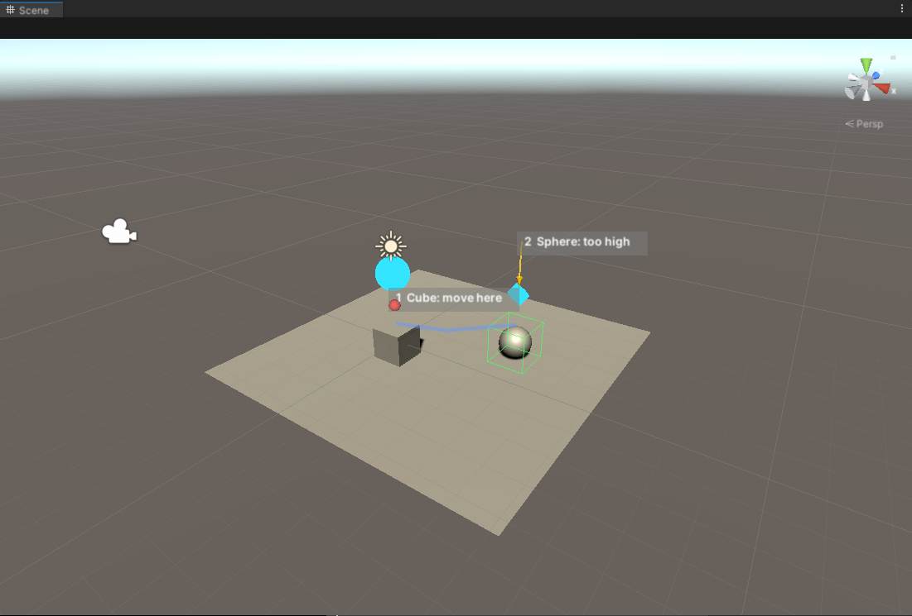
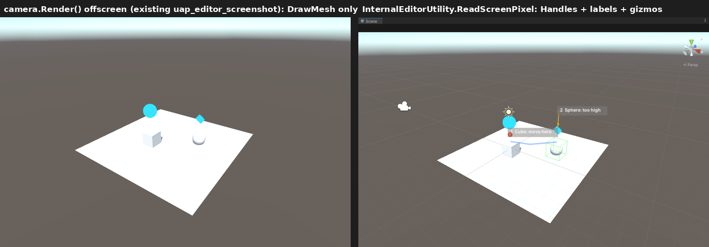
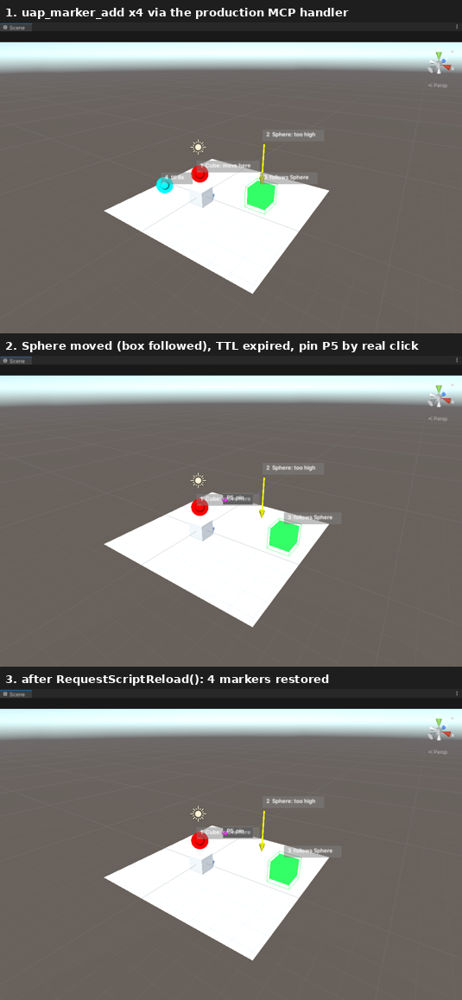
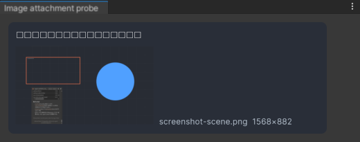
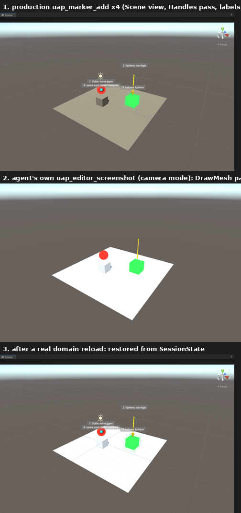
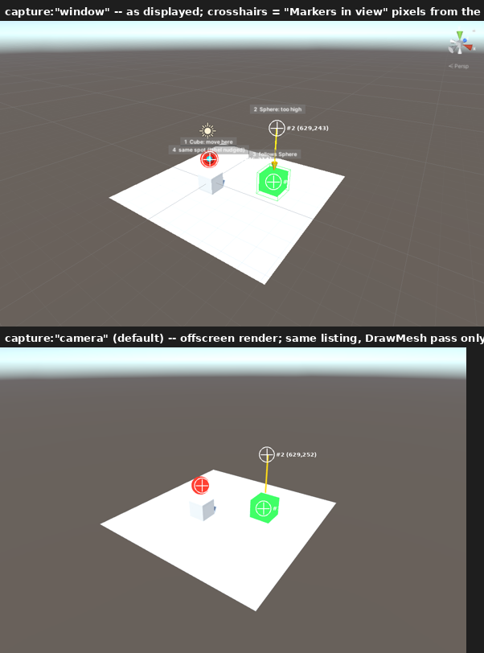
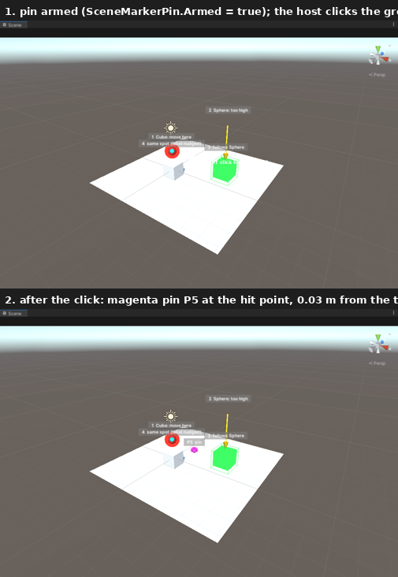
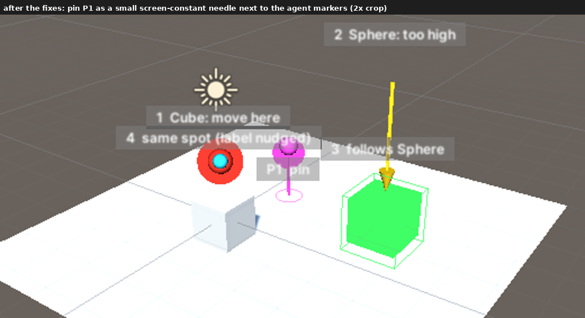

# 2026-09-07 -- シーンビュー 3D マーカー / 画像添付 / エラーチップ送信の整合

発端: ユーザー「シーンビューへの視覚的な指示機能(3D マーカー)」「画像添付機能」
「エラー通知送信機能のバグ修正(現在表示されているものを送る機能)」の 3 件を、
設計 → 仮想環境での Unity 検証 → 画像付き報告 → 実装計画の順で進める。

方法: 現状コードの調査(送信パイプライン / UapOps ツール基盤 / エラーチップ)を
先に行い、設計上の**判断が割れる点だけ**を GameCI の Unity 2022.3.22f1 イメージ
(Xvfb + Mesa llvmpipe、CI と同じ Personal シート有効化)で実機検証した。検証
ドライバは `ci/HostProject/Assets/Editor/UapSpike.cs`(検証専用、パッケージ外)。
Claude Code CLI 側のプロトコル検証は本コンテナの実 CLI(v2.1.263)で行った。

本ノートは 3 部構成: §1 3D マーカー、§2 画像添付、§3 エラーチップ。各部が
「設計 / 検証結果 / 未決事項」を持ち、§4 に横断の実装計画(フェーズ・ファイル・
回帰ガード)をまとめる。

---

## 0. 結論(先に決めたこと)

| # | 決定 | 根拠(検証) |
|---|---|---|
| M1 | マーカーは **Handles(画面用)+ `Graphics.DrawMesh`(撮影用)の二重描画**。シーンにオブジェクトは作らない | §1.4: Handles はオフスクリーン描画に映らず、DrawMesh は両方に映る |
| M2 | `uap_editor_screenshot` に `capture: "window"` を追加し、`InternalEditorUtility.ReadScreenPixel` で **ユーザーが見ている画面そのもの**(ラベル・グリッド込み)を撮る。既定は従来の `camera` | §1.4: ReadScreenPixel でラベル込みの画面が取れた |
| M3 | マーカーは双方向: エージェント → ユーザー(`uap_marker_*` ツール)と、ユーザー → エージェント(Scene ビューのピン置き → コンテキストチップ) | 「視覚的な指示」は両方向に価値がある。ピンは既存チップ基盤に乗るだけ |
| M4 | マーカー状態はドメインリロードをまたいで保持(SessionState の JSON)。シーン切替で自動消去、ターン終了では消さない | エージェントが「ここ」と示した直後にリロードが起きるのは日常(スクリプト保存) |
| I1 | 画像は **stream-json の `content[]` に `image` ブロック(base64)** として送る。CLI 側の対応は実 CLI で確認済み | §2.2: v2.1.263 が受理し、画像の色を正しく答えた |
| I2 | 送信前に長辺 1568px へ縮小、PNG 既定・1.5 MB 超なら JPEG(q85)、最終 5 MB 上限。1 メッセージ最大 4 枚 | §2.4: 2560×1440 → 1568×882 の縮小・符号化が 1 フレーム内で終わる |
| I3 | 画像本体は `Library/AgentPanel/Attachments/<sha1>.<ext>` に置き、キュー・トランスクリプトキャッシュはパスだけ持つ | CompileGate キューは SessionState 文字列、SessionCache は JSON: base64 を抱えると両方が肥大化する |
| I4 | 取り込み経路は 4 つ: OS からのファイルドロップ(`DragAndDrop.paths`)/ Project の Texture アセットドロップ / ファイル選択ボタン / 「今の画面を添付」ボタン(Scene / Game / window) | 現状 `DragAndDrop.paths` は一切読まれておらず、OS からのドロップは無反応(§2.1) |
| E1 | 修正ボタンは **チップが数えている集合(visible − acknowledged − dismissed)** をそのまま送る。件数表示・添付タイトル・acknowledge も同じ集合で揃える | §3.1: 現状は全 visible を送り、10 件超で「表示中の唯一のエラー」が落ちる(再現テストで確認) |
| E2 | Console ウィンドウの Clear と同期する(`LogEntries.GetCountsByType` をポーリング)。リフレクション失敗時は従来動作 | §3.3: 2022.3.22f1 で `LogEntries.GetCount/Clear/GetCountsByType/StartGettingEntries` を確認 |

---

## 1. シーンビュー 3D マーカー

### 1.1 目的

「どこ」を言葉で往復するコストを消す。

- **エージェント → ユーザー**: 「この Cube をここへ動かしました」「このスポーンポイントが
  地面の下にあります」を、Scene ビュー上の番号付きマーカーで示す。チャットの本文には
  `[1]` のように番号だけ書けばよい。
- **ユーザー → エージェント**: Scene ビューでピンを置き、「ここに階段を作って」と
  送る。ピンはワールド座標と最寄りオブジェクトを持つコンテキストチップになる。
- **エージェントの自己検証**: マーカーを置いた後にスクリーンショットを撮れば、
  「置いた場所が本当に意図した場所か」を自分で確かめられる(既存の
  dump → act → screenshot ループの延長)。

### 1.2 現状(調査)

- パッケージ内に `SceneView.duringSceneGui` / `Handles` / `Gizmos` の使用は一切ない。
  マーカーはこの種の統合の最初の例になる。
- `uap_editor_screenshot`(`Editor/Ops/UapEditorScreenshotTool.cs`)は
  `SceneView.lastActiveSceneView.camera` を **オフスクリーン RenderTexture に
  `camera.Render()`** して PNG を書く。Scene ビューの見た目(グリッド、ギズモ、
  Handles、選択アウトライン)は含まれない。
- ツールは `IUapTool`(`Name / Description / Module / Undoable / ReadOnly /
  InputSchema / Execute`)を実装し、`ToolRegistry.CreateDefault` に登録、
  `PanelSettings.uapOpsModules` でモジュール単位に有効化される。実行は常にメイン
  スレッド(`UapMainThreadDispatcher`)。結果は `UapToolResults.Text` の text ブロック
  のみで、MCP の `image` ブロックを返す経路はまだない。
- ドメインリロード耐性の作法: static は `[InitializeOnLoadMethod]` で再購読、
  `AssemblyReloadEvents.beforeAssemblyReload` で解放(`UapTurnScope` の例)。

### 1.3 設計

#### 1.3.1 データモデル(`Editor/Ops/Markers/SceneMarker.cs`)

```
SceneMarker
  id          int      1 から採番。チャット本文の [n] と一致させる
  kind        enum     Point | Arrow | Box | Path | Label
  position    Vector3  ワールド座標(Arrow は始点、Path は points[0])
  points      Vector3[] Arrow の終点 / Path の経由点
  target      string   追従対象(Hierarchy パス、任意)。指定時は position を
                       対象の bounds.center で毎フレーム上書き(消えたら消す)
  label       string   1 行、64 文字まで。番号は自動で前置("1  Spawn point")
  color       string   "red" | "yellow" | "green" | "blue" | "cyan" | "magenta" | "#RRGGBB"
  size        float    Point の半径 / Box の一辺 / Arrow の長さ(既定 0.5)
  ttlSeconds  float    0 = 手動で消すまで(既定)。>0 で自動消去
  origin      enum     Agent | User
  createdAt   double   EditorApplication.timeSinceStartup
```

`SceneMarkerStore`(static): `List<SceneMarker>`、`Changed` イベント、
`Add / Remove(id) / Clear(origin?) / Snapshot()`。状態は
`SessionStateBridge.SceneMarkersJson` に JSON で保存し、`[InitializeOnLoadMethod]`
で復元する(D5「正史は CLI 側」に倣い、ここは UI 状態扱い。エディタ再起動では消える)。
`EditorSceneManager.activeSceneChangedInEditMode` と Play モード遷移で全消去
(**マーカーはシーンに紐づく**。別シーンに古い矢印が浮くのは誤解の元)。

#### 1.3.2 描画(`SceneMarkerRenderer`)

決定 M1 の二重描画:

| 経路 | 描くもの | 映る場所 |
|---|---|---|
| `SceneView.duringSceneGui` + `Handles`(`zTest = Always`) | 球・矢印・ワイヤ箱・折れ線・**番号付きラベル**(`Handles.Label` + 背景付き GUIStyle) | Scene ビュー画面、`capture:"window"` の撮影 |
| `Camera.onPreCull`(Built-in)/ `RenderPipelineManager.beginCameraRendering`(SRP)で `cameraType == SceneView` の時だけ `Graphics.DrawMesh(mesh, matrix, unlitMat, 0, camera)` | 球(Point)・箱(Box)・矢印の軸(細長い箱)を **Unlit/Color** で | Scene ビュー画面、`capture:"camera"` のオフスクリーン描画 |

- シーンにオブジェクトを作らない(Hierarchy に出ない、シーンが dirty にならない、
  保存に混ざらない、Undo 履歴に入らない)。DrawMesh は**そのカメラのその描画にだけ**
  乗る一時的な描画命令で、Game ビューには映らない(`cameraType` で除外)。
- ラベルは Handles でしか描けない。撮影が `camera` モードのときはラベルが映らない
  代わりに、ツール結果テキストに **各マーカーの 2D 画素座標**を併記する
  (`WorldToScreenPoint` を撮影解像度に合わせて換算)。モデルはそれで「画像の
  (412, 300) 付近の青い球が #1」と読める。
- 再描画は `SceneMarkerStore.Changed` → `SceneView.RepaintAll()`。TTL 付きが
  あるときだけ `EditorApplication.update` で期限を見る(常時ポーリングしない)。
- Handles の描画色は `Handles.color`、DrawMesh は `MaterialPropertyBlock` の
  `_Color`。マテリアルは `HideFlags.HideAndDontSave`、リロードで作り直す。

#### 1.3.3 ツール(`editor` モジュール、いずれも `ReadOnly = false` / `Undoable = false`)

| ツール | 入力 | 動作 |
|---|---|---|
| `uap_marker_add` | `kind`, `position` or `target`, `to`(Arrow)/`points`(Path), `label`, `color`, `size`, `ttl_seconds` | 追加して `{"id":n}` と「Scene ビューに #n を表示した」を返す。上限 32 個(超えたら最古の Agent マーカーを落として警告) |
| `uap_marker_list` | なし | 現在のマーカー一覧(id / kind / label / position / origin)。**ユーザーが置いたピンもここに出る** |
| `uap_marker_clear` | `id`(省略で Agent 由来を全消去)、`all: true` でユーザーのピンも | 消去 |

`ReadOnly = false` にするのは「シーンを変えないが、ユーザーの画面を変える」ため。
`autoApproveReadOnlyOps` の自動承認対象には入れない(画面に勝手に物が出るのは
承認して欲しい種類の副作用)。ただし権限カードでは「Undo 不可・シーン非変更」を明示する。

`uap_editor_screenshot` の拡張(決定 M2):

```
view:    "scene" | "game"          (既存)
capture: "camera" | "window"       (新規、既定 "camera")
```

- `"window"`: `EditorWindow.position` の矩形を `InternalEditorUtility.ReadScreenPixel`
  で読む。**画面に実際に表示されている**必要がある(最小化・他ウィンドウで隠れて
  いる・バッチモードでは構造化エラー)。Scene ビューのツールバー帯はクロップする。
- 両モードとも、結果テキストの末尾に `Markers in view:` として各マーカーの id /
  label / 画素座標 / 画面外なら off-screen を列挙する。
- ステアリング文(`AgentHub.ComposeUapOpsSteeringSection`)に 1 行追加:
  「場所を示すときは uap_marker_add を使い、本文では [n] で参照する。マーカーや
  ギズモを含めて確認したいときは capture:"window"」。

#### 1.3.4 ユーザー → エージェント(ピン)

- Scene ビューの右上に Overlay(`UnityEditor.Overlays.Overlay`、2021.2+)で
  「📍 ピン」トグル。ON の間、Scene ビューの左クリック(`HandleUtility.GUIPointToWorldRay`
  → `Physics.Raycast`、外れたら `HandleUtility.PlaceObject`、それも外れたら
  カメラ前方 5m)でピンを置く。置いたらトグルは自動 OFF(1 回 1 ピン、Shift で連続)。
- ピンは `origin = User` の Point マーカー(色は固定で magenta、ラベルは
  "P1", "P2"...)として同じストアに入る。
- 同時に ContextBarView に **ピンチップ**(`ChipKind.Marker`)が立つ。ペイロード:

  ```
  Scene marker P1 (user-placed)
    world position: (12.30, 0.00, -4.75)
    hit object: Environment/Ground (Assets/Scenes/Main.unity)
    nearest objects: Tree_03 (1.2m), Rock_01 (2.8m)
    scene view camera: pos (…), looking at (…)
  ```

  チップの × でピンも消える。送信後もピンは残す(エージェントが `uap_marker_list`
  で参照できる)。
- Overlay が使えない環境(古い 2022 でも使えるが、念のため型解決失敗時)は
  パネルのコンテキストバーに「📍 ピンを置く」ボタンを出し、押下後 Scene ビューを
  クリックする流れにする(実装は同じ `duringSceneGui` ハンドラ)。

#### 1.3.5 設定・可視性

- 設定「Unity 操作ツール > editor モジュール」の子として「シーンビューのマーカー」
  トグル(既定 ON)。OFF でツールは登録されず、描画も止まる。
- コンテキストバーに「マーカー n 個」チップ(エージェント由来が 1 個以上あるとき
  表示)。× で全消去。メニューに「表示中のマーカーを一覧に出す」。
- 空状態の提案に「シーンビューにマーカーを置いて説明して」は入れない(提案は
  ユーザーの状況に依存するものだけ、という既存方針)。

### 1.4 実機検証(2026-09-07、Unity 2022.3.22f1 / Xvfb / llvmpipe)

検証ドライバ `UapSpike.Markers`: Cube / Sphere / Plane / Main Camera を置き、
Handles 5 種(球・矢印・ワイヤ箱・折れ線・背景付きラベル ×2)と DrawMesh 2 種
(球・箱、Unlit/Color)を描き、3 通りに撮影した。





| 描画経路 | 画面 | `camera.Render()`(既存ツール) | `ReadScreenPixel` |
|---|---|---|---|
| Handles 球 / 矢印 / ワイヤ箱 / 折れ線 | ✅ | ❌ | ✅ |
| Handles.Label(番号付きラベル) | ✅ | ❌ | ✅ |
| DrawMesh(Camera.onPreCull、SceneView カメラ限定) | ✅ | ✅ | ✅ |
| グリッド・ライトギズモ・カメラギズモ | ✅ | ❌ | ✅ |

所見:

- 決定 M1 の根拠そのもの。Handles だけだとエージェントは自分のマーカーを
  スクリーンショットで確認できない。DrawMesh だけだとラベルが出ない。両方描く。
- `ReadScreenPixel` は `duringSceneGui` の Repaint イベント中に呼ぶと 1101×723 を
  即時に返した(例外なし)。呼び出し位置は必ず GUI コールバック内にする。
- 既存ツールのオフスクリーン描画は Scene ビューの見た目と**照明が違う**(地面が
  白飛び)。これは今回の主題ではないが、`capture:"window"` を既定にしない理由の
  一つ(Scene ビューが隠れていると失敗する)と、`camera` モードの結果に
  「Scene ビューの見た目とは照明が異なる」注記を入れる理由になる。
- Overlay(ピン)と `HandleUtility.PlaceObject` は今回未検証(API は 2022.3 に存在。
  実装フェーズの最初に検証する)。

### 1.5 設計の通し検証(2026-09-07 追記、`UapSpikeMarkers.cs`)

「経路・ツール・UI・設計が揃っているか」を、§1.3 の設計どおりに配線した
プロトタイプで**一本の実行として**確かめた(GUI エディタ、Xvfb、実クリックは
X ディスプレイへの XTEST)。ログ全文: `docs/verify/2026-09-07-markers-e2e-log.txt`。



| 設計項目 | 検証内容 | 結果 |
|---|---|---|
| ツール登録・MCP ワイヤ(1.3.3) | `IUapTool` 3 本を `ToolRegistry.CreateDefault` に並べ、**本番の `UapOpsRequestHandler`** に `initialize → tools/list → tools/call` を投げる | ✅ tools/list に 28 本(既存 25 + 3)。add ×4 が `{"id":n}` を返し、`target` 不在と `kind` 不正は `isError:true` の構造化エラー |
| ストア(1.3.1) | 採番、`list` の出力形、`clear` | ✅ |
| 追従(1.3.1 `target`) | Sphere を +1.5 動かして box マーカーの解決位置を読む | ✅ (3,0,2) → (4.5,0,2) |
| TTL(1.3.1) | `ttl_seconds: 6` のマーカー | ✅ 約 12 秒後に消えている |
| 描画(1.3.2) | Handles + DrawMesh(§1.4 と同じ) | ✅ 画像参照 |
| Overlay(1.3.4) | `[Overlay(typeof(SceneView), "uap-agent-pin")]` が登録されるか | ⚠️ `TryGetOverlay` は True、しかし `displayed=false` で**画面には出ていない**(既定非表示。実装では `defaultDisplay: true` と `ToolbarOverlay` 化が必要。配置位置は Windows 実機で確認) |
| クリック配置(1.3.4) | ピンモードで Scene ビューを**本物のマウスクリック** | ✅ `duringSceneGui` の MouseDown → `GUIPointToWorldRay` → `Physics.Raycast` が Ground に当たり、`origin=User` のピン P5 が置かれ、チップ用ペイロード(座標・命中オブジェクト・最寄り 3 件・カメラ)が生成された |
| `window` 撮影 + 画素座標(1.3.3) | `ReadScreenPixel` の画像内でマーカーの画素色をサンプル | ⚠️ **y が 47px ずれる**: `EditorWindow.position` の原点はタブ帯+ツールバーを含み、`HandleUtility.WorldToGUIPoint` の原点は Scene ビューの GUI 領域。ずれを補正して読むと (255,0,0) / (51,255,102) / (236,63,241) と**マーカー色そのもの**が取れた → 設計修正 M2' |
| リロード保持(M4) | `RequestScriptReload()` を実際に起こす | ✅ `beforeAssemblyReload` で 4 件保存、`[InitializeOnLoadMethod]` で 4 件復元、再描画・画素座標も同一 |
| シーン切替消去(M4) | `EditorSceneManager.NewScene` | ✅ `activeSceneChangedInEditMode` で 4 → 0 |
| リロード後のツール | 新しい registry/handler から `uap_marker_clear` | ✅ ストア以外に状態を持たないことを確認 |

**検証で判明した設計修正**

- **M2'(撮影原点)**: `capture:"window"` は `EditorWindow.position` ではなく、
  `duringSceneGui` 内で `GUIUtility.GUIToScreenPoint(Vector2.zero)` を原点、
  `sv.camera.pixelRect` を寸法として読む。これで画像座標 = `WorldToGUIPoint`(×
  `pixelsPerPoint`)になり、「Markers in view」の座標がそのまま画像に当たる。
  ツールバー帯のクロップも不要になる。
- **`uap_marker_list` は `ReadOnly = true`**(§1.3.3 の「いずれも false」を訂正)。
  読むだけのツールなので `UapReadOnlyToolMetadataTests` の固定集合に追加する。
  `add` / `clear` は false のまま。
- **`target` の解決は `UapAddressing.ResolveHierarchyPath`** を使う(プロトタイプの
  `GameObject.Find` では Prefab ステージ内や非アクティブのオブジェクトを引けない)。
- **Overlay は `ToolbarOverlay` + `defaultDisplay: true`**。プロトタイプの
  パネル型 `Overlay` は登録されても既定で非表示だった。
- **ラベルの重なり**: ピン P5 のラベルが #1 のラベルに重なった(画像 2 段目)。
  同一画面位置に近いラベルは y 方向に 18px ずつずらす(GUI 座標でのソート後に
  重なり判定、Handles.Label の直前に補正)。
- `UapToolResults` は internal なので、ツールはパッケージ内に置く前提で問題なし
  (プロトタイプは HostProject 側だったため自前の text ブロックを使った)。

### 1.6 未決事項

- SRP(URP/HDRP)プロジェクトでの DrawMesh 経路は `beginCameraRendering` で
  同じ関数を呼ぶ設計にしたが、Built-in の HostProject では未検証。実装時に URP
  を入れたサンプルで確認する。
- ラベルのフォントは Handles の既定(エディタ GUI フォント)。CJK は環境依存。
  ラベルは ASCII/番号中心の運用を README に書く。

---

## 2. 画像添付

### 2.1 現状(調査)

- 送信は `ComposerView.TrySend` → `CompileGate.SendOrQueue(wire, display, attachments)`
  → `AgentHub.SendUserMessage` → `AgentClient.SendUserText` → `OutboundMessages.UserText`
  の一本道で、**`content[]` は常に text 1 個**。
- `ContextAttachment` は `title + payload(string)` のみ。`ChatMessageBlock` にも
  画像用の kind はない。`SessionCacheFile` / `CompileGateQueue` の JSON も文字列のみ。
- `DragDropAttachHandler` は `DragAndDrop.objectReferences` しか見ない。OS の
  エクスプローラからファイルを落としても `paths` は読まれず、オーバーレイすら出ない。
- `TranscriptLoader.HandleUserLine` は `text` 以外のユーザー側ブロック(`image` など)
  を明示的に捨てる(コメントあり)。履歴復元で画像は消える。
- 実 CLI の `--input-format stream-json` は `content[]` に `image` ブロックを取る
  (下記 2.2)。

### 2.2 プロトコル検証(実 CLI v2.1.263、本コンテナ)

```
{"type":"user","message":{"role":"user","content":[
  {"type":"text","text":"What color is this image? one word."},
  {"type":"image","source":{"type":"base64","media_type":"image/png","data":"<1×1 の赤 PNG>"}}]}}
```

を `claude -p --input-format stream-json --output-format stream-json --model haiku`
の stdin に流した結果(`docs/verify/2026-09-07-cli-image-block.jsonl` に全文):

```
{"type":"assistant","message":{"model":"claude-haiku-4-5-20251001", ... "content":[{"type":"text","text":"Red"}] ...
{"duration_api_ms":5607,"stop_reason":"end_turn", ... "total_cost_usd":0.0146 ...
```

`image` ブロックはそのまま API に渡り、モデルは画像を見ている。パネル側は
**`OutboundMessages` に content 配列版を 1 本足すだけ**でよい(D8 の自前 JSON で
base64 文字列を書けることは §2.4 で確認)。

### 2.3 設計

#### 2.3.1 モデル

```
ImageAttachment(Model/ImageAttachment.cs)
  path        string  Library/AgentPanel/Attachments/<sha1>.png|.jpg(送信用に加工済み)
  mediaType   string  "image/png" | "image/jpeg"
  width/height int
  bytes       long
  sourceName  string  元のファイル名 / "Scene view" / "Game view"(表示用)
```

- `ContextAttachment` は今のまま(テキスト)。画像は **別リスト**として
  `CompileGate.SendOrQueue(wire, display, attachments, images)` に流す。
  既存の 3 引数オーバーロードは残す(呼び出し元が多い)。
- `ChatMessageBlock` に `ChatBlockKind.Image` を追加(`text` に path、`title` に
  sourceName、`warning` にサイズ注記)。`SessionCacheFile.WriteBlock/ReadBlock` は
  既存フィールドで表現できるので**スキーマ追加なし**(kind の値が増えるだけ)。
- `CompileGateQueue.Entry` に `Images(List<ImageAttachment>)` を追加、JSON は
  `{"path","mediaType","width","height","bytes","sourceName"}`。SessionState 文字列に
  乗るのはパスだけ。

#### 2.3.2 取り込み経路(決定 I4)

| 経路 | 実装 |
|---|---|
| OS からのファイルドロップ | `DragDropAttachHandler.HasObjects` を「`objectReferences` が空でも `DragAndDrop.paths` に画像拡張子(png/jpg/jpeg/webp/gif)があれば受ける」に拡張。ドロップで `ContextBarView.AddImageFiles(paths)` |
| Project の Texture アセット | `AddObjectChips` で `Texture2D` かつ `AssetDatabase.GetAssetPath` が画像拡張子なら**アセットの元ファイル**を読む(Importer 設定に依存しない)。それ以外の Texture(Render Texture 等)は従来のテキストチップ |
| ファイル選択 | コンポーザの「＋」メニューに「画像ファイル…」(`EditorUtility.OpenFilePanelWithFilters`) |
| 今の画面 | 同メニューに「Scene ビュー」「Game ビュー」「Scene ビュー(表示のまま)」。前 2 つは `UapEditorScreenshotTool` の撮影コード(`CaptureCameraToPng` を `UapScreenCapture` として切り出して共有)、3 つ目は `ReadScreenPixel` |

クリップボード貼り付けは当初 **対象外** としたが(Unity のクリップボード API は
テキストのみ)、ユーザー要望により §4.15 の方式(OS ごとの短いヘルパープロセス、
ネイティブプラグイン依存なし)で実装した。

#### 2.3.3 前処理(決定 I2、`ImageAttachmentEncoder`)

1. `ImageConversion.LoadImage`(png/jpg のみ。webp/gif は拒否して理由をチップに出す)
2. 長辺 > 1568 なら `Graphics.Blit` で縮小(API 側が 1568 で縮めるので、送る前に
   縮めた方がトークンも転送も安い。文字が読める解像度は保つ)
3. PNG で符号化 → 1.5 MB 超なら JPEG q85 に切替(スクリーンショットは PNG が
   小さく文字が綺麗、写真は JPEG が圧倒的に小さい)
4. 5 MB 超は拒否(API の上限)
5. SHA-1 でファイル名を決めて `Library/AgentPanel/Attachments/` に書く(同じ画像を
   何度添付しても 1 ファイル)。起動時に 7 日より古いものを掃除

処理はすべてメインスレッド同期(§2.4 の計測で 2560×1440 → 1568×882 が合計
100 ms 未満)。4 枚を超えたら 5 枚目は拒否。

#### 2.3.4 ワイヤ

```csharp
// OutboundMessages
public static string UserContent(string text, IList<ImageAttachment> images)
//  content: [ {type:text,text}, {type:image,source:{type:base64,media_type,data}}... ]
//  画像は text の後(ユーザー本文が先、という既存方針と同じ)
```

`AgentClient.SendUserContent(text, images)` を追加(`SendUserText` はそれを画像なしで
呼ぶ薄いラッパに)。`AgentHub.SendUserMessage` に images 引数を足し、ChatMessage に
Image ブロックを積む。base64 化は送信の瞬間にファイルから読む(キューに base64 を
持たない)。ファイルが消えていたら(Library 掃除・手動削除)そのメッセージは
テキストだけで送り、本文末尾に「(添付画像 X は見つからなかった)」を付ける。

#### 2.3.5 表示

- コンポーザ上部に**添付ストリップ**(サムネイル 64px + × ボタン、最大 4)。
  既存チップ行と同じ `uap-ctx-*` トークンで作る。
- トランスクリプトのユーザーバブルには `Image` 要素(`ScaleMode.ScaleToFit`、
  最大 240×160)+ ファイル名。クリックで `EditorUtility.OpenWithDefaultApp(path)`。
  テクスチャは `ImageThumbnailCache`(LRU 32 枚、`HideFlags.HideAndDontSave`)で
  持ち、ドメインリロードで作り直す。
- 履歴復元(`TranscriptLoader`)の `image` ブロックは、base64 をデコードして
  Attachments フォルダに書き戻し、同じ Image ブロックとして出す(フェーズ 2。
  フェーズ 1 では「画像 1 枚(履歴からは表示できません)」プレースホルダ)。

#### 2.3.6 リロード耐性

- 未送信の添付ストリップは `SessionStateBridge.ComposerImagesJson` に保存し、
  ContextBarView 生成時に復元(テキスト下書きの既存経路と同じ場所)。
- CompileGate キューは §2.3.1 の通りパスで持つので、リロード後の送信でも画像が付く。

#### 2.3.7 エージェント側(任意、フェーズ 3)

`uap_editor_screenshot` に `return_image: true` を足し、MCP の
`{"type":"image","data":<base64>,"mimeType":"image/png"}` ブロックを返す。現状は
パスを返し、モデルが `Read` ツールで開く(Read は画像を読める)ので**必須ではない**。
`UapOpsRequestHandler` は content 配列をそのまま通すため、追加は
`UapToolResults.Image(bytes, mime)` を足すだけで済む。

### 2.4 実機検証(`UapSpike.ImageProbe`、Unity 2022.3.22f1 / llvmpipe)

2560×1440 の PNG(UI 風の合成画像 + 実パネルのスクリーンショット貼付、179 KB)を
§2.3.3 の手順で処理した計測値(ソフトウェア GPU なので実機ではさらに速い):

| 工程 | 結果 |
|---|---|
| `ImageConversion.LoadImage` | 2560×1440、176 ms |
| 長辺 1568 へ `Graphics.Blit` 縮小 + `ReadPixels` | 1568×882、169 ms |
| `EncodeToPNG` | 99,664 B、29 ms |
| `EncodeToJPG(85)` | 82,436 B、12 ms |
| base64(PNG) | 132,888 文字、1 ms |
| `JsonWriter` で `content[]`(text + image)を 1 行に | 133,059 文字、4 ms、改行なし |
| 推定入力トークン(w×h/750) | 約 1,843 |

- 4 枚添付しても合計 1 秒未満・数百 KB。送信の瞬間に同期処理してよい(決定 I2)。
- パッケージ自前の `JsonWriter`(D8)は 13 万文字の文字列値を問題なく 1 行に書けた。
  `LineChannel` は行長制限を持たないので、5 MB 上限(base64 で約 6.7 MB)でも
  stdin 1 行として成立する。
- スクリーンショット類は PNG の方が小さいことが多い(上の例では JPEG との差が
  17 KB)。「PNG 既定、1.5 MB 超で JPEG」は妥当。



### 2.5 未決事項

- `DragAndDrop.paths` が OS ドロップで埋まる挙動は Windows/macOS では既知だが、
  本コンテナ(Xvfb)では OS ドラッグを再現できず未検証。実装フェーズで Windows
  実機の確認を最初にやる。
- 履歴復元の画像(§2.3.5 フェーズ 2)はトランスクリプト JSONL が base64 を
  そのまま持つ前提。CLI 側で外部ファイル参照に変わる可能性があるので、実装時に
  実トランスクリプトを再採取する。

---

## 3. エラーチップの送信内容が表示と一致しない

### 3.1 症状と根本原因(コード検査)

`ContextBarView` は 2 つの一時集合(送信済み `_acknowledgedErrorMessages`、
× で閉じた `_dismissedForNowErrorMessages`)で**チップに数える集合**を決める
(`CountUnacknowledgedVisible(visible, acknowledged, dismissed)`、
`ContextBarView.cs:573-597`)。一方、修正ボタン `OnFixErrorsClicked`
(`ContextBarView.cs:315-344`)は:

```csharp
ConsoleErrorProvider.Entry[] visible = ConsoleErrorProvider.VisibleSnapshot();  // 全 visible
string digest = ConsoleErrorProvider.FormatDigest();                           // 全 visible の先頭 10 件
int count = visible.Length;                                                    // タイトル "Console errors (N)"
...
AcknowledgeSentMessages(visible, _acknowledgedErrorMessages);                  // 先頭 10 件を acknowledge
```

つまり**送るのは「表示中」ではなく「無視リストにない全部」**。結果:

1. 送信済み・× で閉じたエラーが毎回また送られる(添付タイトルの件数もチップと違う)。
2. `FormatDigest` は**古い順に 10 件**で切るので、送信済みが 10 件たまった後に
   出た新しいエラーは「+1 more」に押し出され、**チップが「1 console error」と
   言っているその 1 件だけが送られない**。
3. 2 の後 `AcknowledgeSentMessages` は先頭 10 件(=送信済み)を再度 acknowledge
   するだけなので、新しい 1 件は acknowledge されず、チップも消えない。押しても
   押しても同じ。

再現テスト(`ZzRepro_FixButtonPayloadTests`、修正前の一時テスト)3 件の結果は
`docs/verify/2026-09-07-errchip-before.xml`: 3 件とも失敗(期待どおり)。

### 3.2 修正設計(決定 E1)

`ContextBarView` に**送信集合を決める純関数を 1 つ**足し、数える側・送る側・
acknowledge する側の 3 箇所を全部それに向ける:

```csharp
internal static List<ConsoleErrorProvider.Entry> SelectSendable(
    IList<ConsoleErrorProvider.Entry> visible,
    HashSet<string> acknowledged, HashSet<string> dismissedForNow)
// visible の順序を保ったまま、どちらの集合にも入っていない entry だけ

internal static int CountUnacknowledgedVisible(...)  => SelectSendable(...).Count  // 述語を 1 か所に
```

`OnFixErrorsClicked`:

```csharp
var sendable = SelectSendable(ConsoleErrorProvider.VisibleSnapshot(),
    _acknowledgedErrorMessages, _dismissedForNowErrorMessages);
if (sendable.Count == 0) return;
string digest = ConsoleErrorProvider.FormatDigest(sendable, ConsoleErrorProvider.DefaultDigestEntries);
int count = sendable.Count;                       // タイトルもチップと同じ数
...
AcknowledgeSentMessages(sendable, _acknowledgedErrorMessages);  // 送ったものだけ
```

- `FormatDigest(IList<Entry>, int)` の純関数オーバーロードは既にあるので Provider は
  無変更。ヘッダの「(N distinct)」も送る集合の数になる。
- 10 件の上限はそのまま(送る集合の古い順 10 件)。11 件以上あるときは従来どおり
  「+n more」で、acknowledge も送った 10 件だけ(既存テスト
  `AcknowledgeSentMessages_CapsAtTheDigestEntryLimit` の契約を維持)。
- `AgentHub` / `ReloadLifecycle` のコンパイル後ダイジェスト(`FormatDigest()`
  零引数)は**据え置き**。あれは「コンパイル直後に残っている全エラー」を送る
  用途で、チップの acknowledge とは独立(設計ノート 2026-08-13 の「transient
  acknowledged set」の意図どおり)。

### 3.3 Console ウィンドウとの同期(決定 E2、フェーズ 2)

「現在表示されているもの」のもう一つの意味 -- Console ウィンドウを Clear した
のにチップが古いエラーを抱えたまま -- は、2026-08-13 ノートが「Unity 2022.3 に
公開 API がない」として棚上げした点。内部 API `UnityEditor.LogEntries` をリフレク
ションで叩けるかを実機で確かめた(`UapSpike.LogEntries`、batchmode):

```
UnityEditor.LogEntries type found: True
methods: Clear/0, GetCount/0, GetCountsByType/3, GetEntryInternal/2, StartGettingEntries/0,
         EndGettingEntries/0, get_consoleFlags/0, SetFilteringText/1, ...
GetCount before=3  after 2 errors + 1 warning=6  callback errors=2
GetCount after Clear()=0
event-like members: (Clear に対応するイベントはない)
StartGettingEntries/GetEntryInternal で行も読める:
  row 2 mode=0x804100 msg=UapSpike row error A          (bit 8 = ScriptingError)
  row 3 mode=0x804200 msg=UapSpike row warning B        (bit 9 = ScriptingWarning)
  row 4 mode=0xC20100 msg=InvalidOperationException: …  (例外も bit 8 を持つ)
  row 0 mode=0x804400 msg=[UapSpike] …                  (bit 10 = ScriptingLog)
```

設計:

- `ConsoleWindowSync`(`Integration/`): 起動時に `LogEntries.GetCountsByType` を
  リフレクションで解決(失敗したら静かに無効化 = 従来動作)。
- `EditorApplication.update` で 0.5 秒ごとにエラー+例外の件数を読む。**前回より
  減った**(Clear、Clear on Play / on Recompile、Clear on Build)ときだけ
  `ConsoleErrorProvider.Clear()` を呼ぶ。増えた・同じは無視(取り込みは今までどおり
  `logMessageReceivedThreaded`)。
- 「Collapse」や検索フィルタで表示件数が減るのは `GetCountsByType` には影響しない
  (種別ごとの総数)ので誤爆しない。
- `StartGettingEntries/GetEntryInternal` で行を読む「完全同期」は**採らない**。
  内部構造(`LogEntry.mode` のビット)への依存が深く、Unity のマイナー更新で
  壊れたときの失敗モードが「チップが何も出さない」になる。件数の減少だけを見る
  方が、壊れても従来動作に落ちるだけで安全。

### 3.4 検証

- 修正前: `ZzRepro_FixButtonPayloadTests` 3 件失敗(`docs/verify/2026-09-07-errchip-before.xml`)。
- 修正後: `ContextBarViewFixSendConsistencyTests` 4 件 + 既存
  `ContextBarViewLogicTests` / `ConsoleErrorVisibilityTests` / `ConsoleErrorIgnoreFilterTests`
  (`docs/verify/2026-09-07-errchip-after.xml`): 58 件中 58 合格 / 0 失敗。

---

## 4. 実装計画

### 4.1 フェーズと順序

| フェーズ | 内容 | 規模 | 依存 |
|---|---|---|---|
| **P0** | §3.2 エラーチップ修正(本ブランチで実装済み・検証済み) | 小(1 ファイル + テスト) | なし |
| **P1** | 画像添付 コア: モデル / エンコーダ / `OutboundMessages.UserContent` / `AgentClient` / `AgentHub` / `CompileGate` 4 引数 / Image ブロック表示 / 添付ストリップ / ファイル選択・画面添付ボタン(**本ブランチで実装済み**、§4.9) | 中 | なし |
| **P2** | 画像添付 取り込み: OS ドロップ(`DragAndDrop.paths`)/ Texture アセットドロップ / リロード耐性 / Attachments 掃除(**本ブランチで実装済み**、§4.11) | 小〜中 | P1 |
| **P3** | マーカー コア: ストア / レンダラ(Handles + DrawMesh)/ `uap_marker_add/list/clear` / 設定トグル / ステアリング文(**本ブランチで実装済み**、§4.6) | 中 | なし(P1 と並行可) |
| **P4** | マーカー 撮影統合: `uap_editor_screenshot capture:"window"` / マーカー画素座標の列挙 / `UapScreenCapture` 共有化(P1 の画面添付と共用)(**本ブランチで実装済み**、§4.7) | 小 | P3、P1 の共有コードと調整 |
| **P5** | ユーザーピン: Overlay トグル / クリック配置 / ピンチップ(**本ブランチで実装済み**、§4.8) | 中 | P3 |
| **P6** | Console 同期(§3.3)/ 履歴復元の画像(§2.3.5)(**本ブランチで実装済み**、§4.12)/ `return_image`(§2.3.7、未着手) | 小 ×3 | P0 / P1 / P4 |

P1 と P3 は独立なので、2 本のブランチで並行できる。P4 は両方を触るので最後に
1 本にまとめる。

### 4.2 ファイル別の変更点

**P0(実装済み)**

| ファイル | 変更 |
|---|---|
| `Editor/UI/ContextBarView.cs` | `SelectSendable` 追加、`CountUnacknowledgedVisible` をそれに委譲、`OnFixErrorsClicked` を送信集合ベースに |
| `Tests/Editor/ContextBarViewFixSendConsistencyTests.cs` | 新規 4 件 |

**P1 画像添付コア**

| ファイル | 変更 |
|---|---|
| `Editor/Model/ImageAttachment.cs` | 新規(§2.3.1) |
| `Editor/Integration/ImageAttachmentEncoder.cs` | 新規: LoadImage → 縮小 → PNG/JPEG → 上限判定 → SHA-1 保存。純関数部(縮小率・形式選択・上限)は `ImageAttachmentPolicy` として Unity 非依存に切り出しテスト |
| `Editor/Integration/ImageAttachmentStore.cs` | 新規: `Library/AgentPanel/Attachments/` の作成・掃除(7 日)・存在確認 |
| `Editor/Core/Protocol/OutboundMessages.cs` | `UserContent(text, images)` 追加。`UserText` はそれの画像なし呼び出しに |
| `Editor/Core/Client/AgentClient.cs` | `SendUserContent(text, images)` |
| `Editor/Integration/AgentHub.cs` | `SendUserMessage(wire, display, attachments, images)`; Image ブロック積み; 欠損ファイルの注記 |
| `Editor/Integration/CompileGate.cs` / `CompileGateQueue.cs` | `Entry.Images`、JSON 往復 |
| `Editor/Model/ChatMessage.cs` | `ChatBlockKind.Image`、`MakeImage(path, sourceName, w, h)` |
| `Editor/Model/SessionCacheFile.cs` | kind 値の追加のみ(読み書きは既存フィールド) |
| `Editor/UI/MessageBlockFactory.cs` | `CreateImageBlock`(Image 要素 + ファイル名 + クリックで開く) |
| `Editor/UI/ImageThumbnailCache.cs` | 新規 LRU |
| `Editor/UI/ComposerView.cs` / `ContextBarView.cs` | 添付ストリップ、「＋」メニュー(画像ファイル… / Scene ビュー / Game ビュー / Scene ビュー(表示のまま))、`ConsumeImages()` |
| `Editor/Ops/UapScreenCapture.cs` | `UapEditorScreenshotTool.CaptureCameraToPng` と `ReadScreenPixel` 経路を静的ユーティリティに切り出し(ツールと添付ボタンで共有) |
| `Editor/UI/L10n/UiStrings.cs` / `UiStringsJa.cs` | 添付ストリップ・メニュー・エラー文(約 12 本) |
| `Editor/UI/Uss/AgentPanel.uss` + Theme | `.uap-attach-strip`, `.uap-attach-thumb`, `.uap-msg-image` |

**P2 画像添付 取り込み**

| ファイル | 変更 |
|---|---|
| `Editor/Integration/DragDropAttachHandler.cs` | `HasObjects` → `HasDroppable`(objectReferences or 画像 paths)、コールバックに paths を渡す |
| `Editor/UI/ContextBarView.cs` | `AddImageFiles(paths)`、`AddObjectChips` の Texture2D 分岐 |
| `Editor/Model/SessionStateBridge.cs` | `ComposerImagesJson` |

**P3 マーカー コア**

| ファイル | 変更 |
|---|---|
| `Editor/Ops/Markers/SceneMarker.cs` / `SceneMarkerStore.cs` / `SceneMarkerRenderer.cs` | 新規(§1.3.1-1.3.2)。JSON 往復は `JsonNode` |
| `Editor/Ops/UapMarkerAddTool.cs` / `UapMarkerListTool.cs` / `UapMarkerClearTool.cs` | 新規。`Module = "editor"` |
| `Editor/Ops/ToolRegistry.cs` | 登録(設定トグルが OFF なら登録しない) |
| `Editor/Model/PanelSettings.cs` | `sceneMarkersEnabled = true`(`RequiresReconnect` 対象: tools/list が変わる) |
| `Editor/UI/SettingsView.cs` | editor モジュールの子トグル |
| `Editor/Integration/AgentHub.cs` | ステアリング文 1 行、`UapOpsModuleFamilies` の editor 説明にマーカーを追記 |
| `Editor/UI/ContextBarView.cs` | 「マーカー n 個」チップ |
| `Editor/Model/SessionStateBridge.cs` | `SceneMarkersJson` |

**P4 撮影統合**

| ファイル | 変更 |
|---|---|
| `Editor/Ops/UapEditorScreenshotTool.cs` | `capture` 引数、`window` 経路(`UapScreenCapture`)、`Markers in view:` の列挙 |
| `Editor/Ops/UapEditorScreenshotPaths.cs` | ファイル名に capture 種別 |

**P5 ユーザーピン**

| ファイル | 変更 |
|---|---|
| `Editor/Ops/Markers/SceneMarkerPinOverlay.cs` | `Overlay` トグル + `duringSceneGui` のクリック処理(`PlaceObject` フォールバック) |
| `Editor/UI/ContextBarView.cs` | `ChipKind.Marker`、ペイロード生成(`SceneMarkerContextProvider`) |

### 4.3 回帰ガード(EditMode)

- `ContextBarViewFixSendConsistencyTests`(P0、実装済み): 送信集合 = 表示集合、
  順序保持、10 件超の新規エラーが送られる、送ったものだけ acknowledge。
- `ImageAttachmentPolicyTests`(P1): 縮小率(1568 境界)、PNG→JPEG 切替閾値、5 MB 拒否、
  拡張子判定、4 枚上限。
- `OutboundMessagesImageTests`(P1): `UserContent` の JSON 形(text が先、image の
  `source` 3 フィールド、base64 に改行なし)。1 行であること(D8: 1 行壊れると CLI が死ぬ)。
- `CompileGateQueueImageTests`(P1): Images の JSON 往復、欠損パスの扱い。
- `MessageBlockFactoryImageTests`(P1): Image ブロックが `Image` 要素とファイル名を持つ、
  欠損ファイルでプレースホルダ。
- `DragDropAttachHandlerPathsTests`(P2): paths のみのドラッグを受ける / 非画像は
  受けない(純関数 `IsDroppable(objects, paths)`)。
- `SceneMarkerStoreTests`(P3): 採番、上限 32 と最古の Agent 追い出し、origin 別
  Clear、JSON 往復、シーン切替で消える(`EditorSceneManager.NewScene` を使う実テスト)。
- `UapMarkerToolsTests`(P3): 入力検証(kind 不正、position/target 両方なし、color
  文字列)、`target` の追従、list の出力形。
- `UapEditorToolsMetadataTests` に 3 ツール追加、`UapReadOnlyToolMetadataTests` の
  read-only 集合は**不変**であることを明示。
- `UapEditorScreenshotCaptureTests`(P4): `capture` の解析、`Markers in view` の
  座標換算(純関数)、バッチモードで `window` が構造化エラー。
- `ConsoleWindowSyncTests`(P6): 件数減少判定の純関数(減少のみ Clear、初回は無視)。

### 4.4 検証ログ(本セッション)

画像付きの報告は `docs/verify/2026-09-07-verification-report.md`。

| 記録 | 内容 |
|---|---|
| `docs/verify/2026-09-07-cli-image-block.jsonl` | 実 CLI v2.1.263 が stream-json の `image` ブロックを受理し「green / white」と答えた往復 |
| `docs/verify/2026-09-07-errchip-before.xml` | 修正前の再現テスト 3 件: 3 失敗 |
| `docs/verify/2026-09-07-errchip-after.xml` | 修正後、`ContextBarView;ConsoleError` フィルタ 58 件: 58 合格 |
| `docs/verify/2026-09-07-full-editmode.xml` | 修正後の全スイート 2592 件: 2572 合格 / 0 失敗 / 20 スキップ(環境依存の自己スキップのみ) |
| `docs/images/verify-2026-09-07-markers-*.png` | マーカー描画 3 経路の撮影比較、通し検証の 3 段モンタージュ |
| `docs/verify/2026-09-07-markers-e2e-log.txt` | 通し検証のログ(MCP 往復・クリック・リロード・シーン切替) |
| `docs/images/verify-2026-09-07-image-thumbnail.png` | UI Toolkit `Image` によるサムネイル表示 |

### 4.6 P3 実装記録(2026-09-07)

§1.5 の修正点を織り込んで実装した。設計からの差分:

- モジュール名は `editor` の子トグルではなく**独立モジュール `markers`**(既定 ON、
  `CurrentModuleDefaultsGeneration = 2` で既存アセットにも追加)。既存の
  モジュール機構(`ListEnabled` / `ApplyUapOpsModulesChanged` / ステアリング文の
  family)にそのまま乗るので、トグルで tools/list が即時に変わり、OFF にすると
  エージェントのマーカーも消える(ユーザーのピンは残る)。
- 種別は Point / Arrow / Box の 3 つ(Path / Label は需要が見えてから)。
- `target` は `UapAddressing.ResolveHierarchyPath` で解決し、結果テキストには
  正規化したフルパスを返す。解決できなくなった追従マーカーは描かず、`list` が
  「target no longer exists」と報告する。
- `uap_marker_list` は `ReadOnly = true`(固定集合テストに追加)。
- ラベルは `ComputeLabelOffsets`(純関数)で 18px ずつ縦にずらす。

| ファイル | 内容 |
|---|---|
| `Editor/Ops/Markers/SceneMarker.cs` | モデル、ラベル正規化、色/種別パース、JSON 往復 |
| `Editor/Ops/Markers/SceneMarkerStore.cs` | ストア(上限 32、origin 別 clear、TTL)、SessionState 保存/復元、シーン切替・Play モードでの消去 |
| `Editor/Ops/Markers/SceneMarkerRenderer.cs` | Handles + DrawMesh の二重描画、ラベル重なり回避、`TryResolvePosition` |
| `Editor/Ops/UapMarker{Add,List,Clear}Tool.cs` | ツール 3 本(`markers` モジュール) |
| `Editor/Ops/ToolRegistry.cs` / `Model/PanelSettings.cs` / `UI/SettingsView.cs` / `Integration/AgentHub.cs` / `Model/SessionStateBridge.cs` / `UI/ContextBarView.cs` / L10n | 登録、既定 ON + 世代移行、設定トグル、ステアリング文、保存キー、「マーカー n 個」チップ |
| `Tests/Editor/SceneMarkerTests.cs` / `UapMarkerToolsTests.cs` | 純関数 15 件 + ツール 9 件。固定集合・既定モジュール・世代移行のテストを更新 |

**P3 の実機確認**(GUI エディタ、`ci/HostProject/Assets/Editor/UapShotMarkers.cs`、
ログ `docs/verify/2026-09-07-markers-p3-log.txt`):



- 本番 `UapOpsRequestHandler` 経由の add ×4 / list / clear(id / 既定)が設計どおりの
  応答。`target: "Sphere"` はフルパスに正規化され「following Sphere」と返る。
- 実ドメインリロード後、`uap_marker_list` は 4 件を返した(SessionState 復元)。
  注意: 他の `[InitializeOnLoadMethod]` からストアを読むと順序次第で空に見える
  (ドライバのログがそれ)。消費側は `SceneMarkerStore.Changed` を購読すること。
- 全 EditMode スイート: 2624 件中 2604 合格 / 0 失敗 / 20 スキップ(環境依存)
  (`docs/verify/2026-09-07-p3-full-editmode.xml`)。

### 4.7 P4 実装記録(2026-09-07)

`uap_editor_screenshot` に `capture: "camera" | "window"` を追加し、両モードの結果に
「Markers in view」(各マーカーの画像内画素座標 / off-screen / not drawn)を付けた。
撮影コードは `Editor/Ops/UapScreenCapture.cs` に共有化(P1 の「今の画面を添付」が
同じ入口を使う)。

**M2' の最終形(実測で 2 回修正)**: `GUIUtility.GUIToScreenPoint(Vector2.zero)` は
`duringSceneGui` の中でも**ウィンドウの左上(タブ帯込み)**を返し、カメラ領域の
原点ではなかった(1 回目の実装は上 47px にタブ帯と余白を写し、下 47px を切って
いた)。カメラ領域は `sceneView.rootVisualElement.worldBound`(実測 `(0, 47, 1100,
694)`、コンテナ内座標)なので、**原点 = GUIToScreenPoint(zero) + worldBound.position、
寸法 = worldBound.size** で読む。`rootVisualElement` はタブ帯の高さ
(`DockArea.kTabHeight = 19` + 余白)を内包するので定数を持たない。

原点は GUI コールバックの中でしか取れないため、`UapScreenCapture` が Scene ビューの
Repaint ごとに記録し、ツール(ディスパッチャの update から実行)は最新の記録を使う。
記録がなければ(バッチモード・一度も描かれていない)構造化エラーで `camera` を勧める。
`InternalEditorUtility.ReadScreenPixel` 自体は GUI コンテキスト外から呼んで問題なく
動いた(本番ツールの `Execute` から実行して撮れている)。



実機確認(ログ `docs/verify/2026-09-07-markers-p4-log.txt`): window 撮影 1100×694 で
#1 の列挙 (476, 314) に対し画像上の赤球の重心 (475, 317)、#3 の (621, 365) に対し緑箱の
重心 (620.6, 363.7)。camera 撮影 1100×720 でも (476, 325) / (621, 379) に対し
(472.5, 324.7) / (623.4, 376.9)。いずれも ±3px。全 EditMode スイート: 2631 件中 2611 合格 / 0 失敗 / 20 スキップ(環境依存、`docs/verify/2026-09-07-p4-full-editmode.xml`)。

| ファイル | 内容 |
|---|---|
| `Editor/Ops/UapEditorScreenshotPaths.cs` | `UapScreenshotCapture`、`TryParseCapture`、capture 付きファイル名、純関数 `FormatMarkersInView` |
| `Editor/Ops/UapScreenCapture.cs` | 幾何トラッカー、`CaptureCameraToPng`(移設)、`TryCaptureSceneViewWindow`、`ProjectMarkers` |
| `Editor/Ops/UapEditorScreenshotTool.cs` | `capture` 引数、Game ビュー + window の拒否、結果末尾の列挙と camera モードの注記 |
| `Editor/Integration/AgentHub.cs` | ステアリング文に「画素座標が返る / 画面どおりなら capture:"window"」 |
| `Tests/Editor/UapEditorScreenshotCaptureTests.cs` | 引数解析・ファイル名・列挙(画面内 / 画面外 / 背後 / 未解決)・構造化拒否 2 種・スキーマの enum、7 件 |

HiDPI(`pixelsPerPoint > 1`)は本コンテナでは検証できない。`ReadScreenPixel` は
ポイント単位で読み、返る画像も 1 ポイント 1 画素という前提で列挙している。Windows
150% での確認は実装後の最初の項目。

### 4.8 P5 実装記録(2026-09-07)

`Editor/Ops/Markers/SceneMarkerPin.cs`(武装状態 `Armed`、`duringSceneGui` のクリック
処理、`ResolveClickPoint` = Physics.Raycast → `HandleUtility.PlaceObject` → 視線 5m、
ペイロード生成)、`SceneMarkerPinOverlay.cs`(`ToolbarOverlay` + `EditorToolbarToggle`、
`defaultDisplay: true`)、`ContextBarView` のピンボタン(Overlay の双子。`Armed` を
双方向に同期)とピンチップ(`ChipKind.Marker`、× でピンも消す。送信後はピンを残す)。
L10n 15 本。テスト `SceneMarkerPinTests` 8 件(マーカー生成、実コライダーへの
Raycast、フォールバック、最寄り 3 件、ペイロード、Armed イベント、ピンは既定 clear
で残る)。



実機確認(`docs/verify/2026-09-07-markers-p5-log.txt`): Overlay は
`registered=True displayed=True`。P4 で確定した座標変換(カメラ領域原点 + GUI 点)で
ワールド点 (0, −0.5, 2.5) を画面座標に写してクリックした結果、ピンは (0.01, −0.50,
2.48)、誤差 0.03 m、`hit object: Ground`、最寄り 3 件とカメラ位置入りのペイロードが
生成され、武装は 1 回で解除された。エージェントの既定 clear の後もピンは残る
(`after clear: 1`)。全 EditMode スイート: 2639 件中 2618 合格 / 1 失敗 / 20 スキップ。
その 1 件は `GlyphAuditTests`(ソースの ASCII 監査)がコメント中の「→」を検出したもので、
ASCII に直して監査 + ピンのテスト 35 件を再実行し合格
(`docs/verify/2026-09-07-p5-full-editmode.xml` は修正前の全スイート結果)。

未確認: ツールバー Overlay の**見た目と配置**。このコンテナのバッチ生成レイアウトは
既定の Tools / View Options オーバーレイも描かれておらず(向きギズモだけ表示)、
`displayed=True` でも画面上で確認できなかった。Windows 実機でツールバー内の表示位置と
アイコン(現状はテキスト「Pin」)を確認する。パネル側のピンボタンは同じ `Armed` を
使うので、Overlay が見えない環境でも機能は失われない。

### 4.9 P1 実装記録(2026-09-07)

設計 §2.3 のとおり。設計からの差分:

- **縮小は CPU**(`ImageAttachmentEncoder.Resize`、`GetPixels32` のバイリニア)。
  `Graphics.Blit` はバッチモード(`-nographics`)で動かず、テストもできないため。
  実測は §4.9 末尾。
- 撮影は P4 で共有化した `UapScreenCapture.TryCaptureView` を使う(ツールと同じ
  ビュー解決・エラー文)。
- `OutboundMessages.UserContent(text, images)` は text が空でも画像があれば送る
  (画像だけのメッセージ)。トランスクリプトには「(画像)」を表示。
- ファイルが消えていた画像は送らず、本文末尾に英語 1 行の注記を付ける。

| ファイル | 内容 |
|---|---|
| `Editor/Model/ImageAttachment.cs` | パス・media type・寸法・バイト数・表示名、JSON 往復 |
| `Editor/Integration/ImageAttachmentPolicy.cs` | 純関数: 拡張子判定、長辺 1568、JPEG 切替 1.5 MB、上限 5 MB、4 枚、ハッシュ名、トークン見積 |
| `Editor/Integration/ImageAttachmentStore.cs` | `Library/AgentPanel/Attachments/<sha1>.<ext>`、重複排除、7 日で掃除 |
| `Editor/Integration/ImageAttachmentEncoder.cs` | ファイル / バイト列 / テクスチャ / ビュー撮影 → 添付。CPU 縮小、PNG/JPEG 選択、拒否 |
| `Editor/Core/Protocol/OutboundMessages.cs` / `Core/Client/AgentClient.cs` | `UserContent` と `SendUserContent`(`UserText` / `SendUserText` はその薄いラッパ) |
| `Editor/Integration/AgentHub.cs` / `CompileGate.cs` / `CompileGateQueue.cs` | 4 引数の送信、キューの `images` JSON、送信時に base64 化、Image ブロック |
| `Editor/Model/ChatMessage.cs` / `SessionStateBridge.cs` | `ChatBlockKind.Image`、`ComposerImagesJson` |
| `Editor/UI/MessageBlockFactory.cs` / `ImageThumbnailCache.cs` | サムネイル(クリックで OS のビューア)、欠損プレースホルダ、LRU 32 |
| `Editor/UI/ComposerView.cs` | 「+」メニュー(画像ファイル… / Scene ビュー / Game ビュー / Scene ビュー(表示のまま))、添付ストリップ、`ConsumeImages`、リロード復元 |
| L10n / USS | 19 本 / `.uap-attach-strip` `.uap-attach-thumb*` `.uap-msg-image*` |
| `Tests/Editor/ImageAttachmentTests.cs` | 方針・ワイヤ・キュー・ストア・エンコーダ 14 件 |

**実機確認**(GUI エディタ、`ci/HostProject/Assets/Editor/UapShotImages.cs`、ログ
`docs/verify/2026-09-07-images-p1-log.txt`):

| 経路 | 結果 |
|---|---|
| Scene ビュー(camera)を本番エンコーダで添付 | 900×600 PNG 46.9 KB、323 ms |
| Scene ビュー(window)を添付 | 900×574 PNG 61.8 KB、196 ms |
| Game ビュー(camera) | 691×221(Game ビューの実寸) |
| 2560×1440 PNG(179 KB)をファイルから添付 | 1568×882 PNG 108.9 KB、438 ms(CPU 縮小込み、llvmpipe 上) |
| 非対応ファイル | 「PNG と JPEG だけ」の構造化エラー |
| 添付ストリップの SessionState 保存 → 送信で消費 | 3 枚 → 644 文字 → 0 |
| 実パネル(`AgentPanelWindow`)のコンポーザに 3 枚 | ストリップ 604×56 でレイアウト済み。トランスクリプトの Image ブロックはキャプション「Scene view  900×600」…と欠損プレースホルダを生成 |
| Unity が生成した stdin 行(82,844 文字、1 行)を実 CLI v2.1.263 に投入 | モデルは画像を見て「赤・緑・青の向きギズモが右上にある暗い Unity Scene ビュー」と回答(`docs/verify/2026-09-07-cli-image-attachment-roundtrip.jsonl`) |
| 全 EditMode スイート | 2664 件中 2644 合格 / 0 失敗 / 20 スキップ(`docs/verify/2026-09-07-p1-full-editmode.xml`) |

未確認: パネルの**見た目**(ストリップとサムネイルのスクリーンショット)。このコンテナ
の Xvfb では浮動 UI Toolkit ウィンドウのピクセルが描画されず(Scene ビューは描ける)、
レイアウト値と要素ツリーで代替した。Windows 実機で最初に見る項目。

### 4.10 ピンの不具合修正(2026-09-07、ユーザー報告 5 件)

| 報告 | 原因 | 修正 |
|---|---|---|
| パネル非表示時に Overlay からピンを置くとパネルに登録されず消す経路がない | チップは `PinPlaced` イベントでしか作られなかった | ピンの `Note`(ペイロード)をマーカー自身に保存し、`ContextBarView` が `SceneMarkerStore.Changed` と表示開始時にストアと同期(ない分は作る・消えた分は外す)。「マーカー n 個」チップの × はピンも含めて全消去 |
| Overlay の UI が崩れる | テキスト付き `EditorToolbarToggle` はツールバーで巨大・不揃いに描かれる | アイコンのみ(`d_Transform Icon`)+ツールチップ |
| 置かれる位置が置くまで分からない | プレビューなし | 武装中は `MouseMove` で命中点を再計算し、半透明ディスク+十字+針のゴーストを描く |
| ピンが大きすぎる | 0.3 m の球 | `HandleUtility.GetHandleSize × 0.10` の画面定サイズの針+頭(DrawMesh 側はカメラ距離から同等の大きさを計算) |
| 消しても番号が消費される | ラベルにマーカー id を使っていた | `PinNumber` を別採番(空いている最小番号を再利用)。id はエージェント参照用に不変 |



実機確認: 実クリックでのピン配置は修正後も 0.03 m の誤差で成立し、ラベルは「P1  pin」
(id は 5)。Overlay の見た目はこの環境では描かれないため未確認(アイコンのみの
`EditorToolbarToggle` は Unity 標準のトグルと同じ描画経路)。

### 4.11 P2 実装記録(2026-09-07)

`Integration/DropPayloadClassifier.cs`(純関数): `DragAndDrop.objectReferences` と
`DragAndDrop.paths` を「チップになるオブジェクト」と「画像パス」に分ける。Texture2D
でアセットが PNG/JPEG ならインポータ設定に関係なく**元ファイルのパス**を画像にし、
オブジェクト参照に裏付けられたパスは二重に扱わない。OS ドロップ(参照なし・絶対
パスのみ)は PNG/JPEG だけ拾う。`DragDropAttachHandler` は `HasDroppable`(参照 or
画像パス)で受け入れを判定し、`DropPayload` をコールバック。`ChatView` がオブジェクト
を `ContextBarView.AddObjectChips`、画像を `ComposerView.AddImageFiles` に振り分ける。
リロード耐性(P1 の `ComposerImagesJson`)と 7 日掃除(P1 の `ImageAttachmentStore`)
は実装済み。テスト `DropPayloadClassifierTests` 7 件。全 EditMode スイート: 2671 件中 2651 合格 / 0 失敗 / 20 スキップ(`docs/verify/2026-09-07-p2-full-editmode.xml`)。

未確認: 実際の OS ドラッグ(`DragAndDrop.paths` が絶対パスで埋まる挙動)は Xvfb
では再現できない。Windows 実機で最初に見る項目。

### 4.12 P6 実装記録(2026-09-07)

**Console 同期**(`Integration/ConsoleWindowSync.cs`): §3.3 の設計どおり
`UnityEditor.LogEntries.GetCountsByType` をリフレクションで解決し、0.5 秒ごとに
エラー件数を読む。**基準値があって減ったとき**だけ `ConsoleErrorProvider.Clear()`。
初回観測では消さない(新しいドメインは直前の Console を知らない)、増加と同数は
無視(取り込みは従来どおりログコールバック)。解決失敗・呼び出し例外で自らポーリングを
外し、従来動作に落ちる。設定トグルは設けない(挙動が「Console と同じ」という
期待そのものなので、OFF にする理由がない)。テスト `ConsoleWindowSyncTests` 4 件
(純関数の判定、減少で Provider が空になる、初回は消さない、内部 API が 2022.3 で解決する)。

**履歴復元の画像**(`Model/TranscriptLoader.cs`): ユーザー行の `image` ブロック
(`source.type == "base64"`)を `ImageSaver`(`ImageAttachmentStore.Save` を
`[InitializeOnLoadMethod]` で注入。Loader 自体は Unity 非依存のまま)で書き戻し、
`ChatBlockKind.Image` を text の後ろに積む。画像だけのメッセージでもバブルを作る。
URL 参照・壊れた base64・空・8 MB 超・保存例外は**そのブロックだけ**捨てる。
テスト `TranscriptLoaderImageTests` 5 件。全 EditMode スイート: 2680 件中 2660 合格 / 0 失敗 / 20 スキップ(`docs/verify/2026-09-07-p6-full-editmode.xml`)。

### 4.13 `return_image` 実装記録(2026-09-07)

`uap_editor_screenshot` に真偽値 `return_image`(既定 false)を追加。true のとき
撮影 PNG を `ImageAttachmentEncoder.TryImportBytes` で前処理(長辺 1568、1.5 MB 超で
JPEG)し、`UapToolResults.AddImage` が MCP の `{"type":"image","data","mimeType"}`
ブロックをテキストの後ろに積む。前処理に失敗しても従来どおりパス文字列は返し、
警告行を添える。

検証(`docs/verify/2026-09-07-cli-mcp-return-image.jsonl`、base64 本体は省略): GUI
エディタで本番 `UapOpsServer` を起動し、ホストの実 CLI(sonnet)が `--mcp-config` で
接続。`tools/list` に `uap_editor_screenshot` / `uap_marker_*` が並び、
`return_image:true` の呼び出し結果は text + **image(192,460 文字の base64、
image/png)** の 2 ブロック。モデルは「白い平面の上に白い立方体と球、暗い格子の地面、
上にライトのアイコン」と、ファイルを読まずに画像を正しく描写した
(`docs/images/verify-2026-09-07-return-image.png` はその画像ブロックを復元したもの)。
検証ドライバの初回は `UapOpsServer.SetEnabledModules` を呼んでおらず core/prefab
しか並ばなかった。本番では `AgentHub` が設定から流し込む経路で、ドライバの不備。

### 4.14 ピンがメッシュを拾わない不具合(2026-09-07、ユーザー報告)

**症状**: ピンが Y=0 の床にしか置けない。**原因**: `ResolveClickPoint` が
`Physics.Raycast` → `HandleUtility.PlaceObject` の順で、コライダーのないオブジェクト
(エディタのシーンの大半)はレイに映らず、`PlaceObject` の最終フォールバック
(y=0 平面)に落ちていた。

**修正**(`Ops/Markers/SceneMeshRaycaster.cs`): シーンの `Renderer` を bounds で
絞り込み、`HandleUtility.IntersectRayMesh`(internal。Scene ビュー自身が配置に使う
三角形レベルの交差。リフレクションで解決、見つからなければ従来経路)で
`MeshFilter` の共有メッシュ、`SkinnedMeshRenderer` は `BakeMesh` した姿勢に対して
レイを当てる。無効な Renderer、非アクティブ、`HideInHierarchy`、Scene ビューの
可視性トグルで隠したものは除外。`ResolveClickPoint` は**コライダーとメッシュの
近い方**を採り、`PlaceObject` はどちらも外れたときだけ。ホバーのゴーストは
ヒット法線の上に置く(斜面や壁でも面に沿う)。Renderer 列挙はホバーのたびに走る
ので 0.25 秒キャッシュ。

テスト `SceneMarkerPinTests` +4(内部 API の解決、コライダー無し立方体の上面に
当たる、コライダーとメッシュの近い方、無効 Renderer は無視)。GUI 検証は §4.16。

### 4.15 クリップボード貼り付け(2026-09-07、ユーザー要望)

Unity のクリップボード API(`GUIUtility.systemCopyBuffer`)はテキストのみなので、
ビットマップは OS ごとの短い**ヘルパープロセス**で取り出す
(`Integration/ClipboardImageReader.cs`)。ヘルパーは環境変数 `UAP_CLIP_OUT` の
パスに PNG を書き、stdout に `UAP_IMAGE` / `UAP_FILES`(以降 1 行 1 パス)/
`UAP_EMPTY` のいずれかを出す。

| OS | ヘルパー |
|---|---|
| Windows | `powershell -NoProfile -NonInteractive -STA -ExecutionPolicy Bypass -File <ps1>`: `[System.Windows.Forms.Clipboard]::GetImage()` → PNG 保存、なければ `GetFileDropList()` |
| macOS | `/usr/bin/osascript -l JavaScript <js>`(JXA): `NSPasteboard` の `public.png`、なければ `public.tiff` を `NSBitmapImageRep` で PNG 化、なければ `public.file-url` の一覧。AppleScript の `«class PNGf»` 構文は使わない(ソースの非 ASCII 監査に掛かるのと、TIFF しか持たないアプリのコピーに弱い) |
| Linux | `/bin/sh <sh>`: `xclip -t TARGETS` に `image/png` があれば `-o` で保存、`text/uri-list` ならパス列挙。xclip がなければ `wl-paste` |

スクリプトは temp に一度書いて再利用し、引数はパスのみ(クォート問題を避ける)。
ヘルパーのタイムアウト 10 秒、失敗は例外にせず `Error` に載せる。

**UI**: コンポーザの `KeyDownEvent`(TrickleDown)で Ctrl/Cmd+V(Shift/Alt なし)を
見て、**クリップボードにテキストがなければ**ヘルパーを走らせる(テキストがあれば
TextField 自身の貼り付けに任せる。表計算のセルなどテキストと画像の両方を持つ
ケースはテキスト優先)。画像なら temp PNG を `AddImageFiles` で取り込んで削除、
ファイル一覧なら PNG/JPEG だけを取り込む。空のときは何もしない(通常の貼り付けを
邪魔しない)。「＋」メニューの「クリップボードの画像を貼り付け」は同じ処理で、
空・失敗をダイアログで知らせる。

テスト `ClipboardImageReaderTests` 11 件(チョード判定、テキスト優先、OS 別
スクリプト/コマンド、出力パース: 画像はファイル存在が条件、`file://` URI の
デコード、Windows の `/C:/` 形、空・不明出力)。Linux のヘルパースクリプトと
プロセス配管は §4.16 の Unity batchmode 検証(xclip だけを差し替え)。Windows /
macOS のヘルパーは各実機でしか動かないため、本セッションではスクリプト内容の
テストまで。

### 4.16 GUI / batchmode 検証記録(4.13-4.15)

検証報告 §5(`docs/verify/2026-09-07-verification-report.md`)。要点: 実 CLI が
`return_image` の image ブロックを受け取り描写した(§5.1)、コライダーのない立方体・
球へのクリックでピンがその面に乗った(§5.2、`docs/images/verify-2026-09-07-pin-mesh.png`)、
Linux のクリップボードヘルパーが画像 / ファイル一覧 / 空の 3 経路で本番コードを
通った(§5.3)。全 EditMode スイート: 2699 件中 2679 合格 / 0 失敗 / 20 スキップ
(`docs/verify/2026-09-07-p9-full-editmode.xml`)。

### 4.5 リスクと対策

| リスク | 対策 |
|---|---|
| `InternalEditorUtility.ReadScreenPixel` が HiDPI(Windows 150%)で座標がずれる | `EditorGUIUtility.pixelsPerPoint` を掛ける。実装時に Windows 実機で確認 |
| DrawMesh マーカーが SRP で描かれない | `beginCameraRendering` 経路を URP サンプルで確認(§1.5) |
| 画像 base64 で stdin 1 行が数 MB になる | `LineChannel` の書き込みは長さ制限なし(確認済み)。5 MB 上限で最大 6.7 MB/行 |
| `LogEntries` リフレクションが将来壊れる | 解決失敗で無効化。テストは「無効化されても Provider は従来どおり」を保証 |
| 履歴 JSONL の画像が base64 でなく参照になる | フェーズ 2 の着手時に実トランスクリプトを再採取(§2.5) |
