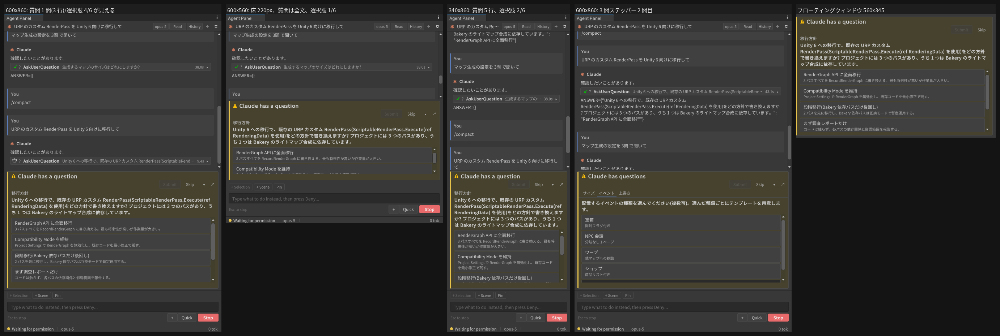

# AskUserQuestion カード: 質問文が読めない(固定表示の質問ブロック)

日付: 2026-09-12 / 対象: v0.42.5 / 関連: 2026-08-05-askuserquestion-stepper.md、
2026-08-12-askuserquestion-other.md、2026-09-05-ui-redesign.md(2026-09-06 review fix 1)

## 1. 現象

発端: ユーザー「AskUserQuestion のデザイン変更に伴って質問内容の視認が難しく
なっている」。

質問カード(`PermissionCard` の question variant)の構造は、2026-09-06 のレビュー
修正 1(要約行の折り返し)以降、次のようになっていた。

```
.uap-perm (インライン: チャット高さの 40% でキャップ)
└ .uap-perm-body
   ├ .uap-perm-summary  ⚠ 「Claude から質問があります」 [送信] [スキップ] ▾ ↗
   │                    (幅が足りないとボタン列が 2 行目に落ちる = 2 行ぶん)
   ├ .uap-perm-qtabs    (2 問以上のときだけ: ヘッダーのタブ帯)
   └ .uap-perm-details  (ScrollView)
      └ .uap-perm-question
         ├ .uap-perm-qheader   ヘッダー(meta サイズ・二次色・太字)
         ├ .uap-perm-qtext     質問文(body サイズ・通常ウェイト)  ← ここ
         ├ .uap-perm-option ×N 選択肢(body サイズ・通常ウェイト)
         └ Other... + 自由入力欄
```

問題は 2 つ重なっている。

1. **質問文がスクロール領域の先頭行にある。** 要約行が 2 行に折り返すと、
   40% キャップの中で details に残る高さが減り、選択肢を 1 段スクロールした
   時点で質問文は画面外に出る。フローティングウィンドウでも、長い選択肢
   リストでは同じことが起きる。
2. **質問文と選択肢ラベルの見た目が同じ**(同サイズ・同ウェイト・同色)。
   スクロールしていなくても「どれが質問でどれが答えか」を形で判別できず、
   ヘッダー(meta・二次色)のほうが目立って質問文が埋もれる。2 問以上では
   ヘッダーはタブにも出るので、質問文だけが唯一の「問い」なのに最も弱い
   表現だった。

## 2. 決定

**質問文をスクロール領域から出し、要約行(タブ帯があればその下)と details の
間に固定表示する。** 選択肢だけがスクロールする。

```
.uap-perm-body
├ .uap-perm-summary
├ .uap-perm-qtabs     (2 問以上)
├ .uap-perm-qprompt   ← 新設。flex-shrink: 0。現在の質問の header + text
│   ├ .uap-perm-qheader   (1 問のときだけ表示。2 問以上ではタブが担う)
│   └ .uap-perm-qtext     太字
└ .uap-perm-details   選択肢セクション(options のみ)
```

- `.uap-perm-qtext` を **太字**にする。サイズは body のまま(カードを高く
  しない)。選択肢ラベルは通常ウェイトなので、ウェイトだけで問い/答えが分かれる。
- `.uap-perm-qprompt` は `flex-shrink: 0`。タブ帯と同じ理由で、高さを返す
  役はあくまで details。高さ不足で質問文が縮んで消える、という元の問題を
  逆側から再発させない。
- 2 問以上ではヘッダーを prompt に重複表示しない。直上のタブが同じ文字列を
  太字+下線で示しているので、繰り返すと質問文(見えにくかった当事者)が
  1 行ぶん下に押される。
- ステッパーのナビゲーション(`RefreshStepperVisibility`)のたびに prompt を
  現在の質問で書き換える。セクション切替時に scrollOffset を 0 に戻す既存の
  処理はそのまま(選択肢の先頭に戻る)。
- prompt はタブ帯と同じく `_body` 直下に置くので、`_details.Clear()` では
  消えない。`ResetStepperState` で一緒に破棄する(2 問目のリクエストで重なら
  ない)。

### 検討して採らなかった案

- **要約行のタイトルを質問文にする**: `.uap-perm-summary-title` は nowrap・
  ellipsis・title サイズ太字。長い質問文は末尾が落ち、ツールチップ頼みに
  なる。要約行はウィンドウホストではウィンドウタイトルにも使われるので、
  「Claude から質問があります」は残す。
- **質問文のフォントを title サイズに上げる**: 高さを食う。40% キャップの
  中では選択肢に回る高さが減り、本末転倒。ウェイトだけで足りる。
- **prompt に max-height を付けて長文を切る**: 長い質問こそ全文が要る。
  極端に長い質問は details 側が縮んでスクロールするだけで、操作は可能。

## 3. 実装

| 変更 | ファイル |
|---|---|
| `_questionPrompt` / `_questionPromptHeader` / `_questionPromptText`、`BuildQuestionPrompt`、`RefreshQuestionPrompt`。セクションから header/qtext を撤去。`ResetStepperState` で破棄 | `Editor/UI/PermissionCard.cs` |
| `.uap-perm-qprompt` 新設、`.uap-perm-qtext` 太字、`.uap-perm-qheader` に折り返し、`.uap-perm-question` の上マージン 0 | `Editor/UI/Uss/AgentPanel.uss` |
| 構造テスト 4 件(body 内の位置、単一質問のヘッダー表示、ナビゲーション追従、リクエスト間で重ならない)+ USS ソーススキャン 1 件(`flex-shrink: 0`、`white-space: normal`、太字) | `Tests/Editor/PermissionCardTests.cs` |

`PermissionCardLayout` の高さ見積り(`QuestionChromeHeight` / `QuestionSectionHeight`)
は変更していない。質問文は section から prompt に移っただけで、カード全体の
内容量は同じ。

## 4. 実機検証(2026-09-12、同セッション)

このコンテナに Unity 2022.3.22f1 の Linux エディタを展開し(`Unity.Licensing.Client
--activate-all --include-personal`、CI と同じ Personal シート)、Xvfb 1600×1000 上で
検証ドライバ `ci/HostProject/Assets/Editor/UapShotQuestion.cs` を走らせた。CLI は
`/usr/local/bin/claude` に置いた擬似 CLI(`--version` / `auth status --json` /
initialize に応え、ユーザー発話ごとに AskUserQuestion の `can_use_tool` を返す:
3 行の質問 + 選択肢 5 件、または 3 問ステッパー)。各状態でカード各部の
`resolvedStyle` と、details ScrollView の viewport / content 高さ、スクロールせずに
全体が見える選択肢の数を記録した(`measurements.txt`)。



### 4.1 1 回目の計測で見つかった 2 つめの問題

固定ブロック自体は意図どおりに働いた(質問文はどの寸法でも全文が見える)。しかし
**会話が少しでもパネルより長くなると、展開カードは 40% キャップに届かず床
(`--uap-perm-card-min` 96px)まで縮む**ことが分かった。UI Toolkit の既定 `flex-shrink`
は 1 で、トランスクリプトの基準高さが巨大なため Yoga はカードも比例して縮める。
1 回目(会話が短い)では 600×860 でカード 325px(= キャップ)だったが、同じ寸法で
会話が数往復あると 220px 未満に落ちる。600×560 の 3 問カードは **138px**(要約 49 +
タブ 23 + 質問 41 → 選択肢 viewport **11px、見える選択肢 0**)。質問は読めるのに
答えが押せない、という逆の欠陥になっていた。

### 4.2 追加した 2 つの規則(`.uap-perm--question`、質問カードの root に付与)

| 規則 | 理由 |
|---|---|
| `min-height: var(--uap-perm-question-min)`(220px、両テーマ) | 要約行 49 + 3 行の質問 77 + 選択肢 2 件分。380px(インライン最小)でも 380 − 28 − 68 = 284 ≥ 220 + トランスクリプト床 60 |
| `flex-shrink: 0` | キャップ(C# の max-height 40%)が既に上限なので、縮む意味が無い。40% + バー 96 + 床 60 は 260px 以上のパネルで収まり、インラインは 380px 以上 |

ツールカード(`.uap-perm--expanded` 単独)は従来どおり縮む(`UssHygieneTests` の
collapsed-crush ガードは不変)。

### 4.3 修正後の計測(3 回目、会話は数往復ある状態)

| 状態 | カード | 質問ブロック | 選択肢 viewport | 見える選択肢 |
|---|---|---|---|---|
| 1 問・600×860 | 325(キャップ) | 77(3 行) | 181 | 4 / 6 |
| 1 問・600×560 | 220(床) | 77 | 76 | 1 / 6 |
| 1 問・340×860 | 325 | 111(5 行) | 147 | 2 / 6 |
| 1 問・ウィンドウ 560×345 | 329 | 94(4 行) | 176 | 3 / 6 |
| 3 問・600×860・2 問目 | 325 | 41(2 行)+ タブ 23 | 190 | 4 / 5 |
| 3 問・600×560・2 問目 | 220 | 41 + 23 | 85 | 1 / 5 |
| 3 問・600×430(インライン最小付近) | 220 | 41 + 23 | 85 | 1 / 5 |

質問文はすべての状態で全文が見え(ブロックは縮まない)、選択肢は最低 1 件が
スクロール無しで見える。低いパネル(560 以下)では 1 件しか見えないので、そこは
「↗」のフローティングウィンドウ(3 件)を使う想定のまま。床を 220 より上げると
380px のインライン最小でトランスクリプト床 60px を割るため、ここが上限。

### 4.4 EditMode

Core + Pro ホスト(`ci/HostProject`)で全スイート 3259 件: 3245 合格 / 2 失敗 / 12 スキップ。
失敗 2 件は本変更と無関係:
`FontLoaderTests.GrownAtlas_NewTexturesComeBackUnstamped_AndSpareSlotsStayHealthy`
(CJK フォント導入環境での既知のアトラス成長前提、2026-09-05 ノートと同じ)と
`UapMainThreadDispatcherPollingTests.PollableTool_ThrowsDuringPoll_PropagatesToCaller`
(TimeoutException。変更したフィクスチャ + この 2 件を含む 8 フィクスチャ 276 件の
再実行では 273 合格 / 1 失敗 / 2 スキップで、残る 1 件は FontLoader のみ。全スイート
同時実行時の負荷起因と見ている)。
本ノートの新規テスト(`QuestionPrompt_*` 5 件、`SourceScan_QuestionPrompt_*`、
`QuestionVariant_CarriesTheHigherFloorClass_*`、`SourceScan_QuestionFloor_*`)は合格。

Core 単体ホスト(`ci/HostProjectCoreOnly`、`make-core-only-host.sh` で組み立て)でも
全スイート 2919 件: 2906 合格 / 1 失敗(同じ FontLoader)/ 12 スキップ。Core だけでも
コンパイル・テストが通ることを確認(2026-09-12-core-only-wording.md の設定 UI 文言も
このホストで走っている)。

### 4.5 既知の限界

- 英数字の長い 1 トークン(`ScriptableRenderPass.Execute(ref` のような)は UI Toolkit の
  折り返し規則上、語の途中では折れない。今回の計測幅では折り返せたが、極端に長い
  識別子は行末で切れうる(全ラベル共通の制約。ツールチップに全文は無い)。
