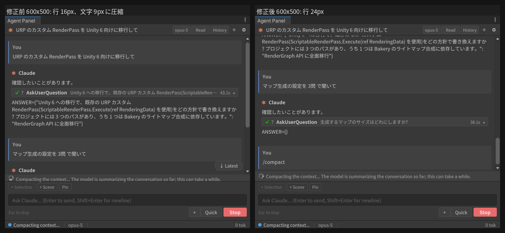

# 会話圧縮中の進行表示が他の UI に重なる(行が押し潰される)

日付: 2026-09-12 / 対象: v0.42.5 / 関連: 2026-09-10-compacting-indicator.md、
2026-07-31-scroll-container-shrink-fix.md、2026-08-01-perm-card-collapsed-crush.md

## 1. 現象

ユーザー報告: 「コンテキスト圧縮の表示 UI が他の UI と重なって表示される」。

会話圧縮中の行(`.uap-compacting-row`: スピナー + 「コンテキストを圧縮しています…」)
は、チャット列(`.uap-chat`)の中で メッセージ一覧(`.uap-chat-content`)と
コンテキストバーの間に通常フローで置かれている。実機(Unity 2022.3.22f1、Xvfb、
擬似 CLI が `system/status: compacting` を返す)で計測した。

| パネル | `.uap-chat-content` | `.uap-compacting-row` | 行内ラベル |
|---|---|---|---|
| 600×860 | 692px | **24px** | 16px |
| 300×860 | 660px | 56px(3 行に折り返し) | 48px |
| 600×500 | 340px | **16px** | **9px** |

600×500 では行が 24px → 16px に、16px の文字を持つラベルが 9px に押し潰されて
いた。ラベルは自身の箱より大きい文字を描くので、上のメッセージ一覧の末尾と下の
コンテキストバーに文字がはみ出して重なる。これが報告の「重なり」。

## 2. 原因

UI Toolkit の既定 `flex-shrink` は 1。トランスクリプトがパネルより高いとき、
チャット列の子は全員が高さを返す候補になり、Yoga は各子の基準サイズに比例して
縮める。メッセージ一覧は `min-height: var(--uap-msg-list-min)` の床を持つが、
圧縮行には床も `flex-shrink: 0` も無かった。同じ欠陥の 4 度目
(list-row alignment / 履歴フィルタバー / 権限カードの collapsed crush に続く)。

## 3. 修正

`.uap-compacting-row { flex-shrink: 0; }`。高さを返す役はメッセージ一覧
(自前の床あり)であり、1 行の状態表示は決して縮まない。

回帰ガード: `UssHygieneTests.SourceScan_CompactingRow_NeverShrinks`。

## 4. 検証

修正後の実機計測(同条件、600×500): 行 24px / ラベル 16px、メッセージ一覧 332px
(修正前 340px → 8px をメッセージ一覧が返し、行は無傷)。600×860 と 300×860 は変化なし。

チャット列の子の worldBound を連続比較し、重なり(次の子の yMin < 前の子の yMax)
と列からの溢れが無いことを `UapShotQuestion.DumpChatColumn`(検証ドライバ)で確認。
