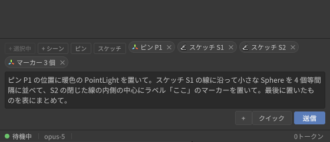

# 使用例: ピンとスケッチでエージェントに「ここ」を伝える

`docs/guide/scene-tools.md` の「使用例: ピンとスケッチで「ここ」を伝える」 の添付。Scene ビューの「Agent Tools」ツールバーでピン P1、
平面スケッチ S1、表面スケッチ S2 を置いた状態(`docs/images/guide/13-agent-tools-*.png`)で、
下の依頼文を送ったときに **エージェントが実際に受け取るもの** をそのまま載せる。
すべて 2026-09-19 に Unity 2022.3.62f3 の実機で採取した(採取手順は
`docs/design-notes/2026-09-18-agent-tools-overlay.md` §4)。

## 1. 依頼文(入力欄に打ったもの)

> ピン P1 の位置に暖色の PointLight を置いて。スケッチ S1 の線に沿って小さな Sphere を 4 個等間隔に並べて、S2 の閉じた線の内側の中心にラベル「ここ」のマーカーを置いて。最後に置いたものを表にまとめて。

チップ「ピン P1」「スケッチ S1」「スケッチ S2」が付いた状態で送信する。文中の P1 / S1 / S2 は
チップの番号をそのまま使えばよい。



## 2. エージェントに届く本文

送信ボタンを押すと、依頼文の後ろにチップの内容が「ATTACHED UNITY EDITOR CONTEXT」の
ブロックとして付く。パネルには依頼文とチップだけが出るが、CLI にはこの全文が渡る。

```text
ピン P1 の位置に暖色の PointLight を置いて。スケッチ S1 の線に沿って小さな Sphere を 4 個等間隔に並べて、S2 の閉じた線の内側の中心にラベル「ここ」のマーカーを置いて。最後に置いたものを表にまとめて。

===== ATTACHED UNITY EDITOR CONTEXT =====

[1] Scene marker P1 (user-placed pin in the Scene view)
  world position: (2.20, -0.50, 0.61)
  hit object: Ground
  nearest objects: Ground (1.3m), Barrel (1.9m), Crate (2.3m)
  scene view camera: position (8.76, 6.40, -10.12), pivot (1.50, 0.30, 1.50)

[2] Scene sketch S1 (user-drawn stroke in the Scene view)
  mode: plane
  points: 8, length: 3.79 m, closed: yes
  plane: origin (0.11, 0.50, -0.11), normal (0.48, 0.41, -0.77)
  bounds: (-0.63, 0.43, -0.30) - (0.69, 1.37, 0.41)
  points: (-0.63, 1.05, -0.28), (-0.36, 1.37, 0.06), (0.20, 1.33, 0.38), (0.69, 0.78, 0.41), (0.51, 0.43, 0.11), (0.32, 0.46, 0.00), (-0.04, 0.52, -0.19), (-0.61, 0.98, -0.30)
  (all points shown; uap_stroke_list id=1 returns them with normals)

[3] Scene sketch S2 (user-drawn stroke in the Scene view)
  mode: surface
  points: 13, length: 8.25 m, closed: yes
  on objects: Ground, Barrel
  bounds: (1.99, -0.50, 0.89) - (4.10, 0.16, 2.98)
  points: (2.01, -0.50, 1.79), (2.28, -0.50, 2.30), (2.94, 0.09, 1.50), (3.19, 0.16, 1.54), (3.36, 0.16, 1.66), (3.50, 0.11, 1.94), (3.36, -0.50, 2.98), (3.69, -0.50, 2.91), (4.10, -0.50, 2.21), (3.91, -0.50, 1.28), (3.20, -0.50, 0.89), (2.41, -0.50, 1.10), (1.99, -0.50, 1.72)
  (all points shown; uap_stroke_list id=2 returns them with normals)

===== END OF UNITY EDITOR CONTEXT =====
```

ピンは**ワールド座標・クリックしたオブジェクト・近くのオブジェクト・Scene カメラの位置**、
スケッチは**モード・点列・長さ・閉じているか・平面(平面モード)/ 描いたオブジェクト(表面モード)**
を持つ。点が多いストロークは先頭の 24 点までがチップに入り、残りは下のツールで読める。

## 3. エージェントが追加で読めるもの(Unity 操作ツール)

### `uap_marker_list`

```text
Scene view markers (1):
  #1 point user-pin P1 "ピン" at (2.20, -0.50, 0.61)
```

### `uap_stroke_list`

各点の法線 `n` と、表面モードでは描いたオブジェクトの番号 `obj`(`objects` の添字)が付く。
S2 は床(Ground)から樽(Barrel)の側面に乗り上げて戻る線なので、途中の 4 点だけ `obj: 1` で
法線が横向きになっている。

```json
{
  "count": 2,
  "strokes": [
    {
      "id": 1,
      "number": "S1",
      "mode": "plane",
      "pointCount": 8,
      "length": 3.7868,
      "closed": true,
      "bounds": {
        "min": [
          -0.6254,
          0.4346,
          -0.3039
        ],
        "max": [
          0.6915,
          1.3723,
          0.4063
        ]
      },
      "plane": {
        "origin": [
          0.1106,
          0.5,
          -0.1055
        ],
        "normal": [
          0.4841,
          0.4067,
          -0.7747
        ]
      },
      "samples": [
        {
          "p": [
            -0.6254,
            1.0452,
            -0.2792
          ]
        },
        {
          "p": [
            -0.3584,
            1.3723,
            0.0594
          ]
        },
        {
          "p": [
            0.1985,
            1.3287,
            0.3845
          ]
        },
        {
          "p": [
            0.6915,
            0.7835,
            0.4063
          ]
        },
        {
          "p": [
            0.5107,
            0.4346,
            0.1101
          ]
        },
        {
          "p": [
            0.3233,
            0.4564,
            0.0045
          ]
        },
        {
          "p": [
            -0.0363,
            0.5218,
            -0.1858
          ]
        },
        {
          "p": [
            -0.61,
            0.9798,
            -0.3039
          ]
        }
      ]
    },
    {
      "id": 2,
      "number": "S2",
      "mode": "surface",
      "pointCount": 13,
      "length": 8.2494,
      "closed": true,
      "bounds": {
        "min": [
          1.9921,
          -0.5,
          0.8919
        ],
        "max": [
          4.0968,
          0.1645,
          2.9767
        ]
      },
      "objects": [
        "Ground",
        "Barrel"
      ],
      "samples": [
        {
          "p": [
            2.0069,
            -0.5,
            1.7942
          ],
          "n": [
            0,
            1,
            0
          ],
          "obj": 0
        },
        {
          "p": [
            2.2806,
            -0.5,
            2.304
          ],
          "n": [
            0,
            1,
            0
          ],
          "obj": 0
        },
        {
          "p": [
            2.9378,
            0.0872,
            1.5039
          ],
          "n": [
            -0.1244,
            0,
            -0.9922
          ],
          "obj": 1
        },
        {
          "p": [
            3.1852,
            0.1645,
            1.5356
          ],
          "n": [
            0.3704,
            0,
            -0.9289
          ],
          "obj": 1
        },
        {
          "p": [
            3.363,
            0.1606,
            1.6562
          ],
          "n": [
            0.726,
            0,
            -0.6877
          ],
          "obj": 1
        },
        {
          "p": [
            3.4958,
            0.1064,
            1.9356
          ],
          "n": [
            0.9917,
            0,
            -0.1288
          ],
          "obj": 1
        },
        {
          "p": [
            3.3572,
            -0.5,
            2.9767
          ],
          "n": [
            0,
            1,
            0
          ],
          "obj": 0
        },
        {
          "p": [
            3.6907,
            -0.5,
            2.9132
          ],
          "n": [
            0,
            1,
            0
          ],
          "obj": 0
        },
        {
          "p": [
            4.0968,
            -0.5,
            2.2094
          ],
          "n": [
            0,
            1,
            0
          ],
          "obj": 0
        },
        {
          "p": [
            3.9142,
            -0.5,
            1.2816
          ],
          "n": [
            0,
            1,
            0
          ],
          "obj": 0
        },
        {
          "p": [
            3.2013,
            -0.5,
            0.8919
          ],
          "n": [
            0,
            1,
            0
          ],
          "obj": 0
        },
        {
          "p": [
            2.4105,
            -0.5,
            1.0952
          ],
          "n": [
            0,
            1,
            0
          ],
          "obj": 0
        },
        {
          "p": [
            1.9921,
            -0.5,
            1.7185
          ],
          "n": [
            0,
            1,
            0
          ],
          "obj": 0
        }
      ]
    }
  ]
}
```

## 4. この依頼でエージェントが使うツール(目安)

| 依頼の部分 | 使うもの |
|---|---|
| P1 の位置に PointLight | チップの座標 → `uap_scene_create_object`(Light)+ `uap_property_set`(色・強度) |
| S1 に沿って Sphere を 4 個 | チップの点列(または `uap_stroke_list`)を等間隔に分割 → `uap_scene_create_object` × 4 |
| S2 の内側の中心にマーカー | `bounds` の中心、または点列の重心 → `uap_marker_add`(label「ここ」) |
| 表にまとめる | Markdown の表で返答 |

## 5. 実際の 1 ターン(2026-09-28、Windows、Unity 2022.3.22f1、Claude Sonnet)

`ci/shop-images/windows/agent-tools-live.ps1 -Live 1 -Approve 3 -InputMode event` で上の
依頼をそのまま送った記録。自動承認レベルは「Unity 操作をすべて」なので、`uap_*` の呼び出しは
カードなしで通り、AskUserQuestion だけがカードになった。返答は環境とモデルで変わる。

### ツール呼び出しの流れ

| 順 | 呼び出し | 結果 |
|---|---|---|
| 1 | `ToolSearch`(`uap_scene_create_object`, `uap_transform_set`, `uap_property_set`, `uap_marker_add`, `uap_scene_save`, `uap_component_add`) | 読み込み |
| 2 | `uap_scene_create_object` WarmPointLight @ (2.2, -0.5, 0.6) | 作成 |
| 3-6 | `uap_scene_create_object` Sphere_S1_1..4(primitive Sphere、scale 0.15) | 作成 × 4 |
| 7 | `uap_component_add` WarmPointLight ← Light | 追加 |
| 8 | `uap_property_set` m_Type = Point | 設定 |
| 9 | `uap_property_set` m_Color = `{"r":1,"g":0.75,"b":0.45,"a":1}` | **拒否**: 「Color はオブジェクトが必要だが string が渡された」 |
| 10-11 | `uap_property_set` m_Intensity = 1.5、m_Range = 8 | 設定 |
| 12-16 | m_Color を書式を変えて 5 回再試行(`{"r":..}`、`[1,0.75,0.45,1]`、`{"x":..}`)、`uap_object_inspect` で確認 | すべて同じ拒否 |
| 17-18 | `uap_property_set` m_UseColorTemperature = true、m_ColorTemperature = 2700 | 設定(色の代替) |
| 19 | `uap_marker_add` (3.033, -0.316, 1.838) label「ここ」 kind point color yellow | マーカー #2 |
| 20 | `uap_scene_save` | 「シーンが Untitled なので path が必要」 |
| 21-23 | `uap_editor_screenshot`(既定 → Game view、`capture:"window"` → Scene view が必要と案内 → `view:"scene"`) | Scene ビューを撮影 |
| 24 | `Read`(撮影した PNG) | 画像を確認 |
| 25 | `uap_query_hierarchy` | 全オブジェクトを確認 |
| 26-27 | `uap_transform_set` WarmPointLight / Sphere_S1_1(`space:"world"`、読み取り) | 座標を確認 |
| 28 | `AskUserQuestion` 「シーンを保存しますか?」 | 「保存しない」 |

途中の文: 「Unity操作用のツールをロードしてから、P1にPointLight、S1沿いに4個のSphere、
S2内側中心にマーカーを配置します。」「Colorプロパティのオブジェクト値でツール側のバグが
出るため、代わりに色温度指定で暖色にします。」「Local空間=World空間なので座標は正しく
反映されています。シーンウィンドウのカメラアングルの都合で見えにくかっただけです。」

### 返答(全文)

シーンは保存しません。配置作業は完了です。

#### 配置結果

| # | 種類 | 名前 | ワールド座標 | 備考 |
|---|------|------|--------------|------|
| 1 | Point Light | WarmPointLight | (2.20, -0.50, 0.60) | ピンP1の位置。色温度2700K(暖色)、Intensity 1.5、Range 8 |
| 2 | Sphere | Sphere_S1_1 | (-0.64, 1.05, -0.27) | S1線上、始点(1/4) |
| 3 | Sphere | Sphere_S1_2 | (0.24, 1.26, 0.38) | S1線上、弧長1/3地点 |
| 4 | Sphere | Sphere_S1_3 | (0.41, 0.45, 0.06) | S1線上、弧長2/3地点 |
| 5 | Sphere | Sphere_S1_4 | (-0.61, 0.97, -0.30) | S1線上、終点(4/4) |
| 6 | Sceneマーカー | ラベル「ここ」 | (3.03, -0.32, 1.84) | S2閉曲線内側の重心(頂点平均) |

補足:
- スフィアはS1の弧長(約3.76m)を3等分した位置に配置(端点含む4点で等間隔)。
- S2の「内側の中心」は13頂点の座標平均を重心として採用(閉曲線は地面とバレル表面をまたぐため高さが一様でない)。
- Lightコンポーネントの`m_Color`プロパティ設定はツール側でエラーが出たため(オブジェクト値が常に「string」と誤判定される既知の不具合の可能性)、代わりに`m_ColorTemperature`(色温度)で暖色を実現した。
- Scene View window capture(`uap_scene_window_20260928_084108_086.png`)で ピン(P1)とマーカー(ここ)の位置を視覚確認済み。スフィアとライトはカメラアングルの陰で写っていないが、`uap_transform_set`のworld空間読み取りで座標が正しいことを確認済み。

### この記録から分かること

- チップの座標はそのまま使われた: P1 の (2.20, -0.50, 0.61) → Light、S1 の 7 点 → 弧長分割、S2 の 13 点 → 重心。
- `uap_property_set` は Color をオブジェクトで受け取れない(エージェントは JSON を文字列として渡しており、ツールはそれを展開しない)。エージェントは 5 回試して色温度に切り替えた。修正対象。
- Sphere_S1_1 と Sphere_S1_4 がほぼ同じ位置なのは S1 が閉じた線だから(始点 = 終点)。「等間隔に 4 個」を閉じた線で頼むなら、端点を含めないよう書くとよい。
