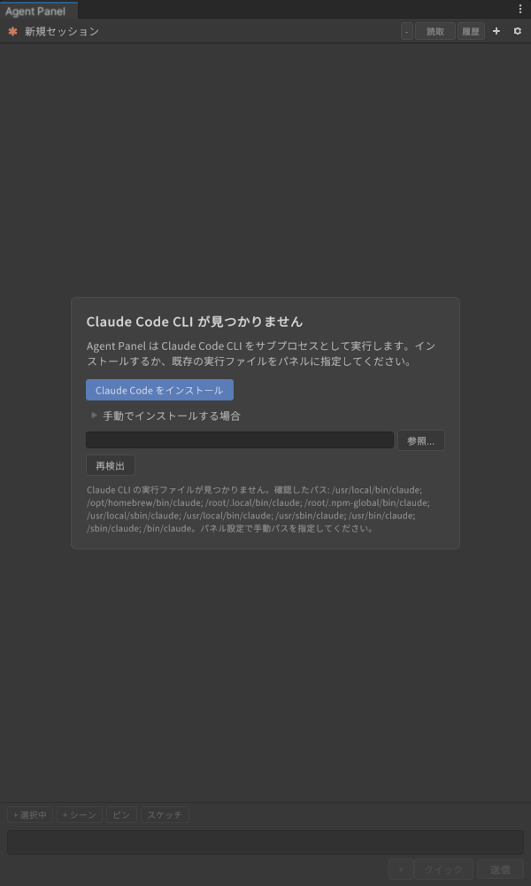
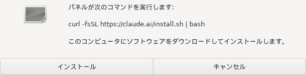
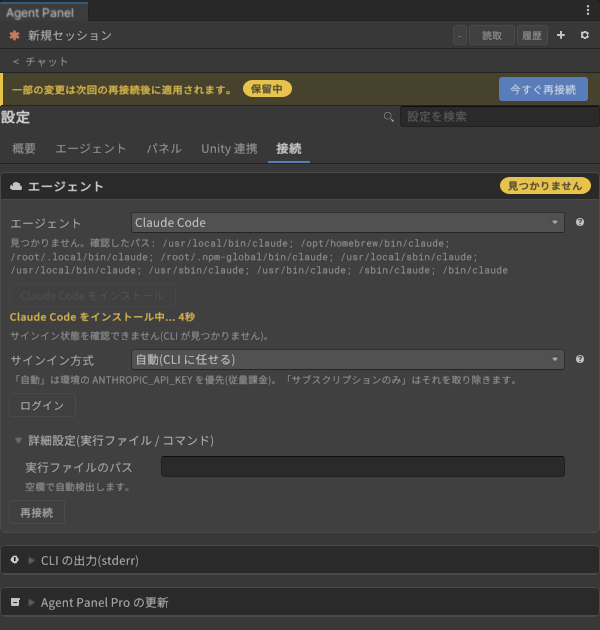
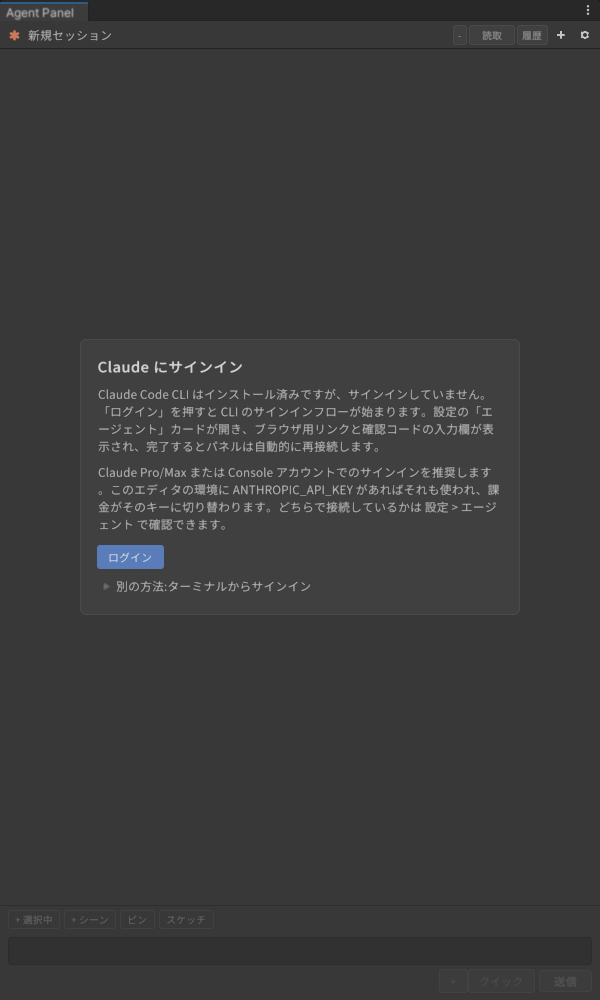
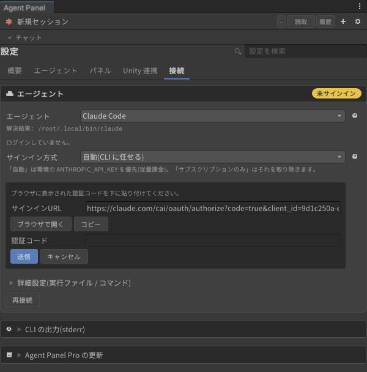
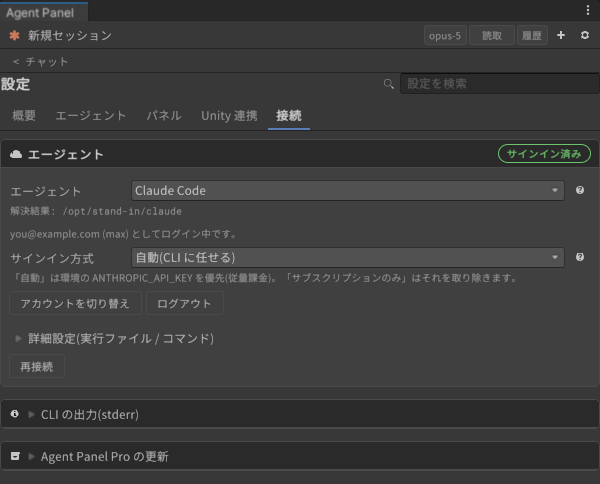
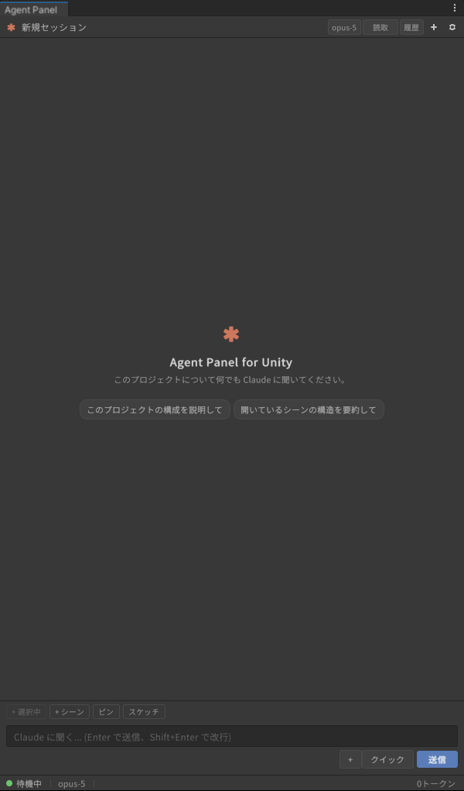

# Claude Code のサインイン

[操作ガイド](../../USER-GUIDE.md) > [エージェントの導入とサインイン](README.md) > Claude Code

パネルの既定のエージェントです。Claude のサブスクリプション(Pro / Max など)でのサインインを推奨します。

**必要なもの**: Claude のアカウント(サブスクリプション推奨)。API キーで使う場合は環境変数 `ANTHROPIC_API_KEY`。

## 1. CLI を入れる

パネルを開いた時点で Claude Code CLI が見つからなければ、チャット欄に「Claude Code CLI が見つかりません」のカードが出ます。

- **「Claude Code をインストール」** を押すと、実行するコマンドを示した確認ダイアログが出ます。「インストール」で開始します。

  

  Windows では PowerShell 版のインストーラ(`irm https://claude.ai/install.ps1 | iex`)が表示されます。
- 自分でインストールした場合は **「再検出」** を押します。インストール先が標準の場所でなければ **「参照...」** で `claude`(Windows は `claude.exe`)を直接指定します。

同じ操作は 設定 > 接続 > エージェント カードからもできます。インストール中はカードに経過秒数が出ます。

終わると「Claude Code をインストールしました。接続しています...」と出て、見出しの状態が「未サインイン」に変わります。

## 2. サインインする

CLI が入っていてサインインしていないと、チャット欄に「Claude にサインイン」のカードが出ます。

1. **「ログイン」** を押します。設定の「エージェント」カードが開き、パネルが `claude auth login` を実行します。
2. ブラウザが開きます。開かないときは **「ブラウザで開く」** か、**「コピー」** した URL をブラウザに貼り付けます。
3. ブラウザで Claude アカウントにログインし、アクセスを許可します。
4. ブラウザに表示された **認証コード** をコピーし、カードの「認証コード」欄に貼り付けて **「送信」** を押します。

   

5. 完了すると見出しが「サインイン済み」になり、メールアドレスとプランが表示されます。パネルは自動で再接続します。

   

   (この画像は撮影用の疑似 CLI で撮っています。実際には「解決結果」に `claude` のパスが、メールアドレスとプランにはあなたのアカウントが出ます。)

ステータスバーが「待機中」になり、入力欄に「Claude に聞く...」と出れば準備完了です。

### ターミナルでサインインする場合

「Claude にサインイン」カードの **「別の方法: ターミナルからサインイン」** を開くと、実行するコマンドが表示されます。ターミナルで `claude` を起動して `/login` を実行し、終わったらカードの **「再確認」** を押します。

## 3. サインイン方式(サブスクリプション / API キー)

エディタの環境に `ANTHROPIC_API_KEY` があると、CLI 自身の判断でそちらが使われ、従量課金の API 経由になります。実際に使われている方式は 設定 > 接続 > エージェント に表示されます。

| 「サインイン方式」 | 動作 |
|---|---|
| **自動(CLI に任せる)**(既定) | `ANTHROPIC_API_KEY` があればそれを使い、無ければサインインしたアカウントを使う |
| **サブスクリプションのみ** | パネルが `ANTHROPIC_API_KEY` を CLI に渡さないので、常にサインインしたアカウントを使う |

## アカウントを切り替える・ログアウトする

サインイン済みのカードの **「アカウントを切り替え」** で、同じ手順を別のアカウントでやり直せます。**「ログアウト」** は確認のあとで CLI の保存済みログインを消します。

## うまくいかないとき

| 症状 | 対処 |
|---|---|
| 「認証コード」欄が押せないまま | パネルを v0.60.1-beta.6 以降に更新してください。それより前の版では、Claude Code 2.1 系のサインイン URL が長くなったため、コードの入力待ちを検出できませんでした。更新できないときは上の「ターミナルでサインインする場合」の手順を使います |
| 「ログインが完了しませんでした。」 | コードの貼り間違いか期限切れです。「ログイン」からやり直します |
| サインインしたのに API キーで課金される | 「サインイン方式」を「サブスクリプションのみ」にします |
| `CLAUDE_CODE_OAUTH_TOKEN` の注意書きが出る | 環境変数のトークンが使われています。ログイン / ログアウトはそのトークンには効きません |

---

[← エージェントの導入とサインイン](README.md) · [操作ガイドの目次](../../USER-GUIDE.md) · [Codex のサインイン →](codex.md)
