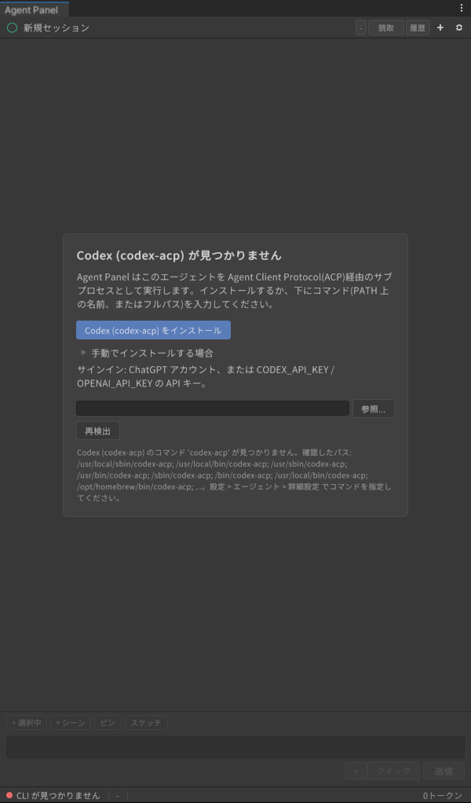
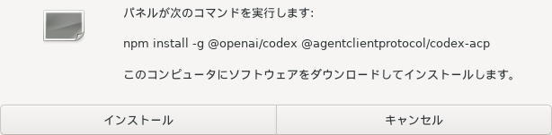
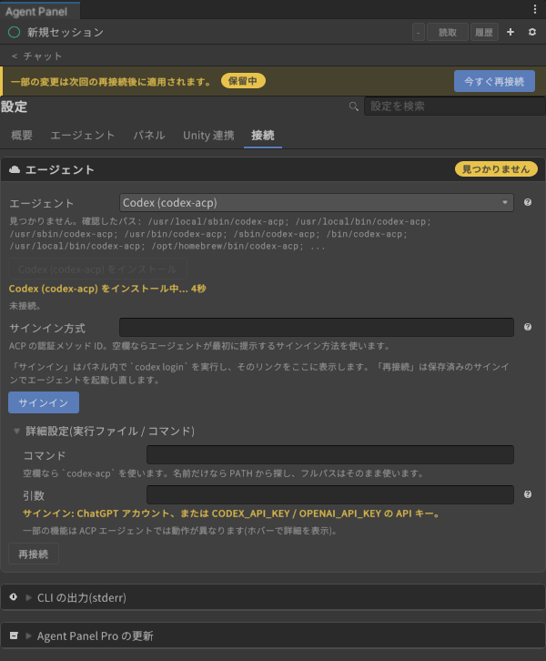
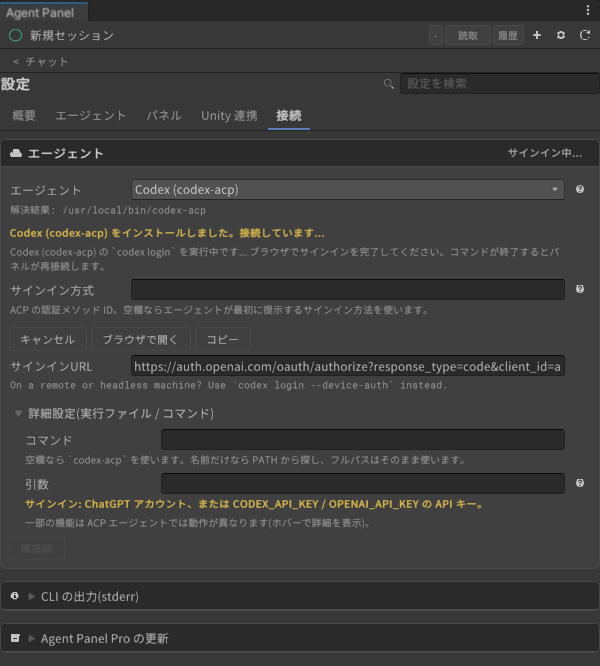

# Codex のサインイン

[操作ガイド](../../USER-GUIDE.md) > [エージェントの導入とサインイン](README.md) > Codex

OpenAI の Codex を、ACP アダプタ `codex-acp` 経由で使います。ChatGPT アカウントでのサインインを推奨します。

**必要なもの**: ChatGPT アカウント(画像生成など一部のツールは Plus 以上のプラン)、Node.js(npm でインストールするため)。API キーで使う場合は環境変数 `CODEX_API_KEY` または `OPENAI_API_KEY`。

## 1. Codex に切り替える

設定(⚙)> 接続 > エージェント の **「エージェント」** で **Codex (codex-acp)** を選びます。上部に「一部の変更は次回の再接続後に適用されます。」と出たら **「今すぐ再接続」** を押します。

## 2. CLI を入れる

`codex-acp` が見つからないと、チャット欄とエージェントカードに「Codex (codex-acp) が見つかりません」と出ます。

1. **「Codex (codex-acp) をインストール」** を押します。
2. 確認ダイアログに実行するコマンドが出るので、**「インストール」** を押します。

   

   Node.js が無いときは、代わりに Node.js の入手ページを開くボタンが出ます。入れたあとエディタを再起動してください。
3. インストール中はカードに経過秒数が出ます。

   

自分でインストールした場合は、同じコマンドをターミナルで実行してから「再検出」(チャット欄)か「再接続」(設定)を押します。

## 3. サインインする

インストールが終わるとパネルが Codex に接続します。まだサインインしていなければ、Codex が自分のブラウザ手順を始めます(ブラウザが開き、カードに「ブラウザでの Codex (codex-acp) へのサインインを待っています...」と出ます)。ブラウザで ChatGPT にログインすれば、パネルが自動で続きを進めます。

ブラウザが開かなかったときや、途中でやめたときは、カードが「未サインイン」になります。その場合は次の手順でサインインします。

1. **「サインイン」** を押します。パネルが `codex login` をパネル内で実行します。
2. カードにサインイン URL と CLI の出力が出ます。**「ブラウザで開く」** を押すか、**「コピー」** した URL をブラウザに貼り付けます。

   

3. ブラウザで ChatGPT アカウントにログインし、Codex へのアクセスを許可します。
4. `codex login` が終わるとパネルが再接続し、カードが「Codex (codex-acp) に接続済み。」になります。使われたサインイン方式もその下に表示されます。

> サインインのコールバックはこのパソコン上(`localhost`)で受け取ります。リモートデスクトップ先などでブラウザが別のマシンにある場合は、ターミナルで `codex login --device-auth` を実行してから「再接続」を押してください(CLI の出力にも同じ案内が出ます)。

## API キーで使う

ChatGPT アカウントの代わりに API キーを使うときは、OS の環境変数 `CODEX_API_KEY`(または `OPENAI_API_KEY`)を設定し、エディタ(Unity Hub から起動している場合は Unity Hub も)を再起動します。API キーでの利用は従量課金です。パネルはキーを保存しません。

## うまくいかないとき

| 症状 | 対処 |
|---|---|
| 会話欄に「サインインに失敗しました: ChatGPT: ... spawn xdg-open ENOENT」 | ブラウザを開くコマンドが無い環境です(Linux)。「サインイン」で出る URL を手でブラウザに貼るか、`codex login --device-auth` を使います |
| 画像生成を頼むと「この環境では使えない」と言われる | ChatGPT の Free プランでは画像生成ツールが提供されません。Plus 以上にすると使えるようになります(反映されないときは「アカウントを切り替え」でサインインし直します)([エージェント別の使用例](../../AGENT-SHOWCASE.md)) |
| 「… にサインインしていないため、再接続を繰り返しませんでした。」 | サインインしてから「再接続」を押します |

---

[← Claude Code のサインイン](claude-code.md) · [操作ガイドの目次](../../USER-GUIDE.md) · [Grok Build のサインイン →](grok-build.md)
