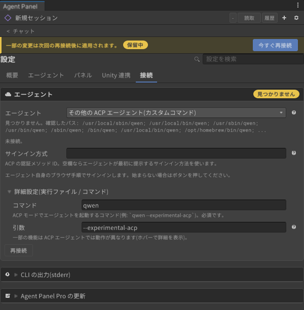
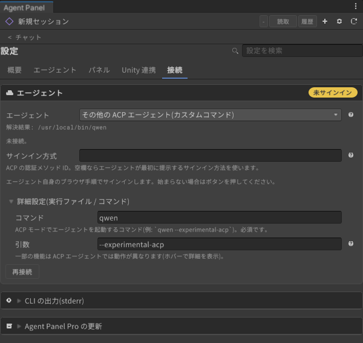

# Other ACP agents (custom command)

[User guide](../../USER-GUIDE.en.md) > [Agents: installing and signing in](README.en.md) > Other ACP agents

CLIs that support ACP (Agent Client Protocol) but are not among the presets (Qwen Code, Kimi CLI, OpenCode, and so on) also work if you enter their launch command by hand. Install and sign in to the CLI outside the panel, following that CLI's own instructions.

## 1. Install the CLI and sign in beforehand

Install the CLI in a terminal and complete that CLI's own sign-in (or API key setup). The panel does not know a custom CLI's login command, so no "Sign in" button appears.

Example: Qwen Code

```sh
npm install -g @qwen-code/qwen-code
qwen          # choose a sign-in method on first launch
```

## 2. Enter the launch command

1. In Settings (⚙) > Connection > Agent, choose **Other ACP agent (custom command)** under **"Agent"**.
2. Open **"Advanced (executable / command)"**, then enter the command that starts the CLI in ACP mode under **"Command"** and its arguments under **"Arguments"**. The command can be a name on your PATH or a full path.

   

3. Press **"Reconnect now"** at the top. When the command is found, its path appears under "Resolved".

   

| CLI | Command | Arguments |
|---|---|---|
| Qwen Code | `qwen` | `--experimental-acp` |
| Others | How to start ACP mode, per each CLI's documentation | |

## 3. If it says sign-in is required

When the agent asks for sign-in on connect, the panel starts authentication with the sign-in method the agent offers (your browser opens). To choose a method yourself, enter the ACP authenticate method id under **"Sign-in method"** and press "Reconnect now". Which ids exist depends on the CLI. This field is saved per agent, so a value you entered for another agent such as Gemini CLI does not appear here.

If it does not work, start the CLI normally in a terminal and complete the sign-in there, then press "Reconnect" in the panel.

- The reason a connection fails appears under Settings > Connection > **CLI output (stderr)**.

---

[← Signing in to Gemini CLI](gemini-cli.en.md) · [User guide contents](../../USER-GUIDE.en.md) · [Layout and chat →](../chat.en.md)
