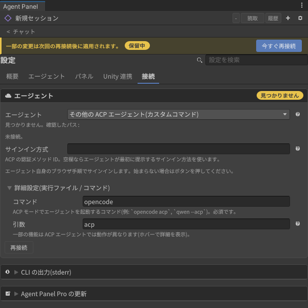
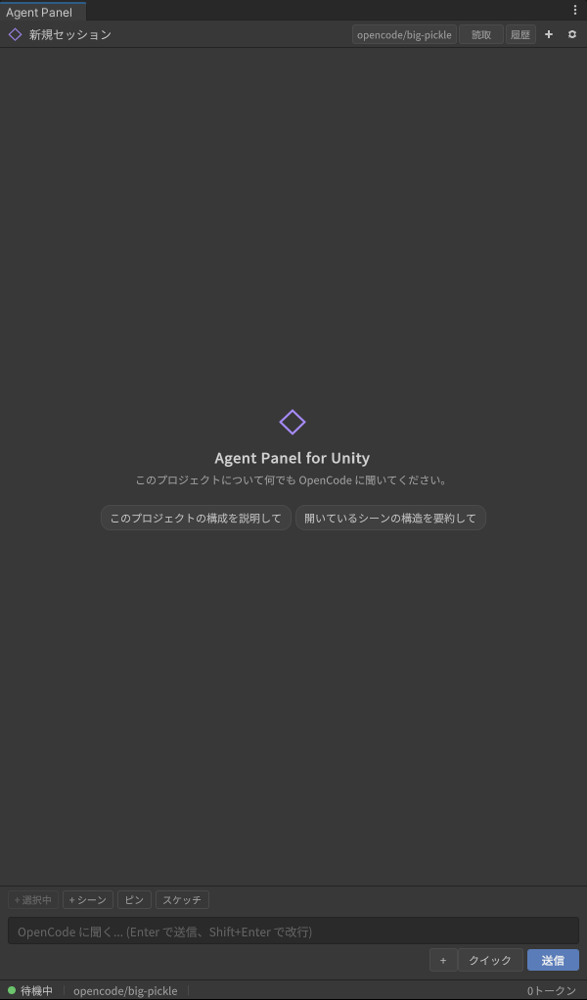
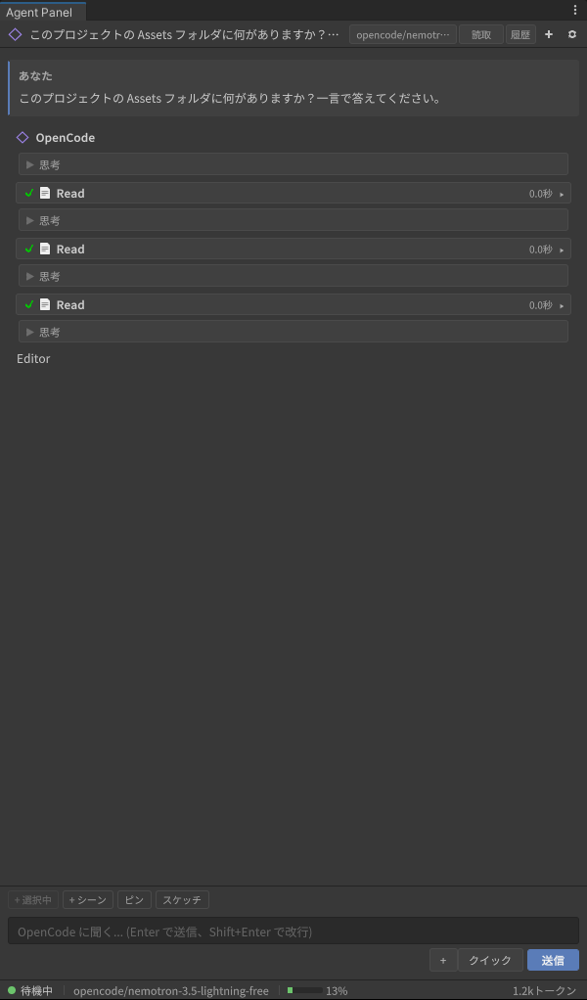
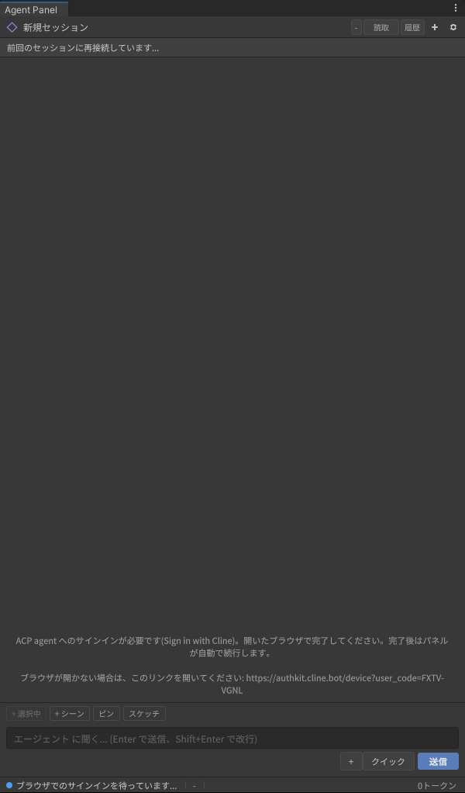

# Other ACP agents (custom command)

[User guide](../../USER-GUIDE.en.md) > [Agents: installing and signing in](README.en.md) > Other ACP agents

CLIs that support ACP (Agent Client Protocol) but are not among the presets (Qwen Code, Kimi CLI, OpenCode, and so on) also work if you enter their launch command by hand. Install and sign in to the CLI outside the panel, following that CLI's own instructions.

## 1. Install the CLI and sign in beforehand

Install the CLI in a terminal and complete that CLI's own sign-in (or API key setup). The panel does not know a custom CLI's login command, so no "Sign in" button appears.

Example: Qwen Code

```sh
npm install -g @qwen-code/qwen-code
qwen          # choose a sign-in method on first launch
```

## 2. Enter the launch command

1. In Settings (⚙) > Connection > Agent, choose **Other ACP agent (custom command)** under **"Agent"**.
2. Open **"Advanced (executable / command)"**, then enter the command that starts the CLI in ACP mode under **"Command"** and its arguments under **"Arguments"**. The command can be a name on your PATH or a full path.

   

3. Press **"Reconnect now"** at the top. When the command is found, its path appears under "Resolved". Once connected, the badge in the corner reads "Signed in" and the card says "Connected".

   

| CLI | Install | Command | Arguments | In a terminal first |
|---|---|---|---|---|
| OpenCode | `npm install -g opencode-ai` | `opencode` | `acp` | Nothing (its free model works as is). Paid models: `opencode auth login` |
| Qwen Code | `npm install -g @qwen-code/qwen-code` | `qwen` | `--acp` | Start `qwen` once and sign in |
| GitHub Copilot CLI | `npm install -g @github/copilot` | `copilot` | `--acp` | `copilot login` |
| Cline | `npm install -g cline` | `cline` | `--acp` | A device-code link appears in the chat on connect. `cline auth` beforehand also works |
| Auggie (Augment) | `npm install -g @augmentcode/auggie` | `auggie` | `--acp` | `auggie login` (required; it cannot sign in through the panel) |
| Mistral Vibe | `uv tool install mistral-vibe` | `vibe-acp` | | Start `vibe` once and sign in (a browser also opens on connect) |
| Goose | Official install script | `goose` | `acp` | `goose configure` for the provider and key |
| Kimi Code CLI | Official install script | `kimi` | `acp` | `kimi login` |
| fast-agent | `uv tool install fast-agent-mcp` | `fast-agent-acp` | | A model and key in `fast-agent.yaml` or environment variables |
| Others | | How to start ACP mode, per each CLI's documentation | | |

### Example: OpenCode (no account needed)

OpenCode ships with a free model, so it works without signing in. Enter `opencode` under "Command" and `acp` under "Arguments", press "Reconnect now", and the header shows the model name; you can ask questions right away.







The CLIs in the table were connected for real with the versions current on 2026-10-07 (details in `docs/design-notes/2026-10-07-acp-other-agents.md`). Launch flags change between versions (Qwen Code moved from `--experimental-acp` to `--acp`).

- **Permission mode**: the header's permission mode switches only when the agent has a mode with the same meaning (Goose: default→approve, acceptEdits→auto; OpenCode: plan only). Otherwise a "no session mode matching" error appears and the agent's own default stays.
- **Models**: agents that publish a model list (OpenCode, Goose, ...) show it in the header's model picker.

## 3. If it says sign-in is required

When the agent asks for sign-in on connect, the panel starts authentication with the sign-in method the agent offers (your browser opens). To choose a method yourself, enter the ACP authenticate method id under **"Sign-in method"** and press "Reconnect now". Which ids exist depends on the CLI. This field is saved per agent, so a value you entered for another agent such as Gemini CLI does not appear here.

CLIs that can only sign in from a terminal (Qwen Code, GitHub Copilot CLI, Kimi Code, ...) are not authenticated by the panel; instead the connection error names the command to run (for example `copilot login`). Run it once in a terminal, then press "Reconnect".


A CLI that cannot sign in over ACP at all (Auggie) shows its own message, which asks you to run `auggie login`.


When an agent prints a sign-in link, the chat shows an "open this link" note (Cline's device code, for example).



If it does not work, start the CLI normally in a terminal and complete the sign-in there, then press "Reconnect" in the panel.

- The reason a connection fails appears under Settings > Connection > **CLI output (stderr)**.

---

[← Signing in to Gemini CLI](gemini-cli.en.md) · [User guide contents](../../USER-GUIDE.en.md) · [Layout and chat →](../chat.en.md)
