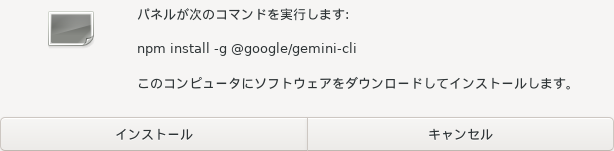
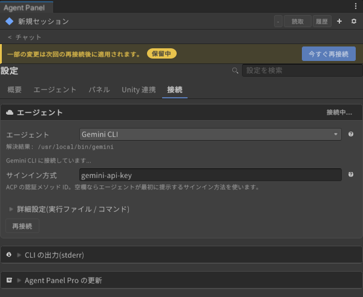
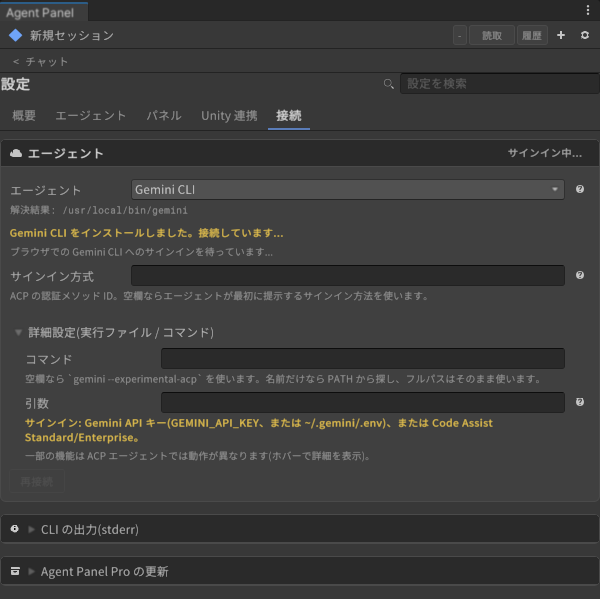
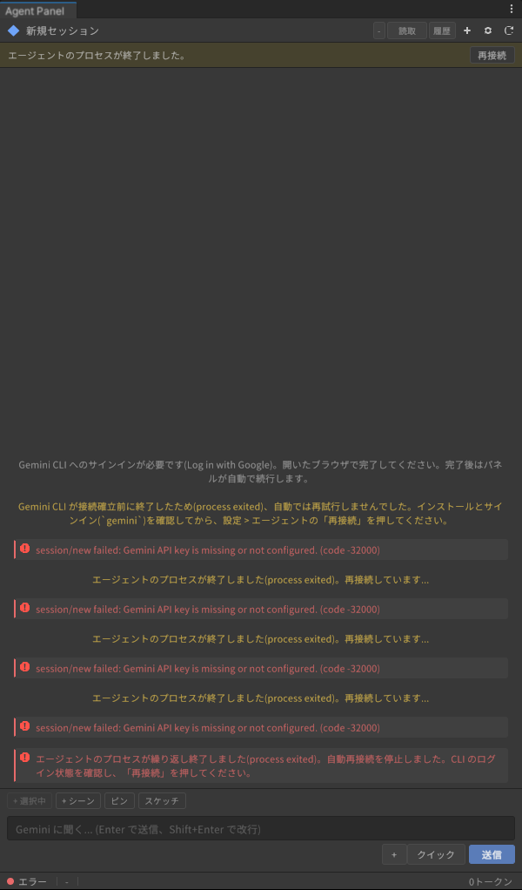

# Gemini CLI の設定

[操作ガイド](../../USER-GUIDE.md) > [エージェントの導入とサインイン](README.md) > Gemini CLI

Google の Gemini CLI を ACP モード(`gemini --experimental-acp`)で使います。

> **個人向けの Google ログインは使えません。** Gemini CLI の個人向け提供(Google AI Pro / Ultra / 無料枠)は 2026-06-18 に終了し、Google は後継の Antigravity CLI への移行を案内しています。このプリセットは **Gemini API キー** か、**Gemini Code Assist Standard / Enterprise** のライセンスを持っている場合にだけ使えます。新しく使い始める用途にはおすすめしません。

**必要なもの**: Gemini API キー(`GEMINI_API_KEY`、または `~/.gemini/.env`)か、Gemini Code Assist Standard / Enterprise のライセンス。Node.js(npm でインストールするため)。

## 1. Gemini CLI に切り替えて CLI を入れる

1. 設定(⚙)> 接続 > エージェント の **「エージェント」** で **Gemini CLI** を選び、**「今すぐ再接続」** を押します。
2. `gemini` が見つからなければ **「Gemini CLI をインストール」** を押し、確認ダイアログの **「インストール」** を押します。

   

## 2. API キーを設定する(API キーで使う場合)

1. OS の環境変数 `GEMINI_API_KEY` に API キーを設定するか、`~/.gemini/.env`(Windows は `%USERPROFILE%\.gemini\.env`)に `GEMINI_API_KEY=...` の行を書きます。環境変数を使う場合は、エディタ(Unity Hub から起動している場合は Unity Hub も)を再起動します。
2. 設定 > 接続 > エージェント の **「サインイン方式」** に `gemini-api-key` と入力し、**「今すぐ再接続」** を押します。

   

「サインイン方式」を空欄のままにすると、Gemini CLI が最初に提示する方式(「Log in with Google」)が選ばれ、ブラウザでのサインイン待ちになります。個人向けの提供は終了しているため、API キーで使う場合は必ず `gemini-api-key` を入れてください。

| 「サインイン方式」 | 使うもの |
|---|---|
| `gemini-api-key` | Gemini API キー |
| `oauth-personal` | Google アカウント(Gemini Code Assist Standard / Enterprise のライセンスがある場合) |
| `vertex-ai` | Vertex AI(Google Cloud のプロジェクト設定が必要) |

「サインイン方式」はエージェントごとに保存されます。Gemini CLI 用に入れた値が、Codex など別のエージェントに送られることはありません(v0.60.1-beta.6 以降)。

## うまくいかないとき

API キーが見つからないと、会話欄に `Gemini API key is missing or not configured` が繰り返し出て、4 回目で自動再接続が止まります。

| 症状 | 対処 |
|---|---|
| `Gemini API key is missing or not configured` | `GEMINI_API_KEY` を設定してエディタを再起動するか、`~/.gemini/.env` に書いてから「再接続」 |
| 「サインイン中...」のまま進まない | 「サインイン方式」が空欄で Google ログインを待っています。`gemini-api-key` を入れて「今すぐ再接続」 |

---

[← Grok Build のサインイン](grok-build.md) · [操作ガイドの目次](../../USER-GUIDE.md) · [その他の ACP エージェント →](custom-acp.md)
