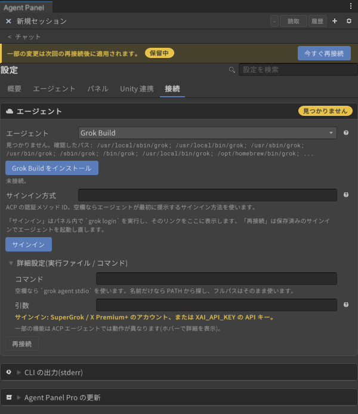
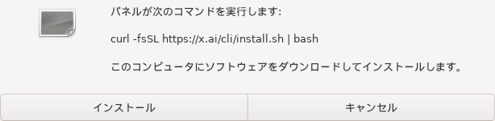
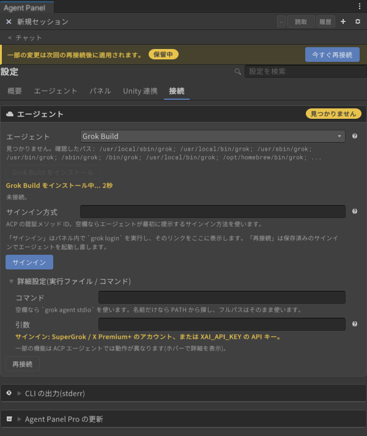
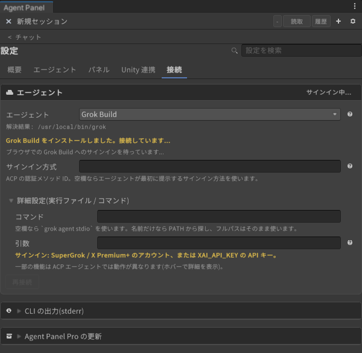
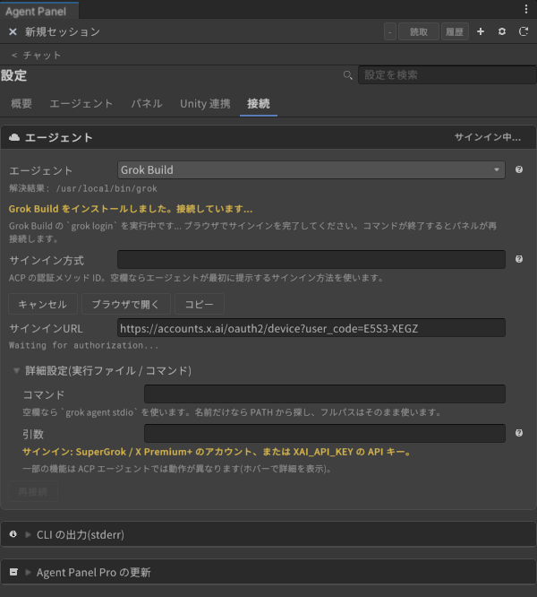

# Signing in to Grok Build

[User guide](../../USER-GUIDE.en.md) > [Agents: installing and signing in](README.en.md) > Grok Build

Uses xAI's Grok Build in ACP mode (`grok agent stdio`). Signing in with a SuperGrok / X Premium+ account is recommended.

**What you need**: a SuperGrok or X Premium+ account. To use an API key instead, set the environment variable `XAI_API_KEY`. Node.js is not required.

## 1. Switch to Grok Build

In Settings (⚙) > Connection > Agent, choose **Grok Build** under **"Agent"**, then press **"Reconnect now"** at the top.

## 2. Install the CLI

If `grok` is not found, the card shows "Not found".

1. Press **"Install Grok Build"**.
2. Press **"Install"** in the confirmation dialog. xAI's official installer runs.

   

   On Windows, the PowerShell version (`irm https://x.ai/cli/install.ps1 | iex`) is shown.
3. While installing, the card shows the elapsed seconds.

   

## 3. Sign in

When the installation finishes, the panel connects to Grok Build. If you are not signed in, Grok's own browser flow starts. The card shows "Signing in..." and "Waiting for the Grok Build sign-in in your browser...". Complete the sign-in in the browser and the panel continues automatically.

If the browser did not open or you abandoned the flow, the card shows "Not signed in". In that case, sign in as follows.

1. Press **"Sign in"**. The panel runs `grok login` inside the panel.
2. The card shows the sign-in URL (`https://accounts.x.ai/oauth2/device?user_code=...`). Press **"Open browser"**, or paste the URL you **"Copy"**-ed into your browser.

   

3. Log in to your xAI (X) account in the browser, **check that the code shown in the browser matches the `user_code` in the URL**, and then approve. Do not approve a code for a sign-in you did not start yourself.
4. The CLI output moves on from "Waiting for authorization...", and when `grok login` finishes, the panel reconnects and shows "Connected to Grok Build."

Grok Build sign-in uses device authorization, so the browser can be on a different computer or a smartphone.

## Using an API key

Set the OS environment variable `XAI_API_KEY` and restart the editor (and Unity Hub too, if you launch the editor from it). API key usage is pay-as-you-go. The panel does not store the key.

## When it does not work

| Symptom | What to do |
|---|---|
| It stays at "Signing in..." | Check that you approved in the browser. To start over, press "Cancel", then "Sign in" |
| You approved but it does not show as connected | Press "Reconnect". If it is still not signed in, run `grok login` in a terminal and then press "Reconnect" |
| X search or image generation does not work | Check your account's plan (available features depend on the plan). For examples, see [Usage examples by agent](../../AGENT-SHOWCASE.en.md) |

---

[← Signing in to Codex](codex.en.md) · [User guide contents](../../USER-GUIDE.en.md) · [Signing in to Gemini CLI →](gemini-cli.en.md)
