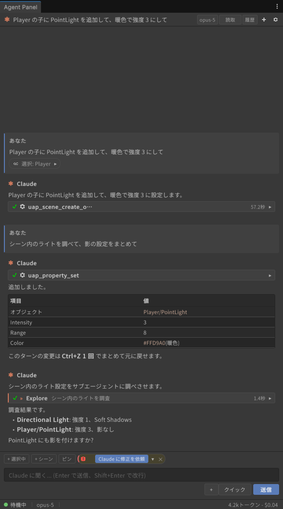
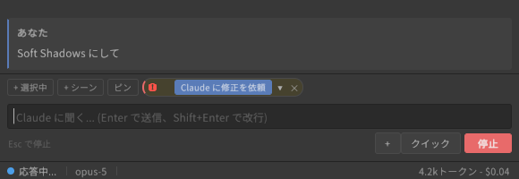
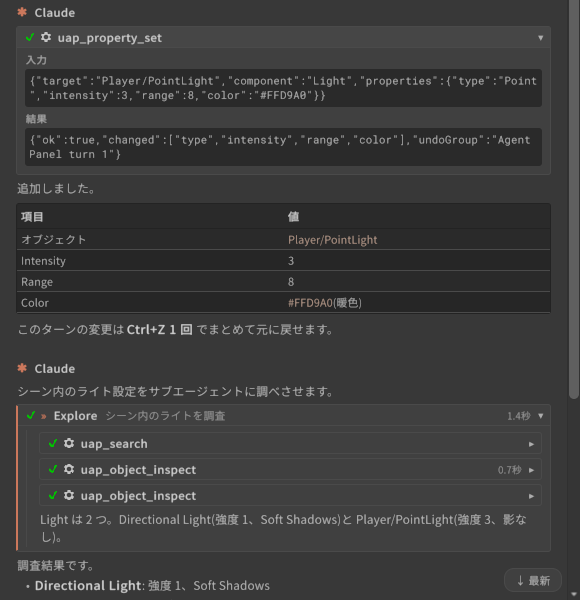
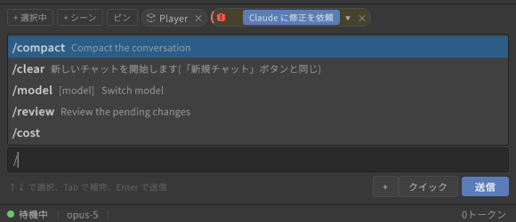

# 画面とチャット

[操作ガイド](../USER-GUIDE.md) > 画面とチャット

このページの内容: [画面の構成](#画面の構成) / [チャットの基本操作](#チャットの基本操作) / [ツールカードとサブエージェントカード](#ツールカードとサブエージェントカード) / [スラッシュコマンドとコンテキスト圧縮](#スラッシュコマンドとコンテキスト圧縮)

## 画面の構成

パネルは上から **ヘッダー**(セッション名 / モデルピッカー / 履歴 / + / ⚙)、**バナー**(再接続中・中断・エラー時のみ)、**会話ログ**(メッセージ・ツールカード・権限カード)、**コンテキストバー**(選択オブジェクト / エラー などのチップ)、**入力欄**(クイック / + / 送信・停止)、**ステータスバー**(状態 / モデル / コンテキスト% / トークン)の順に並びます。

- **ヘッダー**: 現在のセッション名(既定は「新規セッション」)、モデルピッカー、「履歴」ボタン、新規セッション(+)、設定(⚙)。パネル幅が狭いときはモデルと自動承認レベルが 1 つのメニューにまとまります。
- **ステータスバー**: 「待機中」「応答中...」「ツール実行中...」「権限確認待ち」などの状態、使用中のモデル、コンテキストウィンドウの使用率、このセッションの累計トークン(設定でコスト表示も可)。トークン表示をクリックすると「このセッションの使用状況」ポップオーバーが開き、入力/出力/キャッシュの内訳が見られます。

## チャットの基本操作

- 入力欄に依頼を書いて **Enter** で送信します(**Shift+Enter** で改行)。日本語入力の変換確定で誤送信する場合は、設定 > エージェント > 会話 の「Ctrl+Enter で送信」を ON にしてください。
- 応答中は送信ボタンが「停止」に変わります。クリックまたは **Esc** でターンを中断できます。
- 応答中でも入力欄は使えます。Enter を押すと、実行中のターンにメッセージが追加送信されます(入力欄下のヒント「Enter で実行中のターンに送信 / Esc で停止」)。

  
- Unity がコンパイル中のときはメッセージがキューに入り、コンパイル完了後に送信されます。
- **クイック** ボタンから、設定で登録した定型プロンプト(クイックアクション)を挿入できます。何も会話がない空状態では、同じクイックアクションが提案として表示されます。
- 応答の Markdown(見出し・リスト・表・コードブロック)はそのままレンダリングされます。コードブロックにはコピーボタンがあります。
- 応答中の `Assets/...` パスはリンクになり、クリックすると Project ウィンドウで該当アセットがハイライト(ping)されます。
- Claude の推論の要約は「思考」の折りたたみとして表示されます(設定 > パネル > 表示 の「思考ブロックを表示」)。

## ツールカードとサブエージェントカード

- **ツールカード**: エージェントが使ったツール(Read / Edit / Bash / `uap_*` など)は 1 行のカードになり、実行中はスピナー、完了で ✓、失敗で ✗ が付きます。クリックで展開すると「入力」「結果」「エラー」が見られます。完了済みカードが 3 つ以上続くと「ツール N件」のグループ行にまとまります。
- **ツールが返した画像**(エディタのスクリーンショット、PNG の Read、画像生成ツールの出力など)は、そのツールカードの見出し直下にサムネイルとして表示されます。クリックすると OS の既定アプリで開きます。
  - 表示されるのは、結果が名指ししたファイルが実在する場合と、結果に画像データが埋め込まれていた場合(`Library/AgentPanel/Attachments` に 7 日間保持)です。
  - 画像付きのカードは「ツール N件」のグループにはまとまりません。
- **サブエージェントカード**(Claude Code): Claude が Task ツールでサブエージェントを起動すると、入れ子のカードになります。進捗(実行中/完了/失敗)と内部のツール呼び出しはカードの中だけに表示され、上位の会話には混ざりません。設定 > パネル > 表示 の「サブエージェントカードを既定で展開」で初期状態を変えられます。
- 展開/折りたたみの状態は、会話が更新されても維持されます。

## スラッシュコマンドとコンテキスト圧縮

- 入力欄の先頭で `/` を打つと、CLI が提供するコマンドの候補ポップアップが開きます。**↑↓** で選択、**Tab** で補完、**Enter** で送信、**Esc** で閉じます。

  
- `/compact` を送ると CLI がここまでの会話を要約し、会話ログの圧縮位置に「手動/自動」「圧縮前のトークン数」つきのノートが入ります。コンテキストが足りなくなって CLI が自動圧縮したときも同じノートが出ます。
- 圧縮直後はステータスバーのコンテキストメーターが「圧縮済み」になり、次のターンが完了すると実際の値に戻ります。
- コンテキストの残りが少なくなるとメーターが警告色になります。長い作業では区切りのよいところで `/compact` を送るとよいです。
- `/clear` はパネル内で処理され、新規セッションと同じ動作になります。

---

[← エージェントの導入とサインイン](agents/README.md) · [操作ガイドの目次](../USER-GUIDE.md) · [Unity のコンテキストを渡す(チップと添付) →](context.md)
