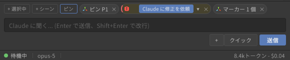
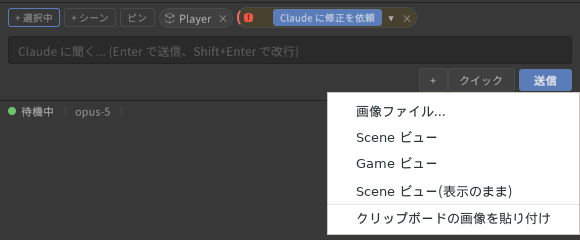

# Passing Unity context (chips and attachments)

[User guide](../USER-GUIDE.en.md) > Passing Unity context (chips and attachments)

The context bar lists the information you can currently pass to the agent as chips.

| Chip | Source | Behavior |
|---|---|---|
| Selected objects | What is selected in the Hierarchy / Project | Shown automatically. Click to include or exclude it from what is sent |
| Console errors | Errors in the Console | Shown automatically. Click to turn one into a "fix this" request. Dismissing with × ignores that error permanently (undo under Settings > Panel > Console errors) |
| Dropped assets/objects | Drag and drop from Project / Hierarchy onto the panel | Included in the conversation as attachment chips |
| Images | The **+** menu next to the input box | "Image file...", "Scene view", "Game view", "Scene view (as displayed)", "Paste image from clipboard". You can also attach PNG/JPEG files by dropping them onto the panel |

- Chips and attached images are included in, and consumed by, the next regular message you send. Sending a slash command does not consume them; they carry over to the next message.
- A sent message keeps its attachments in a collapsed section so you can check them later.

---

[← Layout and chat](chat.en.md) · [User guide contents](../USER-GUIDE.en.md) · [Permission cards, auto-approve and question cards →](permissions.en.md)
