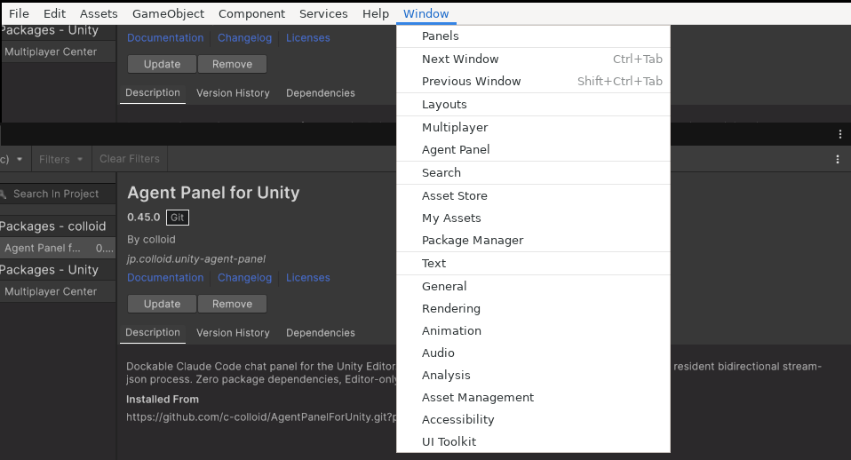
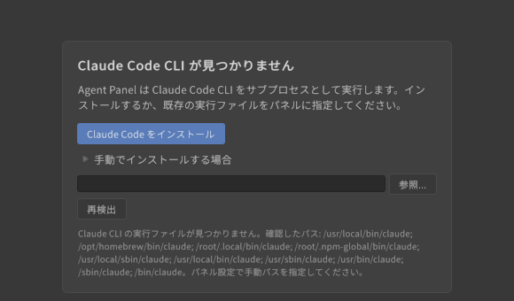

# はじめに(パネルを開く・初回セットアップ)

[操作ガイド](../USER-GUIDE.md) > はじめに

パッケージのインストールと必要要件は [README](../../README.md#インストール) を参照してください。ここではインストール後、最初のメッセージを送るまでの流れを説明します。

## 1. パネルを開く

メニューの **Window > Agent Panel** を選びます。パネルは他のエディタウィンドウと同様にドッキングできます。

## 2. 使うエージェントを決める

既定は **Claude Code** です。Codex・Grok Build などを使う場合は、設定(ヘッダーの ⚙)> 接続 > エージェント の「エージェント」で選び直します。

| エージェント | サインインに使うもの | 手順 |
|---|---|---|
| **Claude Code**(既定) | Claude のサブスクリプション(Pro / Max など)または API キー | [Claude Code のサインイン](agents/claude-code.md) |
| **Codex** | ChatGPT アカウントまたは API キー | [Codex のサインイン](agents/codex.md) |
| **Grok Build** | SuperGrok / X Premium+ のアカウントまたは API キー | [Grok Build のサインイン](agents/grok-build.md) |
| **Gemini CLI** | Gemini API キー(個人向け Google ログインは提供終了) | [Gemini CLI の設定](agents/gemini-cli.md) |
| **その他の ACP エージェント** | CLI ごとの方法 | [その他の ACP エージェント](agents/custom-acp.md) |

エージェント間の違い(履歴・サブエージェントの扱いなど)は [エージェントの導入とサインイン](agents/README.md) にまとめています。

## 3. CLI の導入とサインイン

初回は状態に応じてセットアップカードが表示されます。カードのボタンから CLI の導入とサインインを済ませてください。エージェントごとの画面つきの手順は上の表のリンク先にあります。

- **CLI が見つからない**: カードの「インストール」で CLI を入れるか(実行するコマンドは押す前に表示されます)、自分でインストールしてから「再検出」を押します。
- **サインインしていない**: 「ログイン」/「サインイン」を押すと設定の「エージェント」カードが開き、ブラウザで認証する手順が始まります。

## 4. 準備完了

ステータスバーが「待機中」になれば準備完了です。入力欄に依頼を書いて **Enter** で送信します。

## 次に読む

- [画面とチャット](chat.md) — 画面の各部の名前と、送信・停止・スラッシュコマンド
- [許可カード・自動承認](permissions.md) — エージェントがツールを使う前の確認
- [Unity のコンテキストを渡す](context.md) — 選択中のオブジェクトやエラーを渡す

---

[操作ガイドの目次](../USER-GUIDE.md) · [エージェントの導入とサインイン →](agents/README.md)
