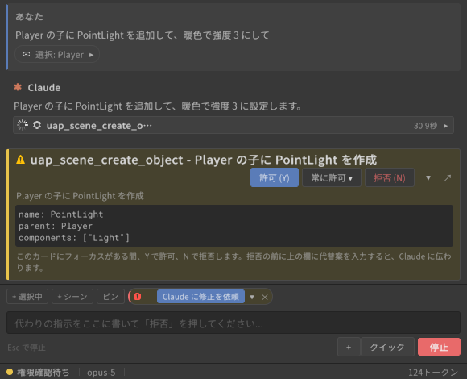
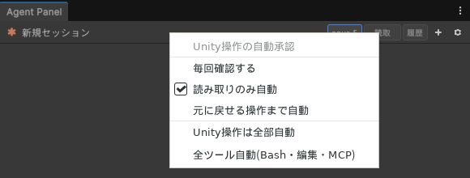
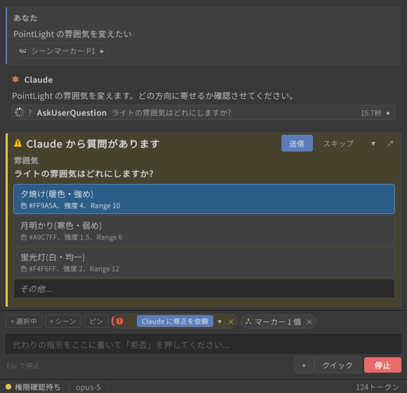

# Permission cards, auto-approve and question cards

[User guide](../USER-GUIDE.en.md) > Permission cards, auto-approve and question cards

On this page: [Permission cards (approving tool calls)](#permission-cards-approving-tool-calls) / [Auto-approve levels](#auto-approve-levels) / [Question cards from the agent](#question-cards-from-the-agent)

## Permission cards (approving tool calls)

Before the agent uses a tool with side effects (file edits, shell commands, Unity operations), a permission card appears at the end of the conversation log (for example "Claude wants to use Edit"). The card shows the diff of the edit or the contents of the command (expand it with the ▾ at the right edge).

| Button | Action |
|---|---|
| **"Allow (Y)"** | Allow this one time only |
| **"Always ▾"** | Choose a scope and stop being asked for the rest of the session. The first entry is "Always allow {tool}", followed by scopes with the paths or command prefixes the CLI suggests, and permission mode switches |
| **"Deny (N)"** | Deny. Before denying, you can type an alternative in the input box ("Tell the agent what to do instead (optional)") and it is passed to the agent |

- While the card has focus, you can answer with the **Y** / **N** keys.
- When the panel is narrow (below a certain width or height), the same card opens automatically in a floating window. The log then shows "Waiting for permission - shown in window", and "Show here" brings it back inline.
- If you shrink the panel below that size while a card is showing, the card collapses to a one-line summary (expand it with ▸). It expands again automatically when the panel is back to its original size.
- When several requests are queued, the card shows "{N} more waiting". Once you answer, the next card appears.
- While waiting for permission, a beep can sound if the panel is inactive (Settings > Panel > Notifications).

## Auto-approve levels

Instead of confirming every call on a card, you can auto-approve up to a certain scope. Choose it in the header (in the "Model and auto-approve level" menu when the panel is narrow) or under Settings > Agent > Conversation, "Auto-approve level".

| Level | What is approved automatically |
|---|---|
| **"Ask every time"** (default) | Nothing. Everything is confirmed on a card |
| **"Read-only Unity ops"** | Read-type tools (file reads, searches, Unity inspect tools) |
| **"Undoable Unity ops"** | The above, plus Unity operations that Undo can revert |
| **"All Unity ops"** | The above, plus every `uap_*` Unity operation. A confirmation dialog appears when you switch to it |
| **"All tools (Bash, edits, MCP)"** | Everything, including Bash, file edits and other MCP servers. Only questions from the agent still wait for you. A confirmation appears when you switch to it |

- At every level, automatic denial by the script validation gate and the `confirm` gate for irreversible operations still apply first.
- If a turn ends with operations that cannot be undone, a warning note appears.
- "Skip ALL permission checks (dangerous)" under Settings > Agent > Danger zone turns off the CLI's own confirmations entirely. You normally do not need it.

## Question cards from the agent

When the agent wants to confirm a direction (AskUserQuestion), a question card with choices appears.

- Click a choice and press "Submit". When there are several questions, answer them one at a time in the tabs.
- Choosing "Other..." opens a free-text field.
- "Skip" continues without answering.

---

[← Passing Unity context (chips and attachments)](context.en.md) · [User guide contents](../USER-GUIDE.en.md) · [Sessions, history and models →](sessions-and-models.en.md)
