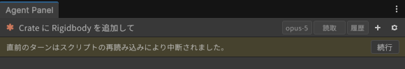

# スクリプトの再コンパイル・Play モードとの共存

[操作ガイド](../USER-GUIDE.md) > スクリプトの再コンパイル・Play モードとの共存

- スクリプトを変更するとドメインリロードが起きますが、パネルは直前に CLI プロセスを終了してセッション ID を保存し、リロード後に同じセッションへ自動で再接続します(バナー「前回のセッションに再接続しています...」→「セッションを再開しました。」)。エディタを再起動しても同様に前回のセッションが復元されます。
- ターンの途中でリロードが起きた場合は「直前のターンはスクリプトの再読み込みにより中断されました。」のバナーが出ます。「続行」を押すとエージェントが続きを実行します。

  
- Play モードの出入りやスクリプト保存後のフォーカス復帰で頻繁に中断される場合は、設定 > Unity 連携 > Unity操作(UapOps) の「中断後に自動継続する」を ON にすると、パネルが自動で「続行」を送ります(会話ログに明示されます)。回数の上限はありません。止まるのは、CLI プロセスが 4 回続けて終了して再接続が停止したとき(下記の「再接続」バナー)と、あなたが停止ボタンを押したときだけです。
- エージェントが C# を書いた後のコンパイル完了を待って作業を続けさせたいときは、同じ場所の「コンパイル後に自動継続する」を使います。継続ターンがさらにスクリプトをコミットした場合も、そのリロード後に再び継続するので、書く→コンパイル→エラーを直す のループを無人で回せます。回数の上限はなく、止まる条件は「中断後に自動継続する」と同じです(エージェントがコミットをやめたとき、再接続が停止したとき、停止ボタンを押したとき)。
- Play モード中に Unity 操作ツールがタイムアウトする場合は、Project Settings > Editor の "Enter Play Mode Settings" を見直してください(設定に「Project Settings > Editor を開く」ボタンがあります)。
- CLI プロセスが落ちると「エージェントのプロセスが終了しました。」のバナーとヘッダーの再接続ボタンが出ます。3 回までは自動で再接続し、4 回続けて落ちると自動再接続を止めて「再接続」を待ちます([困ったときは](troubleshooting.md))。

---

[← Scene ビューのマーカー・ピン・スケッチ](scene-tools.md) · [操作ガイドの目次](../USER-GUIDE.md) · [設定画面リファレンス →](settings.md)
