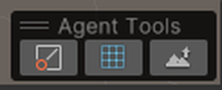
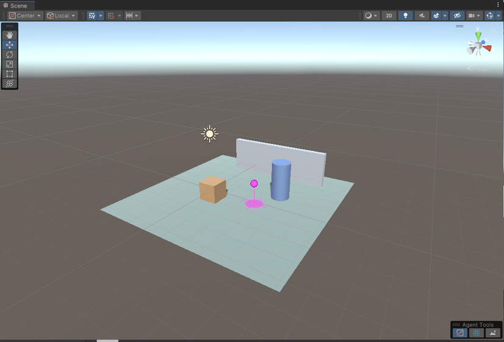
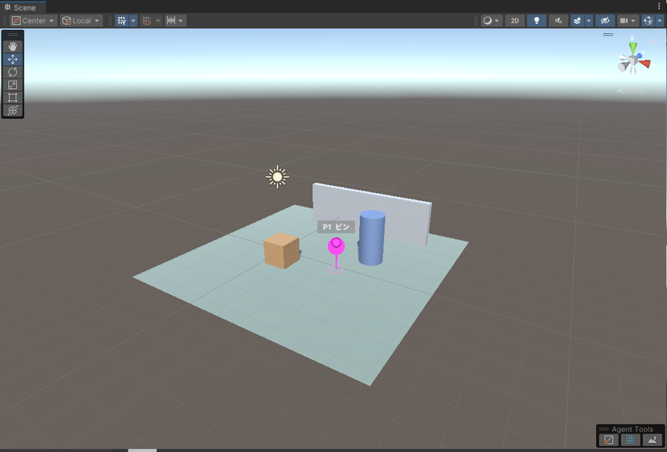
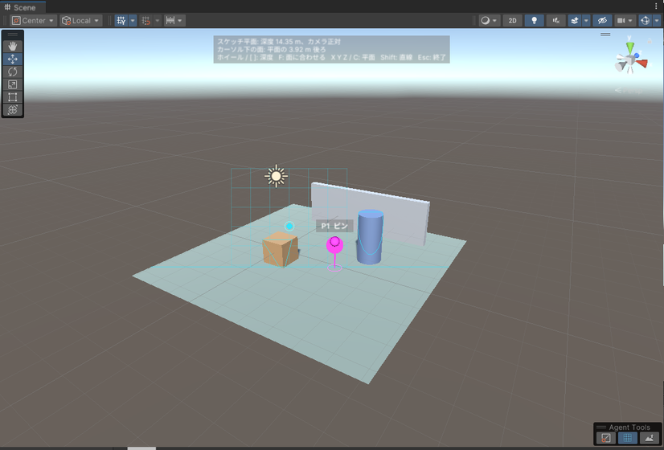
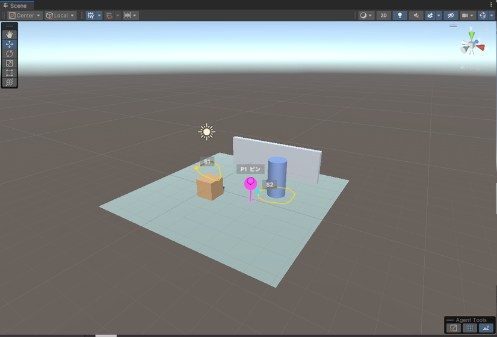
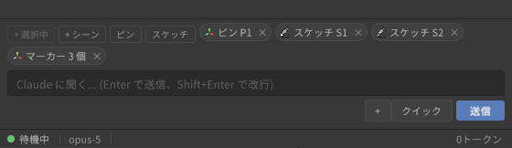
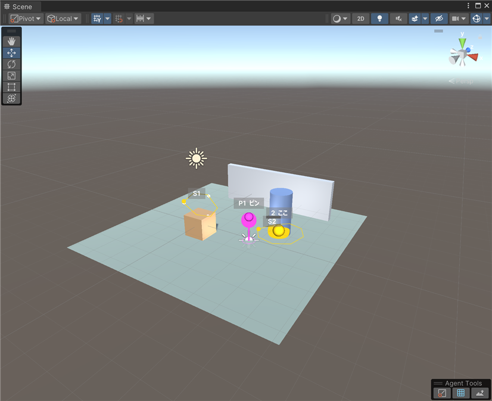
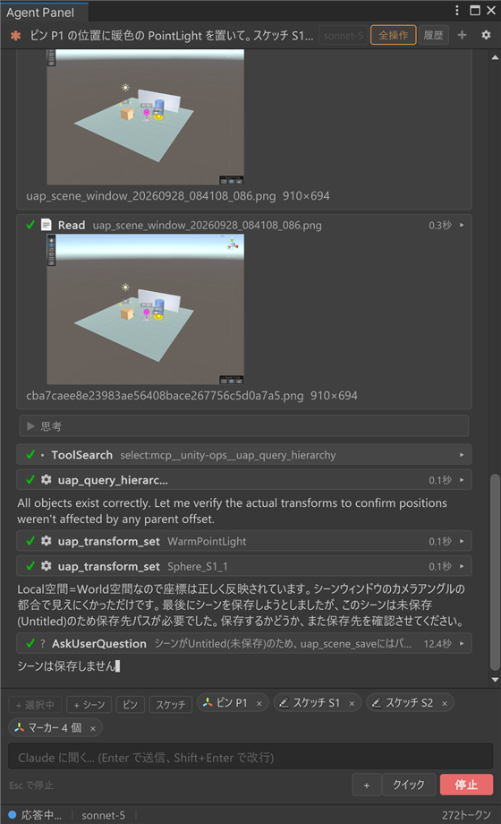

# Scene view markers, pins and sketches

[User guide](../USER-GUIDE.en.md) > Scene view markers, pins and sketches

There are three tools for telling the agent "here". The agent places **markers**, you place **pins**, and you draw **sketches** (lines). Pins and sketches are used from the **Agent Tools** toolbar in the Scene view or from the context bar.

## Markers from the agent

When it wants to point at a position, the agent places numbered markers in the Scene view: spheres, arrows, wire boxes, polylines, labels and so on (`uap_marker_add` / `uap_marker_list` / `uap_marker_clear`). Markers are display-only and are not saved in the scene. The × on the "{N} scene markers" chip in the context bar clears them all at once.

## The Agent Tools toolbar

A toolbar named "Agent Tools" appears at the bottom right of the Scene view. From the left it has three toggles: Pin, Sketch on a plane and Sketch on mesh surfaces. Only one is lit at a time (choosing one releases the other, because both want the same left click). The "Pin" button and the "Sketch" menu in the context bar drive the same state, so it does not matter which one you start from.



- Like other overlays, you can drag the header to move it anywhere. You can also hide it from the overlay menu at the top right of the Scene view (⋮ > Overlays, or the `` ` `` key). The panel-side buttons still work when it is hidden.
- **Esc** leaves any mode.

## Pins

1. Press the pin toggle on the toolbar (or "Pin" in the context bar). A **preview** of where the pin will go (a sphere and a circle at its foot) appears under the cursor.
2. Left-click in the Scene view to place a pin (P1, P2, ...) at that position. A "Pin P1" chip appears in the context bar. On your next send, the chip is passed to the agent along with the world position, the object you clicked, nearby objects and the Scene camera position.
3. The mode ends automatically after one pin. Hold **Shift** while clicking to place several in a row.





## Sketches (lines)

Enter a drawing mode with the plane or surface toggle (or the "Sketch" menu in the context bar) and **left-drag** in the Scene view to draw a line (S1, S2, ...). The line appears in the context bar as a "Sketch S1" chip and is passed to the agent as a series of points (the agent can read every point, the normals, the drawn object, the length, whether it is closed and the sketch plane as JSON with `uap_stroke_list`). Drawn lines are thinned out before saving (bumps smaller than 0.5% of the length are dropped).

**Sketch on a plane** draws on a plane whose depth you set first. The top shows the plane's depth and axis, and a readout of how many meters in front of or behind the plane the surface under the cursor is. A light-blue **outline** appears where the plane cuts the surrounding objects, and a depth-tested **grid** appears around the cursor, so you can see at what depth the plane sits.

| Key | Action |
|---|---|
| Wheel / `[` `]` | Move the depth forward / back |
| **F** | Match the depth of the surface under the cursor |
| **X** / **Y** / **Z** | Use a plane fixed to a world axis |
| **C** | Return to a camera-facing plane |
| **Shift** + drag | Straight line |




**Sketch on mesh surfaces** draws along the mesh surface under the cursor. The drawn object and the normal at each point are passed along too, which suits handing over "this spot on this surface".



Pro's mesh tools can use these lines directly: dig or raise a groove along a line (`uap_mesh_edit`), build a tube along a line, or cut a hole or add a plate with the outline of a closed line (`sdf` / `extrude` of `uap_mesh_create`).

## Chips and cleanup

Placed pins and drawn lines become "Pin P1" and "Sketch S1" chips in the context bar, and each can be removed with its ×. The count in "{N} scene markers" and "Remove every marker and pin from the Scene view" include pins and sketches. Pins and sketches survive domain reloads, and are cleared by switching scenes or entering Play mode.



## Example: telling the agent "here" with pins and sketches

With the state in the figures above (pin P1, plane sketch S1, surface sketch S2), make a request like this. You can write the chip numbers as they are and the agent will understand.

> Place a warm-colored PointLight at pin P1. Line up 4 small Spheres at equal intervals along the line of sketch S1, and put a marker labeled "here" at the center of the inside of S2's closed line. Finally, summarize what you placed in a table.


When you send, the contents of the chips are appended after your request and reach the agent. For example, pin P1 is passed like this.

```text
[1] Scene marker P1 (user-placed pin in the Scene view)
  world position: (2.20, -0.50, 0.61)
  hit object: Ground
  nearest objects: Ground (1.3m), Barrel (1.9m), Crate (2.3m)
  scene view camera: position (8.76, 6.40, -10.12), pivot (1.50, 0.30, 1.50)
```

A sketch comes with its points, its length, whether it is closed, and the plane (plane mode) or the drawn object (surface mode); when there are many points, `uap_stroke_list` reads all of them with normals. The full text the agent receives in this example, and the output of `uap_marker_list` / `uap_stroke_list`, are included as is in [docs/examples/agent-tools-request.md](../examples/agent-tools-request.md).

This is the result of actually sending it (Claude Sonnet, auto-approve level "All Unity ops"). The agent created `WarmPointLight` at P1's coordinates and added a Light, placed small Spheres at 4 points dividing S1's point series into three equal arc lengths, placed a marker labeled "here" at the average of S2's 13 vertices, then took a Scene view screenshot to check and summarized everything in a table.





This is the table the agent returned (the full reply is on the same example page).

| # | Kind | Name | World position | Notes |
|---|------|------|----------------|-------|
| 1 | Point Light | WarmPointLight | (2.20, -0.50, 0.60) | At pin P1. Color temperature 2700K (warm), Intensity 1.5, Range 8 |
| 2 | Sphere | Sphere_S1_1 | (-0.64, 1.05, -0.27) | On line S1, start point (1/4) |
| 3 | Sphere | Sphere_S1_2 | (0.24, 1.26, 0.38) | On line S1, 1/3 of the arc length |
| 4 | Sphere | Sphere_S1_3 | (0.41, 0.45, 0.06) | On line S1, 2/3 of the arc length |
| 5 | Sphere | Sphere_S1_4 | (-0.61, 0.97, -0.30) | On line S1, end point (4/4) |
| 6 | Scene marker | Label "here" | (3.03, -0.32, 1.84) | Centroid inside closed curve S2 (vertex average) |

Along the way, because the scene was unsaved (Untitled), `uap_scene_save` needed a save location, and the agent asked via AskUserQuestion whether to save. Regardless of the auto-approve level, only this question always becomes a card ([Auto-approve levels](permissions.en.md#auto-approve-levels)).

---

[← Unity tools (UapOps)](unity-ops.en.md) · [User guide contents](../USER-GUIDE.en.md) · [Script recompiles and Play mode →](reload-and-play-mode.en.md)
