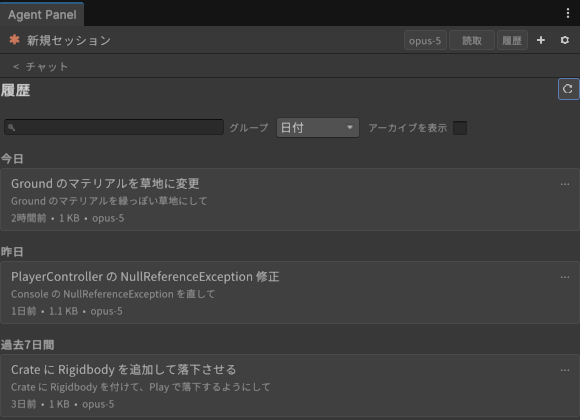
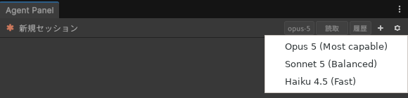

# セッション・履歴・モデル

[操作ガイド](../USER-GUIDE.md) > セッション・履歴・モデル

このページの内容: [セッションと履歴](#セッションと履歴) / [モデルの選択](#モデルの選択)

## セッションと履歴

- **新規セッション**: ヘッダーの **+**。現在のセッションは履歴に残ります。入力欄で `/clear` を送っても同じです。

- **履歴を開く**: ヘッダーの「履歴」。このプロジェクトのセッション一覧が表示されます(Claude Code が保存したセッションと、パネルが保存した ACP エージェントのセッション。後者は行の末尾にエージェント名が付きます)。別のエージェントのセッションを開くと、そのエージェントに切り替えずに、現在のエージェントが新しいセッションで会話ログを引き継ぎます。
  - 上部の検索欄でタイトルや内容を検索できます。
  - 「グループ」で 日付 / シーン / プロジェクト / カスタムグループ の並べ替えを切り替えられます。
  - 行の右端のメニューから「開く」「ピン留め」「名前を変更...」「グループへ移動」(「新規グループ...」もここから)「アーカイブ」「削除...」ができます。「アーカイブを表示」でアーカイブ済みも一覧に出ます。
  - 行を選んで「切り替え」を押すと、そのセッションが `--resume` で復元され、会話ログが再表示されます。使用状況(トークン)や圧縮ノートも復元されます。
- セッション名は既定で会話の先頭から自動生成されます。「名前を変更...」で任意のタイトルに変え、「既定に戻す」で自動生成に戻せます。

## モデルの選択

- **現在のセッションのモデル**: ヘッダーのモデルピッカー。接続後に CLI から取得したモデル一覧から選びます。切り替えは即時で、結果は会話ログのシステムノートで確認できます(「切り替えました」/「失敗しました」)。
  - 「+」や再接続の直後でまだ接続が完了していないときに選ぶと、接続が完了し次第このセッションに適用されます(ログに「接続の完了を待っています」と出ます)。

  
- **新規セッションの既定モデル**: 設定 > エージェント > モデル の「デフォルトモデル」。
- **サブエージェント**: 設定 > エージェント > モデル の「サブエージェントのコスト方針」で「おまかせ(推奨)」か「コスト重視: 単純作業は Haiku」を選びます。さらに「サブエージェントモデルを強制固定」や「タイプ別の詳細設定(上級)」でエージェント名ごとの上書きもできます。これらは新しいセッションから有効です。

---

[← 許可カード・自動承認・質問カード](permissions.md) · [操作ガイドの目次](../USER-GUIDE.md) · [Unity 操作ツール(UapOps) →](unity-ops.md)
