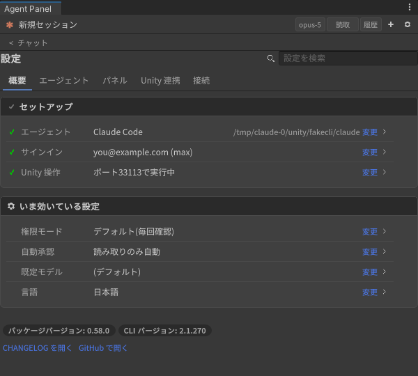
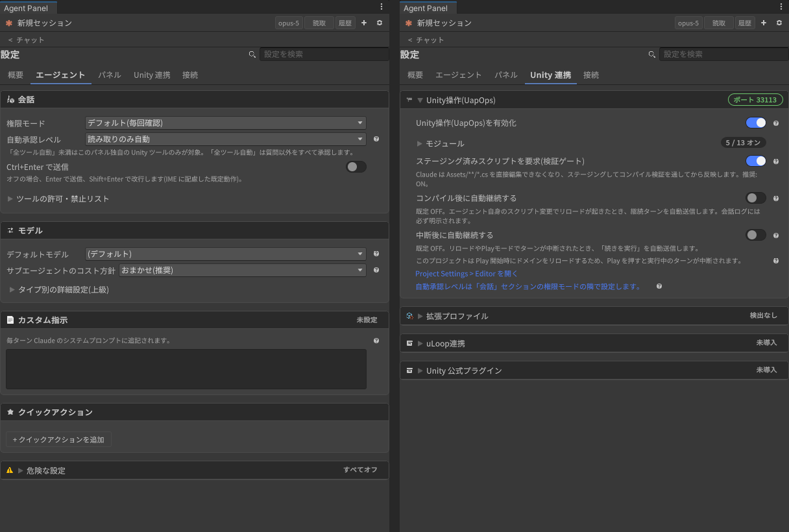
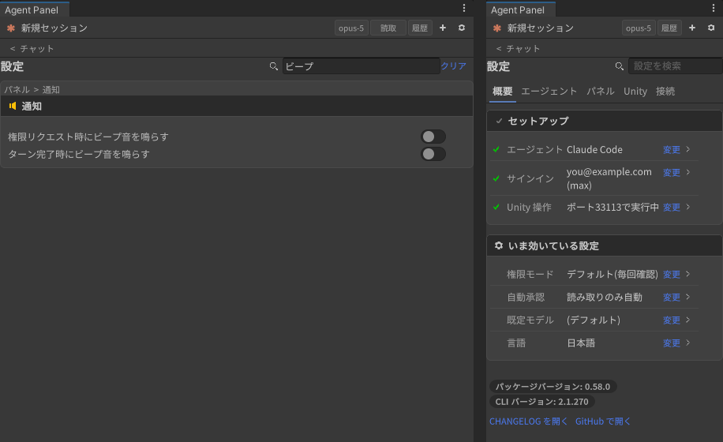

# Settings reference

[User guide](../USER-GUIDE.en.md) > Settings reference

Open it with the ⚙ in the header. Settings are split into 5 tabs, and the tab you looked at last is remembered until you close the editor.

If you only half remember a setting's name, type a word into the search box to the right of the title: only the matching rows from all tabs are listed, labeled "tab > card" (Esc to go back). Most settings apply immediately. Those that need a reconnect show "Some changes will apply the next time you reconnect." at the top and are applied automatically when the turn ends ("Reconnect now" applies them right away).

| Tab | Purpose |
|---|---|
| **Overview** | Where you see the current state. It holds no settings itself; "Change" on each row jumps to where the setting actually lives |
| **Agent** | Things you change while chatting (permissions, model, instructions, canned prompts) |
| **Panel** | The panel's look and notifications |
| **Unity integration** | Editor-side machinery (Unity operations, extension profiles, uLoop, the official plugin) |
| **Connection** | Choosing, detecting and signing in to the agent, CLI output, Agent Panel Pro updates |

| Tab > card | Main items |
|---|---|
| **Overview > Setup** | Agent (the selected agent and the resolved executable; "Set up" if it is not found), Sign-in (email / plan; if signed out, "Sign in" starts the login and goes to the Connection tab), Unity operations (port / off; if off, "Enable") |
| **Overview > In effect now** | Permission mode, auto-approve, default model, language. A red row comes first while "Skip ALL permission checks (dangerous)" is ON. Below it are the package / CLI versions and links to the CHANGELOG and GitHub |
| **Agent > Conversation** | Permission mode (Default (ask every time) / Plan / Accept Edits), auto-approve level, Send with Ctrl+Enter, and a collapsible "tool allow / deny list" (Allowed tools / Disallowed tools; the row end shows the count) |
| **Agent > Model** | Default model, subagent cost policy, Force subagent model, Per-type overrides (advanced). With an ACP agent, a hint says the last two are sent as instructions at the start of a new session |
| **Agent > Custom instructions** | Standing instructions appended to the system prompt (for example: "Always answer in English") |
| **Agent > Quick actions** | Register label and prompt pairs. They appear in the "Quick" menu and in the empty-state suggestions |
| **Agent > Danger zone** | A collapsed card at the end of the tab. "Skip ALL permission checks (dangerous)". The card turns warning-colored only while it is ON |
| **Panel > Display** | Show thinking blocks, Expand subagent cards by default, Show cost in USD |
| **Panel > Appearance** | Language (Auto / 日本語 / English), Font size, Prefer CJK-friendly UI font, the detected font (and whether it comes via UITK Font Fix) |
| **Panel > Notifications** | Beep on permission request / when a turn completes (only while the panel is not focused) |
| **Panel > Console errors** | Ignore patterns (one per line), managing the ignore list |
| **Unity integration > Unity operations (UapOps)** | Enable, a collapsible "Modules" section (Core / Prefab / Editor / Scene view markers / Web fetch with its allowed / denied hosts and search provider / Animation / UI operations / Profile authoring / Avatar measurement / Batch execution / Test runner / Particles / Mesh generation; the row end shows "N / 13 on"), Require staged scripts (validation gate), Continue automatically after a compile, Continue automatically after an interruption, a hint about the Play mode reload setting, a link to the auto-approve level, and the server state ("Running on port N") |
| **Unity integration > Extension profiles** | Enable, the list of detected SDKs with approve / revoke, and (only when Pro is installed) the list of installed packages that have no profile with "Copy a request to draft one" |
| **Unity integration > uLoop integration** | A note on the standing cost, Let the agent run uloop commands, Install uLoop / Remove uLoop, allowing uloop commands, Insert guidance snippet |
| **Unity integration > Unity official plugin** | Detects and installs Unity's official Claude Code plugin |
| **Connection > Agent** | Agent (Claude Code / Gemini CLI / Codex / Grok Build / other ACP agents), the resolution result and install, sign-in state (email / plan, the authentication method actually used), Sign-in method, Log in / Sign in / Switch account / Log out, Advanced (executable path, or launch command and arguments; opens automatically when nothing is detected), Reconnect |
| **Connection > CLI output (stderr)** | The CLI's recent stderr (Copy / Clear) |
| **Connection > Agent Panel Pro updates** | The registry URL and product key from your purchase. "Save key" writes the token to `~/.upmconfig.toml` (or `UPM_USER_CONFIG_DIR`) and a scoped registry to `Packages/manifest.json`, after which you can install and update Pro from My Registries in the Package Manager. "Add to VCC / ALCOM" registers a VPM repository with the same key in VRChat Creator Companion / ALCOM. The panel does not store the key. To receive beta versions too, put `/beta` before `/npm` in the registry URL (`https://<host>/beta/npm`) |

The Unity integration and Connection cards, and the Agent tab's "Danger zone", start collapsed. Click a heading to open it. The right end of each card heading shows the current state in a word ("Port 46673", "Signed in", "Not set", "3 items" and so on), so you can see the state without opening it. Longer explanations are tucked behind the "?" at the end of a row. When the panel is narrow, the tab names are shortened ("Unity", "Connect").

---

[← Script recompiles and Play mode](reload-and-play-mode.en.md) · [User guide contents](../USER-GUIDE.en.md) · [Keyboard shortcuts →](shortcuts.en.md)
