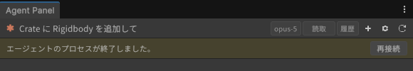
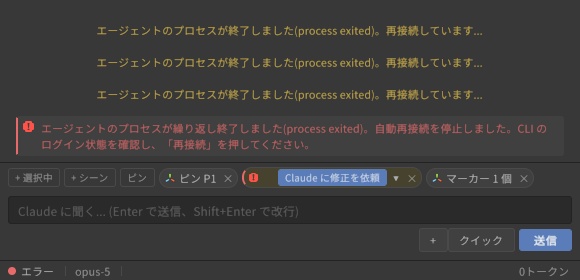

# 困ったときは

[操作ガイド](../USER-GUIDE.md) > 困ったときは

| 症状 | 確認すること |
|---|---|
| ステータスが「CLI が見つかりません」 | 設定 > 接続 > エージェント > 詳細設定 で実行ファイルのパスを指定(見つからない間は自動で開きます) |
| 「接続中...(通常より時間がかかっています)」のまま | ログイン状態(設定 > 接続 > エージェント。`ANTHROPIC_API_KEY` があるとそちらが優先されるので実際の認証方式もここで確認)、設定 > 接続 > CLI の出力(stderr) |
| 権限カードが多すぎる | 「常に許可」のツール単位ルール、または自動承認レベルを上げる |
| 日本語がまだら太字・□になる | 設定 > パネル > 外観 で CJK フォントを優先、または UITK Font Fix を導入 |
| エラーチップを消してしまった | 設定 > パネル > コンソールエラー で無視リストから解除 |
| Unity 操作ツールが「メインスレッド待ちタイムアウト」になる | Editor がフォーカスを失っている / Play モード中。Editor に戻すか、エージェントに `uap_job_status` で結果を取らせる |
| エディタ終了後に `claude` プロセスが残る | 次回パネル起動時に自動で終了されます |
| サインインできない・「未サインイン」のまま | エージェント別の手順の「うまくいかないとき」: [Claude Code](agents/claude-code.md#うまくいかないとき) / [Codex](agents/codex.md#うまくいかないとき) / [Grok Build](agents/grok-build.md#うまくいかないとき) / [Gemini CLI](agents/gemini-cli.md#うまくいかないとき) |
| 「エージェントのプロセスが繰り返し終了しました。自動再接続を停止しました。」 | CLI が 4 回続けて落ちた状態。ターミナルで `claude` が起動できるか(ログイン切れ、CLI の更新失敗など)を確認してから、バナーかヘッダーの「再接続」を押す |

上記で解決しないときは、設定 > 接続 > CLI の出力(stderr) と再現手順を添えて
[GitHub Issues](https://github.com/c-colloid/AgentPanelForUnity/issues) に報告してください。

---

[← キーボードショートカット](shortcuts.md) · [操作ガイドの目次](../USER-GUIDE.md)
