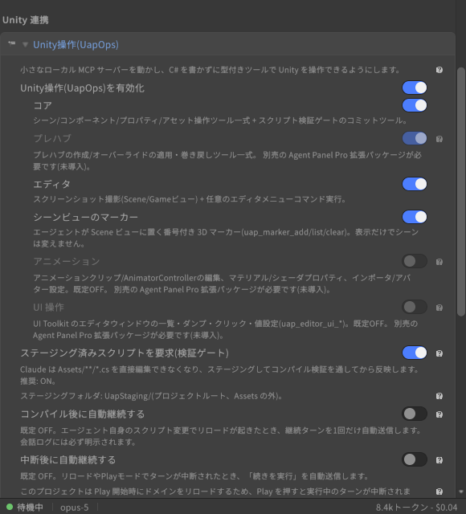

# Unity tools (UapOps)

[User guide](../USER-GUIDE.en.md) > Unity tools (UapOps)

Through a built-in MCP server (local loopback only, token-authenticated), the panel lets the agent operate the Unity Editor directly. Turn on "Enable Unity operations (UapOps)" under Settings > Unity integration > Unity operations (UapOps), and choose the modules you want to use.

| Module | What it can do |
|---|---|
| **Core** | Create, find and inspect scene objects, add components, set properties and Transform, asset operations, run menu items, stage and commit scripts |
| **Prefab**\* (Agent Panel Pro) | Create prefabs, list, apply (Apply) and revert (Revert) overrides, open and close Prefab Mode. To edit the contents of a prefab, open its stage (while it is open, other tools refer to that stage when you omit the scene name). On close, pending edits are written to the prefab. Creating from something that is already a prefab instance makes a Variant, per Unity's behavior, and the result says which one you got |
| **Editor** | Scene / Game view screenshots, running any editor menu item, starting, stopping, pausing and single-stepping Play mode (`uap_play_mode`), reading (`uap_console_logs`) and clearing (`uap_console_clear`) the Unity console log, getting and changing the Game View resolution (`uap_game_view_size`; a size not in the list is added to the dropdown under a name like "Agent Panel 1920x1080"). Lightmap baking (asynchronous, with preflight diagnostics) and Bakery GPU Lightmapper integration\* (Agent Panel Pro) |
| **Animation**\* (Agent Panel Pro, off by default) | Create AnimationClips (float / GameObject on-off / sprite-swap curves, with key interpolation), edit AnimatorControllers (parameters / states / transitions / layers / sub-state machines / Entry and Exit / Write Defaults / Motion Time, detailed transition settings, deleting elements), create and edit BlendTrees (1D / 2D / Direct), add, configure and remove StateMachineBehaviours, create and edit AvatarMasks and AnimatorOverrideControllers, material/shader properties, asset property settings, importer settings |
| **UI automation**\* (Agent Panel Pro, off by default) | Editor UI automation by listing, dumping, clicking and setting values in UI Toolkit windows |
| **Profile authoring**\* (Agent Panel Pro, off by default) | Draft and validate extension profiles for this project (`.uap-profiles/*.json`). It scans the types of the installed packages to write the detection conditions and leaves only the instruction text as a TODO. A profile that has only been created is not injected; it needs approval in the extension profile list. Writing out Claude Code skills (`.claude/skills/<name>/SKILL.md`) is part of the same module |
| **Avatar measurement**\* (Agent Panel Pro, off by default) | Measures an avatar's triangle count, material slots, renderers, bones, blendshapes, PhysBone / Contact / Constraint components and missing scripts. If you pass a second hierarchy (such as a baked clone), it returns per-statistic differences. If the VRChat SDK is present, it also reads the PC / Quest performance rank. It can run an NDMF manual bake and produce the difference against the clone in one go (with confirmation, since it writes generated output). Reading and writing the expression menu and parameters also belongs to this module; before writing, it validates every item against the VRChat SDK rules (the control limit per menu, the 256-bit synced-parameter budget, the number of puppet axis parameters, and controls that point at parameters that do not exist) |
| **Batch execution**\* (Agent Panel Pro, off by default) | Runs several Unity operations in one call with one permission card. Everything is validated before running, so if even one item is invalid, nothing runs. Destructive operations (such as a prefab Apply) and tools from modules you have turned off cannot be included |
| **Test execution**\* (Agent Panel Pro, off by default) | Runs the project's EditMode tests in the Unity Test Runner and returns the names, messages and stacks of failed tests. You can narrow by assembly name, regular expression, full test name and category. It can also just return "what tests exist" without running them (so you do not have to guess at filters). A run where no filter matched anything is reported as "0 tests" (the Test Runner itself reports that as a success). PlayMode is not supported. This row is enabled only in projects that have `com.unity.test-framework` |
| **Particles**\* (Agent Panel Pro, off by default) | Reads and writes Particle System modules by their scripting names (`main` / `emission` / `shape` / `colorOverLifetime` ...). Serialized names are different (the Inspector's "Main" is `InitialModule` in the file, Duration is not there but is the top-level `lengthInSec`, and shape is a plain integer with no enum name), so you do not need to learn them. Curve values fix the mode together with the value, so "I meant a number but it became a curve multiplier" does not happen; writes to a disabled module (Unity accepts them and does nothing) and obsolete properties that no longer have any effect are rejected. Burst settings can also be made here |
| **Mesh generation**\* (Agent Panel Pro, off by default) | Compile-free mesh operations and non-destructive models. `uap_mesh_create` generates a mesh from numbers: box, plane, cylinder, cone, sphere, torus, stairs, extrusion of an XZ outline, a lathe of an XY profile, an SDF tree (sphere, box, capsule, cylinder, torus and ellipsoid combined with union / intersect / subtract, with `smooth` rounding the seams = organic shapes and smooth booleans), and a raw vertex list (`raw`). `assetPath` saves it as a Mesh asset, and `place` creates a GameObject in the scene with a MeshFilter + MeshRenderer (and optionally a MeshCollider). `uap_mesh_inspect` returns an existing mesh's vertex count, bounds, storage location and whether it is closed, and lists vertices in a range or nearest to a point. `uap_mesh_edit` edits an existing mesh over a region (sphere + falloff = proportional editing, box, whole mesh): move, inflate, smooth, subdivide, noise. Unity built-in or imported meshes are copied with `detach:true` before editing. `uap_mesh_boolean` makes a union / intersect / subtract of two closed meshes as a new mesh (the inputs are not changed). Generation tools only create new things and never overwrite existing assets. `uap_mesh_validate` reports, with severity, degenerate and duplicate triangles, non-manifold edges, inconsistent winding, open edges (informational by default since they are often intentional), flipped normals, faces uniformly facing inward (informational for skyboxes and the like) and coplanar overlaps, and `uap_mesh_repair` repairs the ones you choose (the default is a safe combination that does not change the shape; welding, overlap removal and hole filling are opt-in, and Ctrl+Z works). `uap_scene_zfight_scan` lists faces of different objects in the scene that overlap on the same plane (Z-fighting) and suggests fixes. `uap_mesh_export` / `uap_mesh_import` write and read meshes as glTF (.glb / .gltf), so you can round-trip with external tools (Blender, Python mesh kernels, generative AI). `place.checkZFight: true` also checks right after placement. Non-destructive models: a hierarchy of `Model Node`s (distance-field shapes; position by Transform, combined with their children by `fold` / `smooth`) under a `Model` component is handled with `uap_model_inspect` (reads the tree as JSON: node ids, signatures, changes since last time, staleness, and the signed distance at any point), `uap_model_apply` (edit by patch; one call = one Undo) and `uap_model_evaluate` (meshes the root's MeshFilter using a sparse brick grid + dual contouring). Nodes include mirror, repeat, shell and offset, tube shapes from sketch lines, and shapes that turn any Unity Mesh into a distance field (with cage modifiers for bevel and Catmull-Clark subdivision with creases). A `Live` model previews on every edit and builds the real mesh once you stop (human edits are recorded in the edit log, so the AI can read them; if the project has Burst, evaluation automatically uses the Burst version). If you make node values follow expressions with the model's script (`var` / `bind`), you get a parametric model where one number changes the whole thing. A node's `material` / `color` paints the evaluation result into submeshes and vertex colors, so one mesh can use as many materials as it needs (`color` / `colors` / `uv2` of `uap_mesh_create`, `materials` of placement, and glTF vertex colors are supported too). `uap_model_bake` does decimation, UV unwrapping, normal / AO baking from the distance field and asset output in one go (`remesh: true` rebuilds into a mostly-quad mesh following curvature, ridges and material boundaries and also writes a quad cage; `output: "cage"` writes the distance field's quads as is into a Mesh with quad topology). `uap_mesh_remesh` rebuilds any mesh into a mostly-quad mesh with a target face count. `uap_cage_edit` edits a cage Mesh with extrude, inset, loop cut, bridge and triangle-to-quad (keeping the quad topology), and a mesh leaf's `edges` specify crease, bevel and sharp by the coordinates of both ends of an edge. A node's `displace` + `falloff` is a displacement brush with falloff. `uap_forge_migrate` migrates a Forge scene to a non-destructive model. You can also make material-side assets with `uap_material_create` (presets `lit` / `unlit` / `vertexColor` resolved for the render pipeline, shortcuts and properties, shared with `reuse`), `uap_texture_create` (PNGs of solid color, gradient, checker, stripes, noise and palette atlas, plus import settings) and `uap_shader_create` (writes out bundled templates: vertex color, window interior mapping, decal, flipbook, triplanar). The `cubemap` of `uap_texture_create` is a room interior for windows, and the `preset` of `uap_particle_set` is a one-line recipe for smoke, fire, sparks, rain or dust. When the evaluation result is split by per-node `material` / `color`, triangles are cut at the exact position where the owning node changes, so material boundaries do not get a grid-like jagged look |
| **Scene view markers** | Places numbered 3D markers in the Scene view (display only; does not change the scene) |
| **Web fetch** | `uap_web_fetch`, which lets the agent fetch the contents of a URL. PNG / JPEG are downscaled and returned as images (thumbnail in the tool card), GIF / WebP are returned as they are, PDFs and other files are saved under `Library/AgentPanel/Downloads/` and the path is returned (Claude Code can read PDFs with `Read`; adding `as:"text"` or `pages:"1-5"` makes the panel extract the body text and return it, so even an agent that cannot read PDFs sees the contents. Layout is flattened, and pages that are only images or scans come back empty), and HTML becomes the body text plus a list of the image URLs and link URLs on the page. The agent's own web fetch tool can only return text, so use this one for "show me the image or PDF you found by searching". With `save_to`, it saves directly under `Assets/` and imports it ("grab this texture and put it on the material" takes one step; an existing file is not overwritten unless you specify `overwrite`). Public hosts only (localhost, LAN and link-local are rejected), up to 20 MB, and no cookies or authentication headers are sent. You can narrow the destinations further with "Allowed hosts" and "Blocked hosts" in the settings (one host per line, subdomains included). `uap_web_search` in the same module is a search for agents that have no web search of their own. It works once you enter "Search provider" (Brave Search API / Tavily) and "Search API key" in the settings, and returns titles, URLs and snippets (with no key, it only tells the agent so and sends nothing outside). It does not change the project but does communicate externally, so it is excluded from the read-only auto-approve level and always shows a permission card with the URL (you can skip it with "Always") |

\* Modules marked with an asterisk require the separately sold Agent Panel Pro package (`jp.colloid.agent-panel-pro`). While it is not installed, the corresponding toggles are disabled and the hint reads "Requires the Agent Panel Pro add-on (sold separately; not installed)". To install Pro, just enter the registry URL and product key you received at purchase under Settings > Agent Panel Pro updates ([Settings reference](settings.en.md)), and the toggles become enabled after the next domain reload. Modules without an asterisk work with Core alone.

Tips:

- You can make requests in plain words (for example, "Add a PointLight as a child of the selected object and set its intensity to 3"). The agent picks the matching `uap_*` tool and runs it after the permission card.
- **Run it and check**: if you ask "run it and verify after the fix", the agent starts Play mode (`uap_play_mode`), reads the logs the game produced (`uap_console_logs`), and stops when done. Entering and leaving Play mode involves a domain reload, so the agent waits for the switch before checking the state. It declines to run while compiling. If Run In Background in Player Settings is off, Unity operations may time out when the editor loses focus during Play (a warning appears at the start).
- **Undo**: one turn's worth of Unity operations can be undone together with a single Ctrl+Z.
- **Script validation gate** ("Require staged scripts (validation gate)"): C# the agent writes is first placed in a temporary folder, and only code that compiles goes into `Assets/`. A domain reload is never triggered by broken code, and compile errors are returned to the agent so it corrects itself. The hook layer works on Windows only.
- **Irreversible operations** (asset deletion, and with Pro, Apply to a prefab) are not run until the agent adds `confirm:true`; only the scope of impact (what would be deleted, how many other instances) is returned. Check the details in the conversation before it proceeds.
- **Long-running operations** (such as Pro's lightmap bake) become jobs, and the agent fetches the result later with `uap_job_status`. A response is returned even while the Editor is busy.
- **Extension profiles** (Settings > Unity integration > Extension profiles): add the key points of detected third-party SDKs to the agent's instructions.
  - Your project's own profiles (`.uap-profiles/*.json` directly under the project) work with Core alone. They take effect only after you read the full text and press "Review & approve".
  - Bundled profiles that auto-detect VRChat SDK3 (common / avatar / world) / Udon / UdonSharp / NDMF / Modular Avatar / VRCFury / Avatar Optimizer / lilycalInventory / lilToon / UniVRM / MagicaCloth2 / Final IK / Bakery / RPG Maker Unite / ProBuilder are included in Pro. In a project without Pro, supported SDKs are not detected even if installed, and this section says so.
- **uLoop integration** (Settings > Unity integration > uLoop integration): in a project that has [uLoopMCP](https://github.com/hatayama/uLoopMCP) installed, "Allow uloop commands" adds permission rules and "Insert guidance snippet" adds custom instructions. If it is not installed, you can install it with "Install uLoop" (you review the changes before it runs).
  - **What stays resident once installed** (the note at the top of the card; measured with uLoop 3.6.3 on 2026-09-21): the editor-side server (starts automatically every time the editor starts), a 16 ms tick pump (it keeps the editor running even when it is unfocused and idle, so it does not rest when moved to the background), and the descriptions of about 21 agent skills (about 5.7 KB, roughly 1.5 to 2k tokens; included in every session, even ones that never call uloop). **This panel cannot stop these three** (they belong to uLoop).
  - **To tone it down**: `Window > Unity CLI Loop > Server` stops the server for the current editor session only (the tick pump does not stop, and the server returns on the next launch). Disabling individual tools in `Window > Unity CLI Loop > Settings` also removes that tool's skill from deployment, which reduces the tokens too. The only way to stop it completely is to remove the package in the Package Manager.
  - **Keep the agent from using uloop** (the toggle right below the cost row; on by default): when turned off, (1) the agent's instructions state that "uloop is denied", (2) deny patterns for each shell are added to the launch arguments of the next connection, and (3) any uloop command that still arrives is denied, and the `uap_*` tools to use instead are shown in the conversation. It takes effect from the next connection (the same as the allowed / disallowed tool lists). **This only stops the agent's use; it does not stop uLoop itself** (the "What stays resident once installed" items above remain).
  - **Removal** (the "Remove uLoop" button when it is installed): the only way to truly stop what stays resident is to remove the package, so there is a removal path that mirrors the install button. As with installation, **the changes (the manifest.json diff) are shown first**, and a `.uap-backup` is made before writing. Unity does the dependency removal, and this panel tidies up **only the OpenUPM settings it added itself** (it does not touch wide scopes it did not write, scopes other packages still use, or registries other than OpenUPM). The tidy-up is a second stage that runs after the removal finishes; if it fails, the removal itself stays successful and "manifest.json still contains settings" is shown. The `uloop` allow rule and guidance snippet in the settings remain (the confirmation card says so as well). Design: `docs/design-notes/2026-09-22-uloop-remove-from-panel.md`.
  - Play mode control, reading and clearing the console log, screenshots, committing scripts and running tests are all covered by this panel's own `uap_*` tools (you do not need uLoop). Details and measurements: `docs/design-notes/2026-09-21-uloop-always-loaded-cost.md`.

---

[← Sessions, history and models](sessions-and-models.en.md) · [User guide contents](../USER-GUIDE.en.md) · [Scene view markers, pins and sketches →](scene-tools.en.md)
